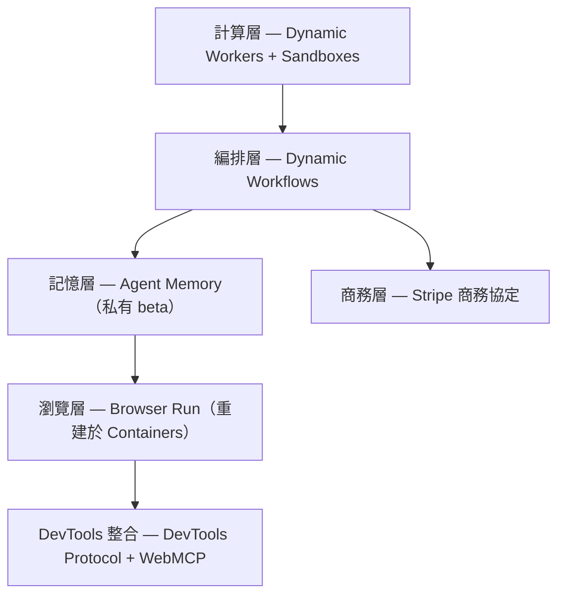
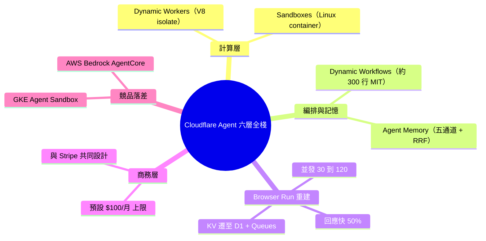

## Cloudflare Completes Its Agent Infrastructure Stack with Browser Run Rebuild and Six-Layer Platform

Cloudflare 完成 agent 基礎設施全棧建設，六層架構為：計算層（Dynamic Workers + Sandboxes）、編排層（Dynamic Workflows）、記憶層（Agent Memory）、瀏覽層（Browser Run）、商務層（Stripe Projects）。重建後的 Browser Run 性能提升 4 倍並發、50% 更快响应。此架構設計提供企業級 agent 應用的完整堆疊參考。

### 重點
- 六層 agent 基礎設施棧 — compute/orchestration/memory/browsing/commerce 分層
- Browser Run 性能：4 倍並發、50% 更快響應
- 框架：從單點工具到完整產品棧的企業 agent 設計模式

**原文：** [infoq-main](https://www.infoq.com/news/2026/05/cloudflare-agent-platform-stack/?utm_campaign=infoq_content&utm_source=infoq&utm_medium=feed&utm_term=global)

---

<!-- deep-analysis:begin -->
## 📌 摘要 (TL;DR)

- Cloudflare 完成 agent 基礎設施六層全棧：計算、編排、記憶、瀏覽、商務協定、DevTools 整合，收尾動作是重建 Browser Run。
- Browser Run 改跑自家 Containers 平台，並發瀏覽器數從 30 拉到 120（4 倍），快速操作回應快 50%，新增 WebGL 與 WebMCP 支援。
- 重建把狀態管理從 Workers KV（最終一致性、會 race condition）遷到 D1 加 Queues，做交易式分配，每地點支援 50 萬 containers。
- 升級對既有用戶零改動，所有 Workers plan 皆可用，Agents SDK 內建 Browser Run 支援。
- 兩個月發布序列從 2026 年 4 月起：Dynamic Workers、Sandboxes、Dynamic Workflows、Agent Memory 陸續出貨。
- 競品落差明顯：AWS Bedrock AgentCore 無 managed browser／agent memory，Google Cloud GKE Agent Sandbox 只是 Kubernetes 原生 primitive，兩者皆無商務協定。

## 🎯 核心概念

- **V8 isolate**：Dynamic Workers 採用的輕量隔離執行單元，啟動只需毫秒級。
- **持久化執行引擎**（durable execution engine）：Dynamic Workflows 的基礎，讓工作流步驟可獨立重試、睡眠時 hibernation。
- **倒數排名融合**（Reciprocal Rank Fusion，簡稱 RRF）：Agent Memory 把多通道搜尋結果合併排序的演算法。
- **WebMCP**：讓模型情境協定（Model Context Protocol，簡稱 MCP）的互動直接透過瀏覽器執行。
- **出口代理**（egress proxy）：Sandboxes 用來安全注入憑證的網路出口通道。

## 📖 整理分析

### 1. 六層全棧的完整輪廓
Cloudflare 把 agent 基礎設施切成六層：計算、編排、記憶、瀏覽、商務協定、DevTools 整合。這是一段為期兩個月的發布序列，從 2026 年 4 月起 Dynamic Workers、Sandboxes、Dynamic Workflows、Agent Memory 陸續上線，Browser Run 重建是最後一塊拼圖。對企業想自建 agent 平台的人，這套分層是現成的架構參考。

### 2. 計算層雙軌：Dynamic Workers 與 Sandboxes
計算層分兩種執行模型。Dynamic Workers 用 V8 isolate，毫秒啟動，適合 linting、typecheck、API 呼叫這類輕量任務。Sandboxes 則是完整 Linux container，可跑 git、bash、dev server、多語言 build，並透過 egress proxy 安全注入憑證——重活與輕活各走各的軌道。

### 3. 編排與記憶：Dynamic Workflows 與 Agent Memory
Dynamic Workflows 是一個約 300 行、MIT 授權的函式庫，延伸 Cloudflare 持久化執行引擎，支援每租戶／agent／request 的 runtime-specific 工作流碼、步驟獨立重試、睡眠期間免費 hibernation，閒置租戶成本近乎為零。Agent Memory 目前處於私有 beta，用雙階段 ingestion pipeline 從 agent 對話抽出結構化記憶，retrieval 採五通道平行搜尋加 RRF，並支援多 agent 團隊共享記憶 profile。

### 4. Browser Run 重建：30 → 120 並發
原本 Browser Run 與 Browser Isolation（BISO）共用基礎設施，人類長連線 session 與 AI agent 短而尖峰的存取模式互相打架。重建後改跑專屬 Containers，配置區域預熱瀏覽器池，並發從 30 拉到 120、快速操作回應快 50%，並新增 WebGL 與 WebMCP。狀態管理從 Workers KV（最終一致性導致 race condition）遷到 D1 加 Queues 做交易式分配，每地點可支援 50 萬 containers 並批次寫入。快速操作也消除了多步 WebSocket choreography，改為單一 HTTP 請求在 container 內一次完成。Browser Run 團隊（Ruskin Constant、Rui Figueira、Sofia Cardita）點出重建動機：「AI agent builders discovered Browser Run and quickly brought request volumes outpacing our existing capacity.」

### 5. 商務層與競品落差
商務協定與 Stripe 共同設計，讓 agent 能自主建立 Cloudflare 帳號、註冊網域、開啟訂閱、部署上線，每個供應商預設 $100／月 支出上限，由 Stripe 處理身分與付款。對比競品：AWS Bedrock AgentCore 沒有對應的 managed browser 或 agent memory；Google Cloud GKE Agent Sandbox 只是 Kubernetes 原生 primitive 而非 managed service；兩者都不具備可比的商務協定能力。

## 🧭 架構圖

## 🧠 Mindmap

<!-- deep-analysis:end -->
### 📄 原文內容

點此展開 / 收合

Cloudflare rebuilt Browser Run on its own Containers platform, delivering 4x higher concurrency and 50% faster response times. The upgrade completes a six-layer agent infrastructure stack: compute (Dynamic Workers + Sandboxes), orchestration (Dynamic Workflows), memory (Agent Memory), browsing (Browser Run), and commerce (Stripe Projects). By Steef-Jan Wiggers

