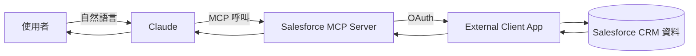
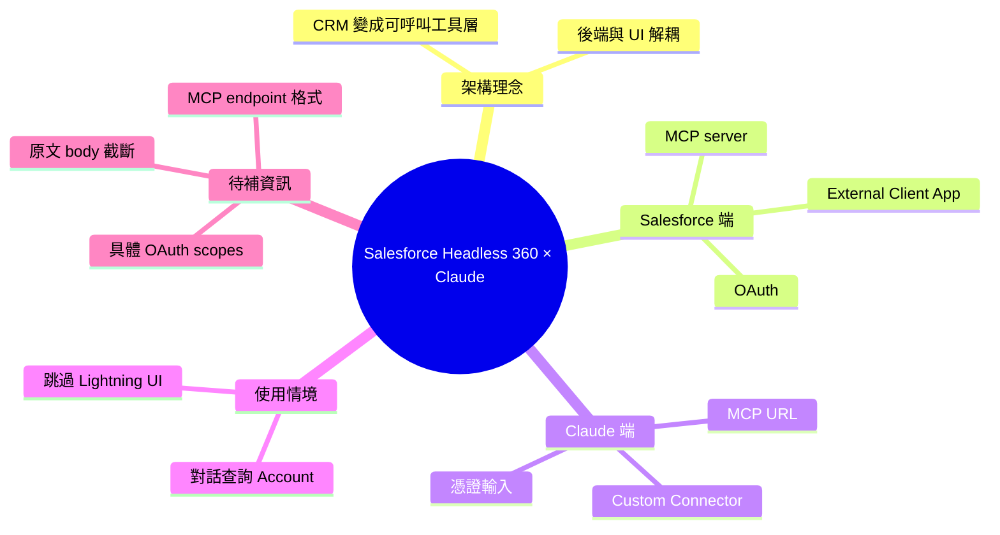

## Salesforce Headless 360: Connecting Claude with Salesforce

Salesforce Headless 360 是將 Salesforce 後端與使用者界面分離的架構，讓用戶通過 Claude、Slack 等外部應用與 Salesforce 數據交互。實現需三層：(1) Salesforce 端建立 External Client App、啟用 OAuth、配置 MCP server；(2) Claude 端建立自定義連接器並輸入 MCP URL 與憑證；(3) 完成授權。配置完成後，用戶可直接通過 Claude 對話查詢 Salesforce 帳戶記錄，無需登入傳統界面。

### 重點
- Headless 360 三層架構：Salesforce 作數據引擎 + Claude/Slack/網頁作體驗層 + API/MCP 作連接器
- Salesforce 配置：建立 External Client App、啟用 OAuth（含 refresh_token、offline_access、mcp_api scope）、配置 MCP server
- 實際應用：直接通過 Claude 對話查詢 Salesforce 數據，跳過登入和 UI 導航的摩擦

**原文：** [medium-tag-claude](https://medium.com/@pankajdave80/salesforce-headless-360-connecting-claude-with-salesforce-9223ded02079?source=rss------claude-5)

---

<!-- deep-analysis:begin -->
## 📌 摘要 (TL;DR)

- Salesforce Headless 360 把 Salesforce 後端與 UI 解耦，外部應用（Claude、Slack 等）可直接讀寫 CRM 資料，不必登入原生界面。
- 整合 Claude 需三層配置：Salesforce 端建立 External Client App + OAuth + MCP server；Claude 端設定 custom connector + MCP URL + 憑證；最後完成授權握手。
- 配置完成後可在 Claude 對話框直接查詢 Salesforce 帳戶（Account）記錄，將 CRM 變成可被 LLM 呼叫的 headless 資料層。
- 注意：原文 body 在 Medium 被截斷（只有引言），以下分析以 summary 與標題為依據，未涵蓋的實作細節（具體 scopes、endpoint URL 格式）需回到原文確認。

## 🎯 核心概念

- **無頭架構**（Headless）：後端 API 與前端 UI 分離，任何客戶端皆可呼叫後端。
- **External Client App**：Salesforce 新一代外部應用註冊機制，取代舊版 Connected App，承載 OAuth 授權。
- **MCP**（Model Context Protocol）：Anthropic 制定的協定，讓 LLM 透過標準 server 介面存取外部工具與資料。
- **Custom Connector**：Claude 端用來掛載第三方 MCP server 的設定入口。

## 📖 整理分析

### 1. 為何需要 Headless 360

傳統 Salesforce 使用者必須登入 Lightning UI 才能查資料。Headless 360 將 CRM 變成純資料/邏輯層，讓 Claude、Slack 等對話介面成為新的存取通道。對 LLM agent 來說，這把 CRM 從「人類專用 SaaS」變成「可呼叫工具」。

### 2. Salesforce 端配置

依 summary，需在 Salesforce 建立 **External Client App**、開啟 **OAuth**、並配置 **MCP server**。三者組合代表 Salesforce 已原生支援 MCP 作為對外協定（而非僅 REST API）。原文未在可讀片段中列出具體 OAuth scopes 與 MCP server 啟用步驟。

### 3. Claude 端配置

Claude 內建 custom connector 功能：填入 Salesforce MCP server URL 與 OAuth 憑證即可。架構上 Claude 扮演 MCP client，Salesforce MCP server 暴露 CRM 物件（Account、Contact 等）為 tool。

### 4. 授權握手與使用

第三步是完成 OAuth 授權流程。完成後使用者直接在 Claude 對話框輸入自然語言查詢即可命中 Salesforce 帳戶資料，無需切換界面。

### 5. 原文限制（推論）

抓取到的 body_md 僅含引言一句，後續細節（截圖、實際 scopes、錯誤排查）無法驗證。建議讀原文取得完整步驟與畫面。

## 🧭 流程圖

## 🧠 Mindmap

<!-- deep-analysis:end -->
### 📄 原文內容

點此展開 / 收合

For the past few days, I&#x2019;ve been exploring the idea of Salesforce Headless 360 and trying to understand what it actually means beyond the&#x2026; Continue reading on Medium »

