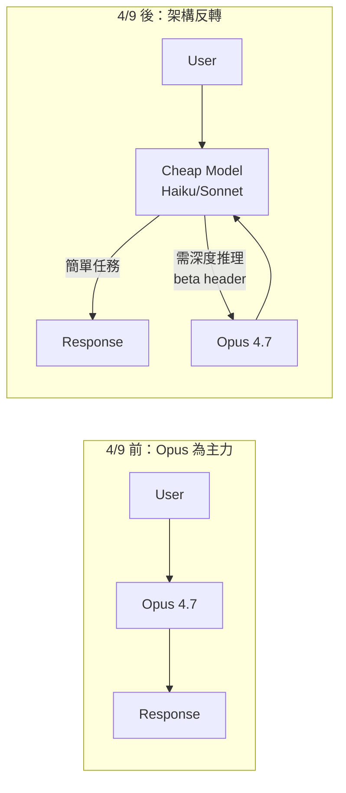
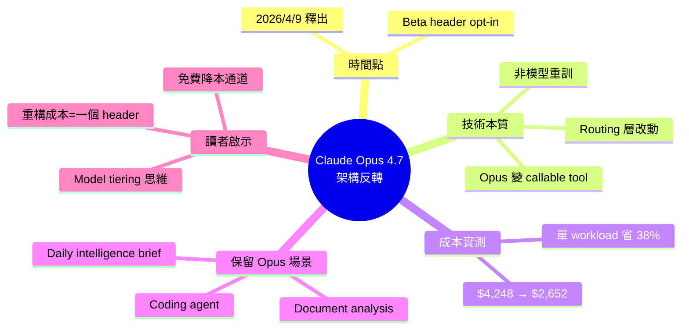

## Claude Opus 4.7

Claude Opus 4.7 於 2026 年 4 月 9 日實現關鍵的架構反轉：從獨立模型轉變為可被成本更低的模型調用的工具。這一變更通過單個 beta header 實現，而非根本性重構。實際成本影響顯著——作者迁移一個工作負載後，4 月賬單從 $4,248 下降至 $2,652，約節省 38%。Opus 4.7 仍保持對複雜任務（編碼 agent、文檔分析）的最強能力，但其角色從主力模型轉為高端推理工具，由廉價模型負責簡單任務。

### 重點
- 架構反轉：Opus 4.7 April 9, 2026 起可被低成本模型調用，通過單個 beta header 實現（非模型重構）
- 成本效應：實測生產環境迁移達成 38% 賬單降低（$4,248 → $2,652）
- 模型定位轉變：從獨占型主力→高端推理工具，與低成本模型協作完成任務

**原文：** [medium-tag-claude](https://medium.com/@anup.karanjkar08/claude-opus-4-7-f2d7c5ee3f6a?source=rss------claude-5)

---

<!-- deep-analysis:begin -->
## 📌 摘要 (TL;DR)

- **2026 年 4 月 9 日架構反轉**：Anthropic 透過單一 beta header，讓 Claude Opus 4.7 從獨立主力模型轉為「可被更便宜模型呼叫的工具」，非根本性重構。
- **實測成本降 38%**：作者 Anup Karanjkar 遷移一個工作負載後，4 月帳單從 **$4,248 → $2,652**。
- **能力未削弱**：Opus 4.7 仍是 Anthropic 2026 年最強模型，能力保留給 coding agent、文件分析、每日 intelligence brief 等複雜任務。
- **角色轉變**：從「跑全部任務」變「廉價模型分派過來的高階推理工具」，呼叫頻率下降但每次呼叫價值更高。
- **重點**：架構改動是 routing 層 opt-in，不是模型重訓，現有 workflow 改 header 即可享受成本下降。

## 🎯 核心概念

- **架構反轉（Architectural Inversion）**：原本 Opus 為頂層模型直接服務 user，現在反過來，由便宜模型（Haiku / Sonnet 等級）作為入口，依需求把硬問題往上派給 Opus 4.7。
- **Beta Header 啟用**：Anthropic 透過單一 HTTP beta header 開啟此能力，無需改模型權重或 SDK 大版本（原文未列出 header 具體字串）。
- **Model Tiering**：成本/能力分層調度——簡單任務廉價模型吃下，複雜推理才升級到 Opus。

## 📖 整理分析

### 1. 4 月 9 日的變更性質
2026 年 4 月 9 日 Anthropic 釋出此能力，原文強調「這是 routing 層的反轉，不是新模型」。Opus 4.7 模型本體沒變，變的是它在 agent 拓樸中的位置——從 top-of-stack 變成 callable resource。改動成本對 client side 極低，僅需 beta header 開關。

### 2. 作者的遷移成本實測
Author 拿一個既有 workload 做 A/B：架構反轉前 4 月帳單跑到 **$4,248**，改用便宜模型作為入口、Opus 4.7 僅在需要時被呼叫後，同月帳單降到 **$2,652**，約 **38% 節省**。這是單一 workload 數字，全公司規模化後預期更可觀。

### 3. 哪些任務仍需要 Opus 4.7
原文點名三類：**coding agent run**、**document analysis**、**daily intelligence brief generation**。共通點是需要長鏈推理、跨段落整合、或高 stakes 輸出品質。對應反面：分類、抽欄位、簡單問答這類「廉價模型已夠用」的不該再吃 Opus token。

### 4. 為什麼這是「架構級」事件而非小 feature
傳統降本靠換小模型，會犧牲品質。架構反轉讓你 **不用二選一**：入口便宜、難題仍由最強模型解。對既有 agent 應用，這等於免費的成本優化通道——重構成本只有一個 header。

### 5. 原文未說明的部分（誠實標註）
本次抓取的 Medium 原文僅有引言可見，正文被截斷。以下細節**原文未提供或本次未取得**：beta header 具體字串、benchmark 數字、code example、routing decision 的判斷規則、Opus 4.7 vs 前代的品質差距量化。讀者若需實作細節須回查 Anthropic 官方 docs。

## 🧭 架構對比

## 🧠 Mindmap

<!-- deep-analysis:end -->
### 📄 原文內容

點此展開 / 收合

Claude Opus 4.7 was the most capable model Anthropic shipped in 2026. As of April 9, it is also a tool that a cheaper model can call. The&#x2026; Continue reading on Medium »

