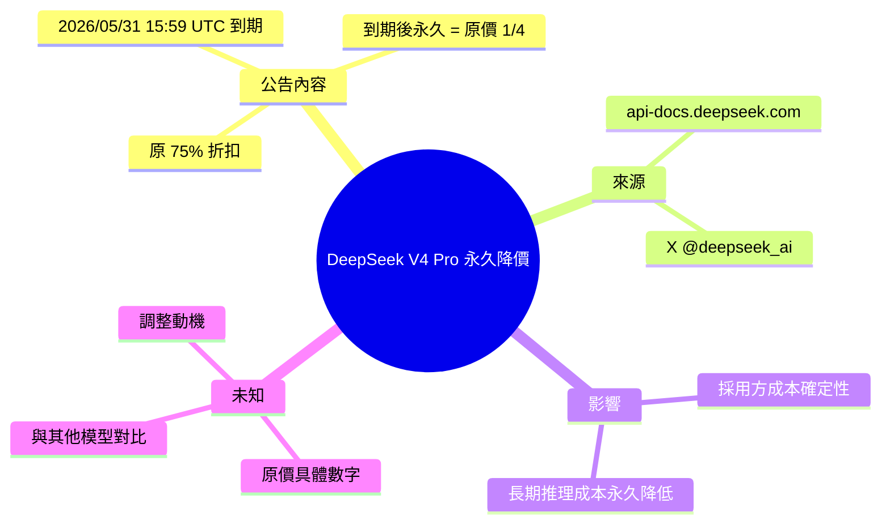

## DeepSeek makes the V4 Pro price discount permanent

DeepSeek 宣佈 deepseek-v4-pro 模型 API 定價永久調整。原有 75% 折扣在 2026 年 5 月 31 日 15:59 UTC 到期後，定價將永久下調至原價的 1/4（25%）。此舉由臨時促銷轉為永久降價政策，反映開源大型模型市場的激烈成本競爭。採用 deepseek-v4-pro API 的企業可實現長期、顯著的推理成本節省。

### 重點
- deepseek-v4-pro API 永久降至原價 25%，2026-05-31 15:59 UTC 生效
- 從 75% 臨時折扣轉為永久降價策略，反映市場競爭壓力
- 直接影響決策：使用該模型的應用程式單位成本永久降低 75%

**原文：** [hackernews](https://api-docs.deepseek.com/quick_start/pricing)

---

<!-- deep-analysis:begin -->
## 📌 摘要 (TL;DR)

- DeepSeek 官方宣佈 `deepseek-v4-pro` API 定價永久調整為原價 1/4（即 25%），等同永久維持 75% 折扣
- 原 75% 折扣促銷於 2026/05/31 15:59 UTC 結束，結束後直接轉為永久新價，不再回到原價
- 消息來源：DeepSeek 官方 X 帳號（@deepseek_ai）公告與 api-docs.deepseek.com 定價頁第 (3) 條
- 對企業用戶意義：採用 `deepseek-v4-pro` 推理成本永久降低 75%，無需擔心促銷到期後成本暴增
- 反映開源大型模型市場價格戰持續加劇，DeepSeek 將臨時促銷直接轉為永久降價

## 🎯 核心概念

- **deepseek-v4-pro**：DeepSeek 第四代 Pro 級模型 API
- **永久降價（permanent price adjustment）**：原本是限時 75% off 促銷，現轉為長期 list price

## 📖 整理分析

### 1. 公告原文要點

DeepSeek 定價頁第 (3) 條明示：`deepseek-v4-pro` 模型 API 定價將於 2026/05/31 15:59 UTC「75% 折扣促銷」結束後，正式調整為原價的 1/4。換言之，促銷不是「結束」而是「轉正」——折扣價變成新的標準價。

### 2. 從促銷到永久的政策轉變

原始來源（DeepSeek 定價頁 + X 公告 status/2057854261699195173）僅揭露價格機制本身，未說明調整原因。可確認事實：折扣期間價格與後續永久價格相同，使用者體驗上不會出現「促銷到期成本跳升」的痛點。

### 3. 對採用方的成本影響

企業若已基於促銷期定價試算 `deepseek-v4-pro` 的單位推理成本，原本需考慮 2026/05/31 後成本是否會回升 4 倍。此公告消除該不確定性，採用方可將促銷價直接寫入長期成本模型。

### 4. 原文未提及的內容（避免推測）

原始 inbox 內容僅一句話，未提供：原價數字、折扣後具體 $/M tokens、與 DeepSeek-V3 或其他 V4 變體（如 v4-lite）的比較、調整背後的商業策略說明。任何具體數字需直接查閱 api-docs.deepseek.com/quick_start/pricing。

## 🧠 Mindmap

<!-- deep-analysis:end -->
### 📄 原文內容

點此展開 / 收合

&gt; (3) The deepseek-v4-pro model API pricing will be officially adjusted to 1&#x2F;4 of the original price after the 75% discount promotion ends on 2026&#x2F;05&#x2F;31 15:59 UTC. https:&#x2F;&#x2F;x.com&#x2F;deepseek_ai&#x2F;status&#x2F;2057854261699195173

