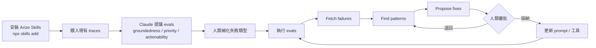
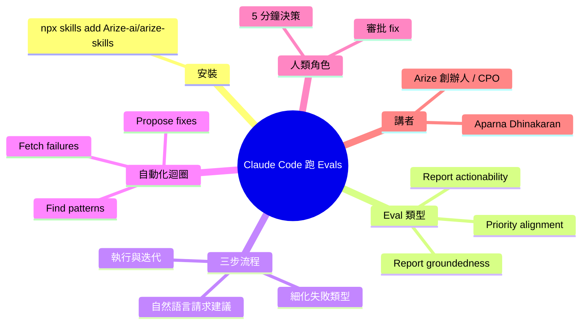

## How to Run Evals in Claude Code with Aparna Dhinakaran, Founder and CPO of Arize

Aparna Dhinakaran（Arize CPO/創始人）演示如何在 Claude Code 中快速建立 LLM agent 評估。核心 3 步流程：(1) 安裝 Arize Skills (`npx skills add Arize-ai/arize-skills`)；(2) 用自然語言請求 eval 建議，Claude 分析 traces 並提議如「Report groundedness」/「Priority alignment」/「Report actionability」；(3) 細化具體問題讓 Claude 識別失敗類型。配合自動化循環（Fetch failures → Find patterns → Propose fixes），從手工 trace 分析轉變為 Agent 夜間生成優先級報告、PM 5 分鐘審查。關鍵是保留人類審批權。

### 重點
- 3 步快速建立 evals：安裝 Arize Skills + 自然語言請求建議 + 細化問題，從 v0 到可用 eval 僅需分鐘級
- Claude 自動識別 eval 類型如「Report groundedness」（源數據驗證）、「Priority alignment」（排序準確性）、「Report actionability」（同日可用性）
- 工作流變革：手工 trace 分析（週級耗時）→ Agent 夜間生成優先級報告、PM 5 分鐘審查，人類審批保留

**原文：** [substack-product-growth](https://www.news.aakashg.com/p/aparna-dhinakaran-podcast)

---

<!-- deep-analysis:begin -->
## 📌 摘要 (TL;DR)

- Arize 創辦人兼 CPO Aparna Dhinakaran 示範如何在 Claude Code 內以三步流程，把 LLM agent 評估（evals）從手工 trace 分析壓縮到分鐘級。
- 核心安裝指令：`npx skills add Arize-ai/arize-skills`，將 Arize Skills 注入 Claude Code 環境。
- 用自然語言請 Claude 讀 traces 並提議 eval，範例輸出包含 Report groundedness、Priority alignment、Report actionability 三類評估。
- 進一步可建立自動化迴圈「Fetch failures → Find patterns → Propose fixes」，由 agent 夜間跑、PM 早上花 5 分鐘審核。
- 關鍵設計原則：自動化生成 + 人類審批（human-in-the-loop），不放棄最終決策權。

## 🎯 核心概念

- **評估（evals）**：對 LLM / agent 輸出進行系統化打分，用以偵測失敗類型與品質回歸。
- **追蹤資料（traces）**：agent 在執行過程中產生的逐步呼叫紀錄，是 eval 的輸入來源。
- **Arize Skills**：Arize 釋出的 Claude Code skill package，封裝 eval 建立、執行與分析的命令。
- **Groundedness**：輸出是否有根據（檢索/上下文）支撐，而非模型幻覺。
- **Actionability**：報告或回覆是否提供使用者可採取的具體行動。

## 📖 整理分析

### 1. 為什麼把 evals 放進 Claude Code

傳統做法是工程師或 PM 手工抽 trace、人眼判讀失敗模式，週期長且難規模化。Aparna 主張把 eval 設計交給 Claude Code：開發者用自然語言描述產品意圖，由 agent 讀現有 traces 後反向提議要評估什麼，把「想出評估指標」這一步從人轉移到模型。

### 2. 三步建置流程

第一步安裝：`npx skills add Arize-ai/arize-skills` 將 Arize 的 skill 載入 Claude Code。第二步請求建議：以自然語言例如「幫我看這些 traces，提議該跑哪些 evals」，Claude 會回傳如 Report groundedness、Priority alignment、Report actionability 等候選項。第三步細化：對每個 eval 指定具體失敗類型（例如「報告是否引用了不存在的資料來源」），Claude 將其轉成可執行的判別邏輯。

### 3. 自動化迴圈：Fetch → Pattern → Fix

建好 evals 後，可串成夜間排程：Fetch failures 拉取失敗樣本、Find patterns 由 agent 對失敗做聚類與歸因、Propose fixes 提出 prompt 或工具修改建議。PM 早上開啟報告，5 分鐘決定要不要採納，等於把 eval 工程師的常規工作量從天級壓到分鐘級。

### 4. 人類審批的設計理由

演講強調最終 fix 必須經人類審核，原因有二：一是 agent 仍會誤判失敗模式或誤歸因；二是 prompt 改動會影響全體用戶體驗，需人類為產品方向背書。自動化負責生成候選，人類負責收斂決策，是這套流程的分工底線。

### 5. 對 PM 與工程團隊的意義

對 PM：不需寫程式即可發起 eval、看報告。對工程：減少寫 eval boilerplate，把時間放在處理 agent 提出的 root cause 而非搜尋 root cause。對 Arize：把自身 observability 平台與 Claude Code 的 skill 系統綁定，建立分發通路。

## 🧭 流程圖

## 🧠 Mindmap

<!-- deep-analysis:end -->
### 📄 原文內容

點此展開 / 收合

Here's the exact prompts and steps to build evals in minutes

