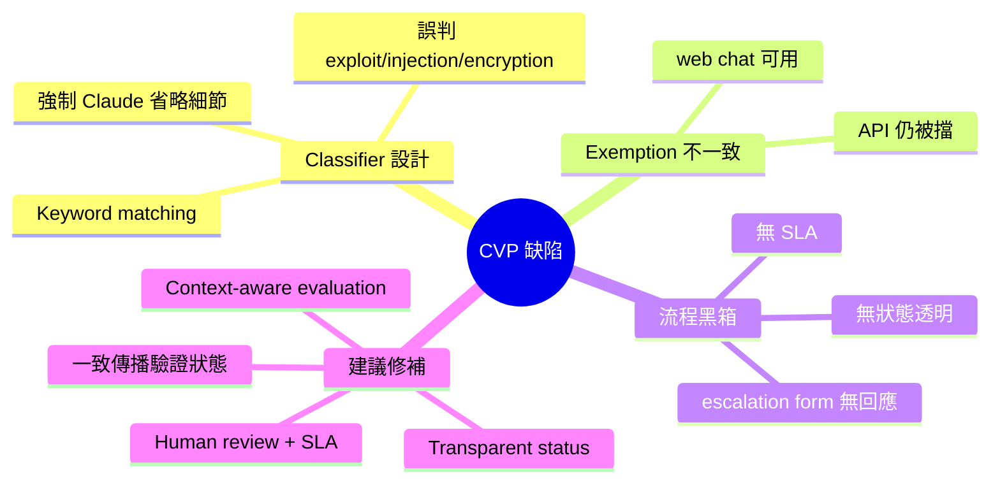

## Anthropic's Broken Cyber Verification Program

Anthropic CVP（Cyber Verification Program）用於讓安全研究人員使用 Claude Opus 4.7 的方案存在多項設計缺陷。Safeguard classifier 採用無上下文的 keyword matching（而非語義評估），誤判技術術語如「exploit」、「injection」、「encryption」；CVP 批准在 web chat 生效但在 API 無效，表明批准信號未一致傳播；escalation form 無回應且無 SLA；classifier 甚至強制 Claude 省略關鍵細節以避免被標記。建議引入 context-aware evaluation、consistent exemption propagation、human review with SLAs、transparent status communication。

### 重點
- Safeguard classifier 用 keyword matching 無上下文，導致技術術語被誤判為危害內容
- CVP 批准在 web chat 有效但 API 無效，exemption 信號傳播不一致
- Escalation form 無回應機制、無發佈的 SLA、無個人帳戶層級的可見行動

**原文：** [medium-tag-claude](https://medium.com/@its.lagus_66214/anthropics-broken-cyber-verification-program-c8c630820fd6?source=rss------claude-5)

---

<!-- deep-analysis:begin -->
## 📌 摘要 (TL;DR)

- Anthropic 推出 **Cyber Verification Program（CVP）**，目的是讓通過驗證的安全研究人員能用 Claude Opus 4.7 處理攻防研究相關內容，但實作上存在多項結構性缺陷。
- Safeguard classifier 採用**無上下文的關鍵字比對（keyword matching）**而非語義評估，導致 `exploit`、`injection`、`encryption` 等正常技術術語被誤判。
- CVP 的批准狀態**只在 web chat 生效，API 無效**，顯示批准信號未一致傳播到所有產品入口。
- Escalation form（申訴表單）無回應、無 SLA，研究人員被卡住卻找不到人。
- Classifier 甚至會**強制 Claude 在輸出時省略關鍵技術細節**以避開自身觸發，反而破壞了 CVP 應該提供的價值。
- 作者主張 Anthropic 應導入：context-aware evaluation、consistent exemption propagation、human review with SLAs、transparent status communication。

## 🎯 核心概念

- **Cyber Verification Program (CVP)**：Anthropic 設計給已驗證安全研究人員使用 Claude 處理 offensive security 內容的白名單方案。
- **Safeguard classifier**：在 prompt / response 上跑的安全分類器，用來判斷請求是否違反 usage policy。
- **Context-aware evaluation**：依語境（誰在問、為什麼問、上下文）而非單一字面詞判定風險的評估方式。
- **Exemption propagation**：把使用者已通過 CVP 驗證這件事一致地帶到 web、API、各產品端。

## 📖 整理分析

### 1. 分類器只看字面，不看語境
作者指出 Anthropic 目前的 safeguard classifier 在判定危險內容時，採用近似 keyword matching 的方式。像 `exploit`、`injection`、`encryption` 這類在資安研究中是日常用語的詞，會被當成違規訊號攔下。對於做漏洞研究、紅隊演練或寫 writeups 的使用者來說，這等於把整個專業領域的詞彙都列入黑名單。

### 2. CVP 批准只在 web chat 生效，API 無效
根據摘要，研究人員即使通過 CVP 驗證，在 web 介面可以順利使用 Claude Opus 4.7，但**同樣的帳號**透過 API 呼叫時仍然會被分類器擋下。這代表 Anthropic 內部的 exemption 狀態沒有一致傳播到所有產品入口，CVP 的「驗證」效力被切成兩半。

### 3. Escalation 流程沒有回應與 SLA
當研究人員遇到誤判想申訴，CVP 提供的 escalation form 並沒有承諾的回應時間，也沒有後續可追蹤的狀態。摘要指出表單「無回應、無 SLA」，使用者被卡住時找不到人類介入。對於以信任為核心的驗證制度而言，這是制度面的破口。

### 4. 分類器反過來逼 Claude 自我審查到失去價值
更弔詭的是，classifier 為了避免自身被觸發，會迫使 Claude **省略關鍵技術細節**。也就是說，即使請求合法、使用者已驗證，模型輸出仍會被裁切到無法回答原本的研究問題。CVP 名義上開放，實際上 deliverable 已被閹割。

### 5. 作者提出的修補方向
摘要列出四項建議：
- **Context-aware evaluation**：以語境、使用者身分判斷，而非單詞觸發。
- **Consistent exemption propagation**：CVP 驗證一旦核可，必須同時在 web chat 與 API 生效。
- **Human review with SLAs**：escalation 必須有人看、有時限。
- **Transparent status communication**：使用者要能看到自己的驗證狀態、案件進度、被擋下的原因。

## 🧠 Mindmap

<!-- deep-analysis:end -->
### 📄 原文內容

點此展開 / 收合

# Anthropic&#x2019;s Cyber Verification Program Is Broken &#x2014; And the Security Community Needs to Say So Continue reading on Medium »

