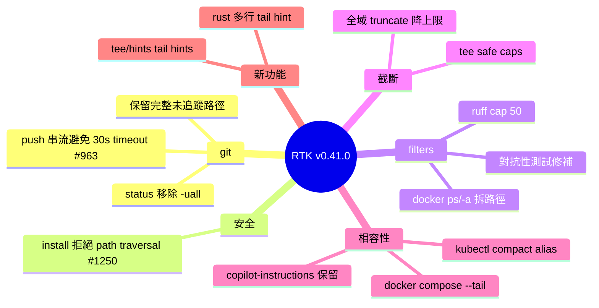

## v0.41.0

RTK v0.41.0 是一次重要維護發佈，共修複 20+ 項 bug 與新增多項功能。最關鍵改進是將 git push 改為串流輸出，避免大型操作中遇到的 30 秒超時問題（issue #963）。另移除 git status 的 -uall 標誌，防止輸出尺寸超過限制。新增尾部提示功能、改進激進過濾機制、強化 Docker/Kubernetes 相容性。重要安全修複：拒絕含路徑穿越的存檔提取（issue #1250），防止被惡意檔案利用。

### 重點
- Git push streaming：改用串流輸出避免 30 秒超時（#963，commit d6c5647）
- Git status -uall 移除：防止輸出超過原始大小限制（commit 7753e48）
- 路徑穿越安全修複：拒絕包含目錄遍歷的存檔提取（#1250，commit e827184）

**原文：** [rtk-releases](https://github.com/rtk-ai/rtk/releases/tag/v0.41.0)

---

<!-- deep-analysis:begin -->
## 📌 摘要 (TL;DR)

- RTK v0.41.0（2026-05-22 發佈）為維護版本，集中修補 20+ bug，涵蓋 git、filters、docker、kubectl、install 等模組
- 關鍵修復：`git push` 改用 `FilterMode::Streaming` 串流輸出（issue #963），解決大型 push 觸發的 30 秒超時假象
- 安全修復：`install` 在解壓前拒絕含路徑穿越（path traversal）的存檔（issue #1250），堵住惡意 archive 利用路徑
- 功能新增：tee 與 hints 加上尾部提示（tail hints），多行 rust 區塊支援 tail hint
- 容量控制：`git status` 移除 `-uall`、tee 加上安全截斷上限（safe truncation caps）、全域上限調降避免 underflow 與 0 結果

## 🎯 核心概念

- **RTK** (Rust Token Killer)：Claude Code 的 CLI proxy，攔截常見 dev 指令並重寫輸出以節省 60–90% token
- **激進過濾**（aggressive filtering）：對輸出量大的指令（如 `docker ps`、`ruff`）動態裁切；本版修補對抗性 test-suite 找出的洩漏
- **路徑穿越**（path traversal）：archive 內含 `../` 條目可寫到解壓目錄外，標準 zip-slip 攻擊向量
- **FilterMode::Streaming**：RTK 過濾管線的串流模式，不等待整個輸出完成即逐段轉發

## 📖 整理分析

### 1. git push 超時根因修復

舊版 `git push` 走 buffered 模式，大型 push（多 commit / LFS / 慢網路）在 RTK 內部累積輸出超過 30 秒被判定 timeout，但底層 git 仍在跑。改走 `FilterMode::Streaming`（commit `d6c5647`、`be51783`），輸出逐 chunk 送出，timer 隨活動重置，避免假超時。對應 issue #963。

### 2. git status 輸出爆量修復

移除 compact status 的 `-uall` flag（commit `7753e48`）。`-uall` 會列出未追蹤目錄內每個檔案，在 node_modules / target 等大型目錄會讓輸出量超過 raw `git status` 本身，違反 RTK「壓縮後不得比原始大」的不變式。同時保留完整路徑與未追蹤檔案顯示（`3ba1634`），避免過度裁切。

### 3. 安裝器路徑穿越防護（#1250）

`install` 解壓前先掃描 archive entry，遇到含 `..` 或絕對路徑的條目直接拒絕（commit `e827184`）。屬於 zip-slip 類防護，避免攻擊者透過惡意 tar/zip 寫到 `~/.bashrc` 等任意路徑。Pre-extraction check 比 post-write 驗證安全，避免部分檔案已落地才失敗。

### 4. 激進過濾的對抗性修復

Filters 模組多筆 commit（`62fc0e0`、`90c285c`、`f21b864`、`f6b28c2`）回應對抗性 test-suite 發現的洩漏。具體改動：
- `docker ps` 與 `docker ps -a` 拆成獨立路徑處理（兩者欄位寬度不同）
- `ruff` 違規上限 cap 在 50 條，避免大型 lint 報告吞 context
- 新增 aggressive filter batch fix 的回歸測試

### 5. tee 與截斷安全上限

tee 模組加上 safe truncation caps（`548e4dd`、`15a0d2e`），避免截斷邏輯在邊界輸入下產生負數或空結果。全域 truncate caps 調降（`d5a1731`），明確點出修前會 underflow 或回傳 0 筆。同步補上 tee/hint 測試覆蓋。

### 6. 周邊相容性

- `docker compose logs` 正確 forward `--tail` flag（`5f1d8b0`）
- `kubectl get pods` / `get services` 加入 compact aliases（`2dd0ec9`）
- `hooks/init` 在覆寫 `copilot-instructions.md` 時保留用戶既有內容（`d108165`）
- `env python` 重新加回 noisy dir 清單（`4eefe2f`）
- Rust 多行 block 支援 tail hint（`4960630`）

## 🧠 Mindmap

<!-- deep-analysis:end -->
### 📄 原文內容

點此展開 / 收合

0.41.0 (2026-05-22) 
 Features 
 
 hints: add tail hints for tee &amp; hints + address reviews ( 46fe7c4 ) 
 
 Bug Fixes 
 
 docker: forward --tail flag in compose logs ( 5f1d8b0 ) 
=* filters: add test for aggressive filter batch fix ( f6b28c2 ) 
 filters: address adversarial test-suite findings on aggressive filtering ( 62fc0e0 ) 
 filters: aggresivity batch fix ( 90c285c ) 
 filters: split docker ps/-a paths, cap ruff violations at 50 ( f21b864 ) 
 git: drop -uall from compact status so output never exceeds raw ( 7753e48 ) 
 git: preserve full status paths and untracked files ( 3ba1634 ) 
 git: stream push output to avoid spurious 30s timeout ( #963 ) ( d6c5647 ) 
 git: stream push output via FilterMode::Streaming ( #963 ) ( be51783 ) 
 hooks/init: preserve user content in copilot-instructions.md ( d108165 ) 
 install: reject archive with path traversal before extraction ( #1250 ) ( e827184 ) 
 kubectl: compact get pods and services aliases ( 2dd0ec9 ) 
 re-add env python as noisy dir ( 4eefe2f ) 
 rust: multi-line blocks used with tail hint ( 4960630 ) 
 tee: safe truncation caps and compose-ps tee content fix ( 548e4dd ) 
 tee: safe truncation caps and tee/hint coverage ( 15a0d2e ) 
 truncate: global caps reduce (avoid underflow and 0 results) ( d5a1731 ) 
 
 
 '...' ascii to unicode, remove some comments ( 3571d52 )

