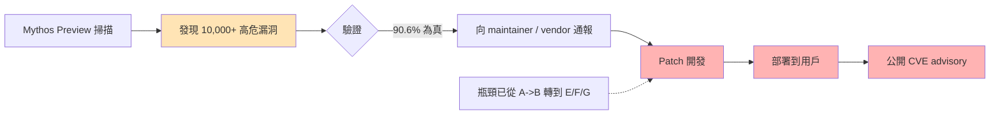
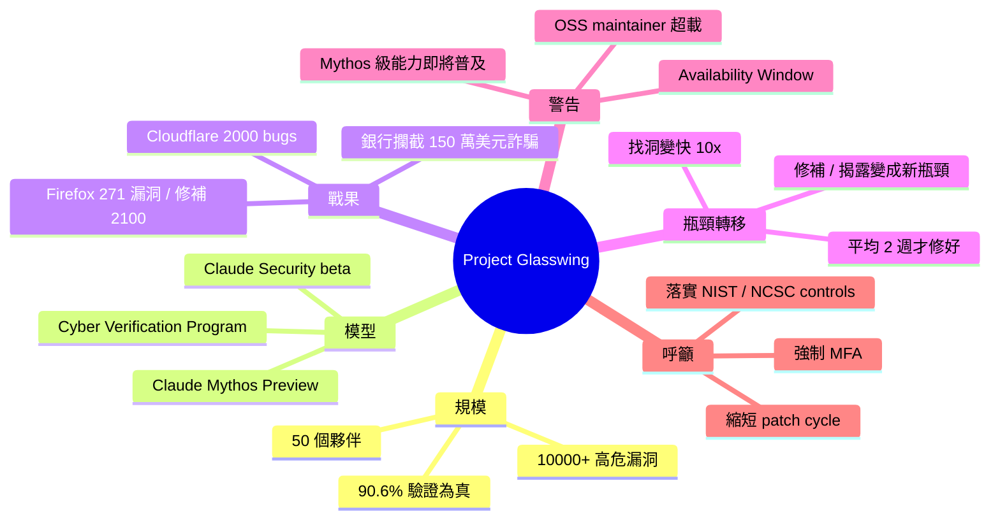

## Project Glasswing: An initial update reads like a warning shot, not a progress report

Anthropic 发布了 Project Glasswing 的初始更新。分析者指出这份更新的措辞和基调更像是一份警告声明，而非常规的项目进展报告，暗示可能涉及重要的技术洞察或战略考量。完整报告已在 Anthropic 研究网站公开发布。

### 重點
- Project Glasswing 初始更新发布
- 更新内容带有警示意味而非常规进展描述
- 可能涉及重要的技术或战略洞察

**原文：** [medium-tag-claude](https://0xrick.medium.com/project-glasswing-an-initial-update-reads-like-a-warning-shot-not-a-progress-report-77781f6e9871?source=rss------claude-5)

---

<!-- deep-analysis:begin -->
## 📌 摘要 (TL;DR)

- Anthropic 於 2026 年 5 月啟動 **Project Glasswing**，與約 50 個夥伴用 **Claude Mythos Preview** 預先找出關鍵基礎設施軟體漏洞。第一個月內掃出超過 **10,000 個高/嚴重等級漏洞**。
- 1,752 個交由獨立資安公司複驗：**90.6% 為真實漏洞**，**62.4% 為 high/critical**，夥伴整體找洞速率提升 **10 倍以上**。
- 具體戰果：Mozilla Firefox 271 個漏洞、Cloudflare 2,000 個（含 400 個 high/critical）、某銀行夥伴攔截 **150 萬美元電匯詐騙**、Firefox 三週內修補 2,100 個漏洞。
- 報告核心訊息已從「找漏洞慢」轉為「**修補與揭露慢**」——目前 530 個已通報、僅 75 個修好、65 個發 advisory，高/嚴重漏洞平均修補時間 2 週。
- Medium 作者解讀此份 update 像「警告聲明」而非進度報告：Anthropic 暗示 **Mythos 級能力的模型即將普及**，網路防禦方必須立刻縮短 patch cycle，否則攻擊方搶先利用。
- Anthropic 尚未公開釋出 Mythos 級模型，理由是 safeguards 不足，但同時警告競爭對手可能無此自制。

## 🎯 核心概念

- **Project Glasswing**：Anthropic 主導的合作專案，在「攻擊方拿到先進 AI」之前，先用 AI 找出系統性關鍵軟體中的漏洞並修補。
- **Claude Mythos Preview**：本次行動使用的內部模型，cybersecurity 能力顯著超越 Claude Opus 4.6，但尚未公開釋出。
- **Claude Security**：以 Mythos 能力為核心對外釋出的 public beta 掃描工具，能生成建議修補（限 Enterprise 客戶）。
- **Cyber Verification Program**：讓通過驗證的資安專家在合法用途下取得無 safeguard 限制的模型存取權。
- **Availability Window**：漏洞被發現、修補、部署之間的時間差，攻擊方可在此空窗利用。

## 📖 整理分析

### 1. 規模與驗證率
第一個月跨夥伴組織挖出逾 10,000 個 high/critical 漏洞；另在 1,000+ 個開源專案掃出估計 6,202 個。獨立資安公司複驗 1,752 件樣本，**90.6% 為真**、**62.4% 真為 high/critical**，照此外推 OSS 領域接近 3,900 個真實高危漏洞。Cloudflare 回報 false positive rate 與人類測試員相當——這是真正的能力跳升，不是噪音灌水。

### 2. 夥伴端具體戰果
Mozilla Firefox 找到 271 個漏洞（明顯多於用 Opus 4.6 時）；Cloudflare 2,000 個總發現中 400 個為高危；某「Partnership Bank」夥伴用 Mythos Preview 攔下一筆 150 萬美元詐騙電匯；Firefox 在三週內透過 Claude Security 修補 2,100 個漏洞。學術端，UK AI Security Institute 確認 Mythos 端到端解開兩個 cyber range；XBOW 評為「絕無前例的精確度」；ExploitBench / ExploitGym 排名第一。

### 3. 瓶頸轉移：找漏洞 → 修漏洞
報告原文點題：「軟體安全的限制已從『多快找到新漏洞』變成『多快驗證、揭露、修補』」。當前狀態：已揭露 530 個、僅 75 個修好、65 個有公開 advisory；1,129 個未驗證 bug 已直接交 maintainer，827 個已確認但等揭露。高/嚴重漏洞平均修補時間 2 週。舉例 wolfSSL CVE-2026-5194 允許憑證偽造，能撐起釣魚網站攻擊。

### 4. 三大警告
1. **Availability Window**：發現到修補的時間差 = 攻擊方的機會窗口。
2. **生態超載**：OSS maintainer 已喊話要求降低揭露速率，capacity 不夠。Anthropic 找 OpenSSF Alpha-Omega 協助分流。
3. **模型擴散**：「具備類似 Mythos 網路安全能力的模型即將更廣泛可得」——這是整份報告為何被解讀為 warning shot 的關鍵句。

### 5. 防禦面建議
對開發者：縮短 patch cycle、簡化用戶更新、善用公開 AI 模型強化自家流程。對網路防禦方：縮短 patch 測試與部署時程、落實 NIST 與 NCSC critical controls、強制 MFA、強化網路分段。Anthropic 同時開源 Cisco Foundry Security Spec 評估框架，並提供 skills、scanning harness、threat model builder 給合格團隊。

### 6. 為何讀來像「警告聲明」
Medium 作者 0xrick 的解讀重點：這份 update 沒在炫耀「我們很棒」，而是在告訴防守方「**時間不多了**」。Anthropic 自陳尚未公開釋出 Mythos 級模型（safeguards 不足），但暗示競爭對手未必會等——換言之，這份報告是要把整個生態系從「能找多少」推到「能修多快」的緊迫感對齊。

## 🧭 流程圖：漏洞處理 pipeline 與當前瓶頸

紅色節點 = Anthropic 標示的真正瓶頸；黃色 = 已被 AI 大幅加速。

## 🧠 Mindmap

<!-- deep-analysis:end -->
### 📄 原文內容

點此展開 / 收合

Read the full report here: https://www.anthropic.com/research/glasswing-initial-update Continue reading on Medium »

