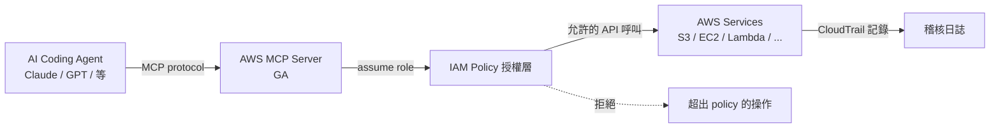
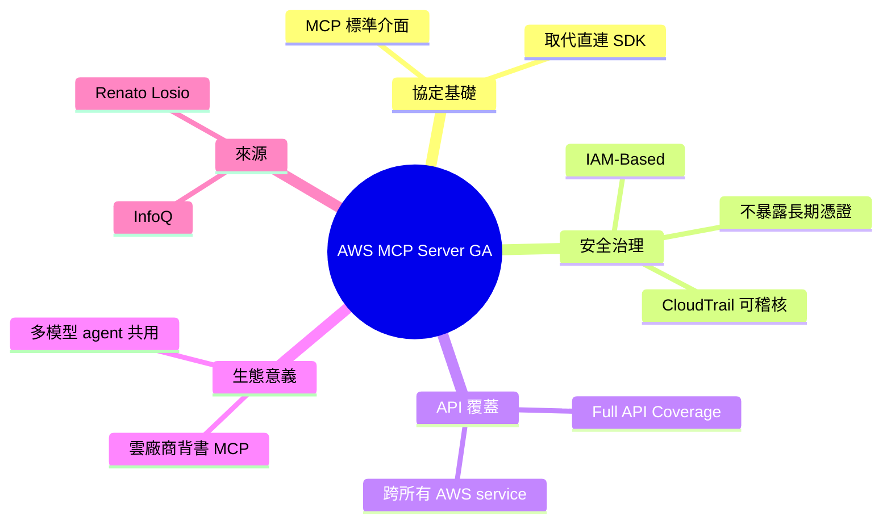

## AWS MCP Server Reaches GA with Full API Coverage and IAM-Based Governance

AWS 正式發佈 Model Context Protocol (MCP) Server，為 AI coding agents 提供對 AWS APIs、文檔和操作工作流的受控訪問。核心創新是採用 IAM 為基礎的授權治理，避免直接洩露廣泛認證憑證，顯著提升安全性和可審計性。相比傳統 API 金鑰方式，MCP Server 通過標準化 interface 使 AI agents 能安全連接 AWS 服務。這套架構讓企業能在生產環境中放心部署 AI agents，同時保持細粒度的權限控制。

### 重點
- AWS MCP Server 已達成正式推出 (GA)，支援完整 AWS API 覆蓋
- 採用 IAM 為基礎的授權模型，相比寬泛 API 金鑰授權安全性更高
- 標準化 interface 讓 agents 無須額外認證管理即可安全連接 AWS 服務

**原文：** [infoq-main](https://www.infoq.com/news/2026/05/aws-mcp-ga/?utm_campaign=infoq_content&utm_source=infoq&utm_medium=feed&utm_term=global)

---

<!-- deep-analysis:begin -->
## 📌 摘要 (TL;DR)

- AWS 正式發佈受管的 Model Context Protocol（MCP）Server，進入 GA（generally available）階段，為 AI coding agents 提供存取 AWS APIs、文檔與操作工作流的標準介面。
- 核心治理機制採用 IAM-Based Governance，取代過去把廣泛憑證直接交給 agent 的做法，提升可審計性（auditable）與安全性。
- 涵蓋完整 API 範圍（Full API Coverage），讓 AI agent 能透過單一標準介面操作 AWS 服務，而非各服務各接一套 SDK。
- 文章作者為 Renato Losio，刊載於 InfoQ。

## 🎯 核心概念

- **模型情境協定**（Model Context Protocol，簡稱 MCP）：標準化介面，讓 AI agent 連接外部工具、API 與資料來源。
- **IAM-Based Governance**：以 AWS Identity and Access Management 為授權基礎，agent 的每次操作都受 IAM policy 約束，而非繞過權限直接呼叫 API。
- **GA**（Generally Available）：服務脫離 preview / beta，AWS 正式提供 SLA 與生產支援。

## 📖 整理分析

### 1. 為什麼需要 MCP Server
過去 AI coding agent 接 AWS 通常要拿到一組長期 access key 或範圍過大的角色憑證，agent 一旦被 prompt injection 或誤用，就能對整個 account 做任意操作。MCP Server 把這層介接收斂成單一 protocol endpoint，agent 不再直接持有底層憑證。

### 2. IAM 治理層的角色
AWS 將授權邏輯掛回 IAM——agent 的身份對應到 IAM principal，policy 決定它能呼叫哪些 API、操作哪些資源。對 enterprise 而言，這代表 MCP 互動可被 CloudTrail 記錄、用既有 IAM 工具稽核，沿用熟悉的最小權限模型。

### 3. Full API Coverage 的意義
MCP Server 並非只暴露幾個熱門服務，而是覆蓋 AWS API 全集。AI agent 可呼叫 S3、EC2、Lambda、IAM 自身等任何 AWS service，能力與 AWS CLI / SDK 對等，差別在於走 MCP 標準。

### 4. 對 AI agent 生態的影響
Anthropic 提出的 MCP 自 2024 年起逐步被各大雲廠商採納。AWS 進入 GA 是雲端巨頭正式背書這套協定的關鍵訊號，意味多模型（multi-model）agent（Claude、GPT、Gemini）可用同一套介面操作 AWS，不必各自客製 connector。

### 5. 來源限制說明
原文為 InfoQ 新聞短訊，body 內容僅含標題與兩句導語，未揭露具體 pricing、region 可用性、支援 IAM policy 範例或 benchmark 數據。以上分析依據標題、summary_zh 與導語推導，未引用未公開細節。

## 🧭 架構示意

## 🧠 Mindmap

<!-- deep-analysis:end -->
### 📄 原文內容

點此展開 / 收合

AWS has recently made its managed Model Context Protocol (MCP) server generally available, giving AI coding agents controlled access to AWS APIs, documentation, and operational workflows through a standard interface. It provides a safer and more auditable way to connect AI agents to AWS services without handing over broad credentials. By Renato Losio

