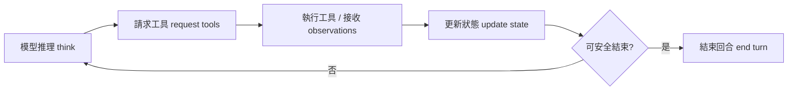
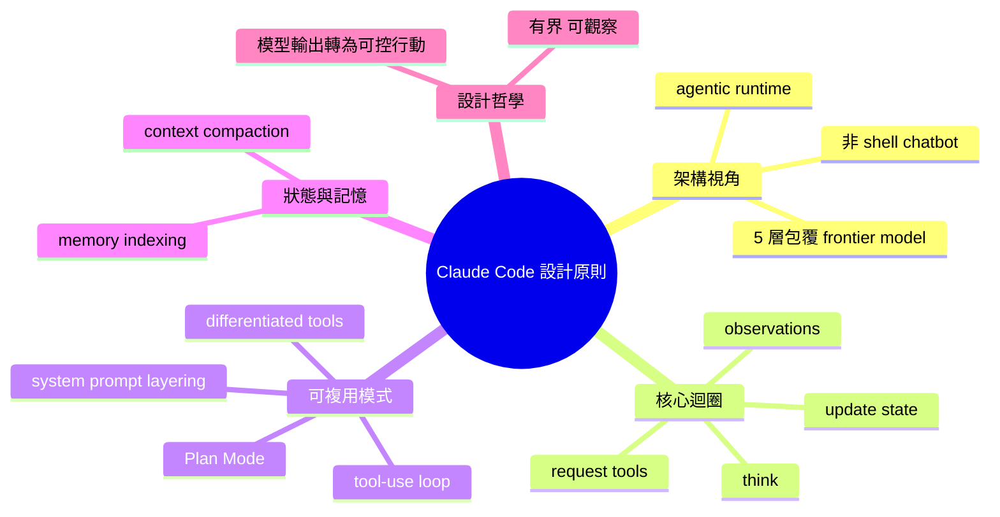

## Inside Claude Code: Design Principles of a Powerful Agent

Yan Xu 分析 Claude Code 內部設計，揭示其核心迴圈（模型推理 → 請求工具 → 接收觀察 → 狀態更新 → 重複）與策略執行層、記憶管理、context 引擎等組件。設計哲學強調「將語言模型輸出轉化為可控行動」。文章提煉可複用的架構模式：工具使用迴圈、Plan Mode（分離規劃與執行避免 context 崩塌）、系統提示分層、差異化工具設計、記憶索引、context 壓縮。這些原則適用於開發者自建 agents，將「模型意圖轉為有界、可觀察」的行動。

### 重點
- Claude Code = agentic runtime：核心迴圈（推理→工具→觀察→狀態更新）+ 策略層 + 記憶管理 + context 引擎
- Plan Mode 分離規劃與執行，避免 context 崩塌；系統提示分層與記憶索引提升控制力
- 可複用設計模式適用於任何 agent：工具迴圈、context 壓縮、差異化工具設計

**原文：** [medium-tag-claude](https://medium.com/@YanAIx/inside-claude-code-design-principles-of-a-powerful-agent-d36a8bed5ada?source=rss------claude-5)

---

<!-- deep-analysis:begin -->
## 📌 摘要 (TL;DR)

- 作者 Yan Xu 將 Claude Code 重新定義為「代理式編碼執行環境（agentic coding runtime）」，而非單純的 shell chatbot。
- 核心觀點：Claude Code 的效能來自一整套有紀律的架構設計，而非單一創新。
- 系統運作迴圈：模型思考 → 請求工具 → 接收觀察結果（observations）→ 更新狀態 → 重複，直到能安全結束回合。
- 文章提出 6 個可複用設計原則：工具使用迴圈、Plan Mode、系統提示分層、差異化工具、記憶索引、context 壓縮。
- 對自建 agent 的開發者：把「模型意圖」變成「有界、可觀察的行動」是關鍵原則。

## 🎯 核心概念

- **代理式編碼執行環境**（agentic coding runtime）：一個由迴圈、策略層、工具系統、記憶系統、context 管理引擎包覆在 frontier model 外圍的整體。
- **工具使用迴圈**（tool-use loop）：模型推理與工具執行之間的反覆循環。
- **Plan Mode**：將規劃（planning）與執行（execution）分離的結構化任務拆解模式。
- **系統提示分層**（system prompt layering）：階層化組織指令的方式。
- **差異化工具**（differentiated tools）：依用途分類的專用工具集合。
- **記憶索引**（memory indexing）：有組織的資訊存取機制。
- **Context 壓縮**（context compaction）：有效管理對話歷史以延長有效 context 視窗。

## 📖 整理分析

### 1. 從 chatbot 到 agentic runtime 的視角轉換

作者開篇即拒絕「Claude Code 等於有 shell 權限的聊天機器人」的看法。他主張正確的心智模型應是：一個 frontier model 外面包了 5 層架構——迴圈、policy layer、工具系統、記憶系統、context 引擎。這個視角轉換決定了後續所有設計推論。

### 2. 工具使用迴圈是骨幹

文中描述的核心執行模式為「think → request tools → receive observations → update state → repeat until safe to end」。每一步輸出都被視為「狀態轉移」而非「文字生成」，這也是把語言模型輸出轉化為可控行動（controllable action）的關鍵：每次模型發話都對應一次可觀察、可審計的工具呼叫。

### 3. Plan Mode 分離規劃與執行

Plan Mode 是文中強調的可複用模式之一。其價值在於將「規劃 context」與「執行 context」拆開，避免長任務（long-horizon task）期間單一 context 視窗被執行細節塞爆、導致規劃意圖喪失（context collapse）。對自建 agent 來說，這是處理多步驟任務最直接的架構解法。

### 4. 系統提示分層與差異化工具

作者列出「system prompt layering」與「differentiated tools」兩項原則。前者意指指令以階層方式組織（例如：全域守則 → 任務 prompt → 工具呼叫指引），讓 agent 在不同情境下取用合適規則。後者意指工具不是萬用一把抓，而是按用途切分（例：讀檔、編輯、執行、搜尋各自獨立），降低模型誤用機率與 token 成本。

### 5. 記憶索引與 Context 壓縮

兩者一起解決 agent 的「長期 + 短期」記憶問題。記憶索引提供結構化檢索（不是把所有歷史塞 prompt）；context 壓縮則在 context window 接近上限時主動摘要、丟棄低訊號內容。這兩項是 Claude Code 能跨多輪、多工具呼叫保持一致行為的工程基礎。

## 🧭 流程圖

## 🧠 Mindmap

<!-- deep-analysis:end -->
### 📄 原文內容

點此展開 / 收合

Most discussions about Claude Code begin with the visible experience: a developer opens a terminal, asks for help, and watches an AI&#x2026; Continue reading on Medium »

