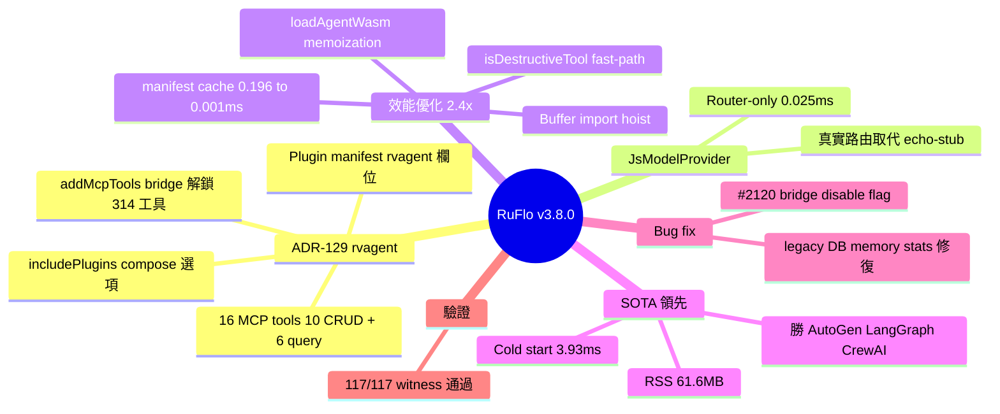

## v3.8.0 — ADR-129 rvagent full integration

RuFlo v3.8.0 實現 ADR-129 rvagent 完整整合，新增 16 個 MCP 工具（10 CRUD + 6 query），透過 wasm_agent_compose with addMcpTools bridge 解鎖全部 314 個 MCP 工具供 WASM agent 使用。性能實現 2.4× 改進（compose_50_tools 從 0.351ms 降至 0.146ms），冷啟動僅 3.93ms 遠領先 AutoGen (185ms)、LangGraph (534ms)、CrewAI (2527ms)；RSS 記憶佔用 61.6MB vs CrewAI 265.7MB。JsModelProvider 實現真實路由替代 echo-stub，Plugin 合約支持 rvagent 欄位。5 項生產效能優化：manifest cache (0.196ms → 0.001ms)、isDestructiveTool fast-path、Buffer import hoisting、loadAgentWasm() memoization。

### 重點
- wasm_agent_compose 性能 2.4× 改進 (0.351ms → 0.146ms)；冷啟動 3.93ms vs AutoGen 185ms / LangGraph 534ms / CrewAI 2527ms；RSS 61.6MB vs CrewAI 265.7MB
- 16 個新 MCP 工具 + 314 個全部 MCP 工具解鎖予 WASM agents；JsModelProvider 真實路由；Plugin 合約新增 rvagent 欄位
- 5 項生產效能優化：manifest cache 21 工具開銷降 0.196ms → 0.001ms；isDestructiveTool 後綴快速路徑；Buffer import hoisting；loadAgentWasm() 模組級 memoization

**原文：** [ruflo-releases](https://github.com/ruvnet/ruflo/releases/tag/v3.8.0)

---

<!-- deep-analysis:begin -->
## 📌 摘要 (TL;DR)

- RuFlo v3.8.0 落地 ADR-129，rvagent 完整整合進 WASM agent 體系（PR #2123）
- 新增 16 個 MCP 工具（10 CRUD + 6 查詢），透過 `wasm_agent_compose` 的 `addMcpTools` bridge 把全部 314 個 MCP 工具開放給 WASM agent 使用
- `JsModelProvider` 改用真實 provider 路由，取代原本 echo-stub bypass；Plugin manifest 新增 `rvagent` 欄位、compose 支援 `includePlugins`
- 4 項熱路徑優化讓 `compose_50_tools` 從 0.351ms 降到 0.146ms（**2.4× 加速**）
- SOTA 對比：冷啟動 3.93ms，遠快於 AutoGen 185ms、LangGraph 534ms、CrewAI 2527ms；RSS 僅 61.6MB（CrewAI 265.7MB）
- 修掉 #2120：`getBridge()` 現在會尊重 `CLAUDE_FLOW_DISABLE_BRIDGE=1`，解決 legacy-DB status backfill 導致 memory stats 報 0 的 regression

## 🎯 核心概念

- **rvagent**：RuFlo 的 WASM agent runtime 抽象，這版正式合約化進 plugin manifest
- **MCP**（Model Context Protocol）：跨工具/agent 的標準介接層；本版透過 bridge 讓 WASM agent 也能呼叫全部 314 個工具
- **wasm_agent_compose**：把 MCP 工具集打包注入 WASM agent 的組合函式，本次熱路徑優化主戰場
- **JsModelProvider**：JS 端模型 provider 抽象；之前是 echo-stub，現在做真實路由
- **SOTA comparator**：對比 LangGraph 1.2.1 / AutoGen 0.4.9 / CrewAI 0.80.0 的基準矩陣（PR #2124）

## 📖 整理分析

### 1. ADR-129：rvagent 全鏈整合
PR #2123 把 rvagent 從原型推到完整合約。新增 16 個 MCP 工具分兩組：10 個 CRUD 管 WASM agent gallery，6 個查詢做 introspection。關鍵橋接是 `wasm_agent_compose` 的 `addMcpTools`——這條 bridge 讓 WASM agent 端可以呼叫宿主側全部 314 個 MCP 工具，等於把 WASM sandbox 接到完整工具生態。Plugin manifest 多了 `rvagent` 欄位，compose API 收 `includePlugins` 參數，正式把 plugin 系統綁進 agent 組裝流程。

### 2. JsModelProvider 真實路由
舊版用 echo-stub bypass 模型呼叫（測試方便但不能上 prod），這版換成真實 provider routing。Benchmark 顯示 router-only 路徑（fake key、不打外部）僅 0.025ms，純路由開銷可忽略。

### 3. 熱路徑效能優化（4 項）
全在 `wasm-agent-tools.ts`：
- **Plugin manifest cache**：21 個 plugin 的解析從 0.196ms 降到 0.001ms（~200× 加速單點）
- **`isDestructiveTool` fast-path**：先做 suffix check，命中就不跑 8 條 regex 全套
- **Buffer import 提升到模組頂層**：消除每次呼叫 `await import('node:buffer')` 的 microtask 開銷
- **`loadAgentWasm()` memoization**：用 module-level promise singleton 共享給 20 個 MCP handler

累積效果：`compose_50_tools` 0.351ms → 0.146ms，2.4× 改進。

### 4. SOTA 基準對比
PR #2124 跑 darwin-arm64 + linux-x64 矩陣對比業界框架：

| Dimension | ruflo | AutoGen | LangGraph | CrewAI |
|---|---|---|---|---|
| Cold start | **3.93ms** | 185ms | 534ms | 2527ms |
| Single turn | **0.012ms** | 6.13ms | 37.1ms | proxy† |
| N=10 parallel | **1.27ms** | 61ms | 393ms | proxy† |
| RSS | **61.6MB** | 78.7MB | 80.3MB | 265.7MB |

† CrewAI dispatch 走 proxy（需真實 LLM）。冷啟動領先 AutoGen 47×、LangGraph 136×、CrewAI 643×。記憶體比 CrewAI 少 4.3×。

### 5. Bug fix #2120：bridge disable flag
`getBridge()` 過去忽略 `CLAUDE_FLOW_DISABLE_BRIDGE=1`，導致 legacy DB（沒有 status column）的 status backfill 出 regression，`ruflo memory stats` 對舊 DB 一律報 0 entries。本版恢復 flag 行為。

### 6. 驗證
Witness manifest 註冊 ADR-129 P1–P4 fix 條目（`verification/witness-fixes.json`），117/117 驗證通過。其他 micro-bench：provider routing 0.025ms、compose 100 工具 0.215ms、gallery CRUD 週期 0.094ms、plugin enum miss 0.035ms（5-trial median，`bench-rvagent.mjs`）。

## 🧠 Mindmap

<!-- deep-analysis:end -->
### 📄 原文內容

點此展開 / 收合

Highlights 
 ADR-129 — Full rvagent integration (PR #2123 ) 
 
 16 new MCP tools for WASM agent gallery &amp; introspection (10 CRUD + 6 query) 
 wasm_agent_compose with addMcpTools bridge unlocking all 314 MCP tools to WASM agents 
 JsModelProvider real provider routing (replaces the echo-stub bypass) 
 Plugin contract : rvagent field on plugin manifest + includePlugins option in compose 
 
 Fixes 
 
 #2120 — getBridge() now honors CLAUDE_FLOW_DISABLE_BRIDGE=1 , fixing the legacy-DB status backfill regression that caused ruflo memory stats to report 0 entries against pre-status-column databases 
 
 Performance (PR #2124 — SOTA comparator benchmarks) 
 4 production speedups on wasm_agent_compose hot path (all in wasm-agent-tools.ts ): 
 
 Plugin manifest cache — 21-plugin overhead: 0.196ms → 0.001ms 
 isDestructiveTool fast-path — suffix check before 8-regex battery 
 Hoisted Buffer import — eliminates await import('node:buffer') microtask per call 
 Memoized loadAgentWasm() — module-level promise singleton for all 20 MCP handlers 
 
 Cumulative compose_50_tools: 0.351ms → 0.146ms (2.4× improvement) 
 Verified SOTA matrix vs LangGraph 1.2.1, AutoGen 0.4.9, CrewAI 0.80.0 on darwin-arm64 + linux-x64: 
 
 
 
 Dimension 
 ruflo 
 AutoGen 
 LangGraph 
 CrewAI 
 
 
 
 
 Cold start 
 3.93ms 
 185ms 
 534ms 
 2527ms 
 
 
 Single turn 
 0.012ms 
 6.13ms 
 37.1ms 
 proxy† 
 
 
 N=10 parallel 
 1.27ms 
 61ms 
 393ms 
 proxy† 
 
 
 RSS 
 61.6MB 
 78.7MB 
 80.3MB 
 265.7MB 
 
 
 
 † CrewAI dispatch proxied (requires real LLM). 
 Full methodology, Linux numbers, concurrency scale, v3.7→v3.8 delta: https://gist.github.com/ruvnet/298f8c668c8859b369f91734a0e9cbbe 
 Benchmarks (5-trial median, bench-rvagent.mjs ) 
 
 Provider routing: 0.025ms (fake key, router only) 
 Compose 100 tools: 0.215ms 
 Gallery CRUD cycle: 0.094ms 
 Plugin enum (absent): 0.035ms 
 
 Witness manifest — ADR-129 P1–P4 fix entries registered ( verification/witness-fixes.json , 117/117 verified) 
 Install 
 npx ruflo@latest # or @3.8.0 / @alpha / @v3alpha 
npx claude-flow@latest
npx @claude-flow/cli@latest 
 🤖 Generated with RuFlo

