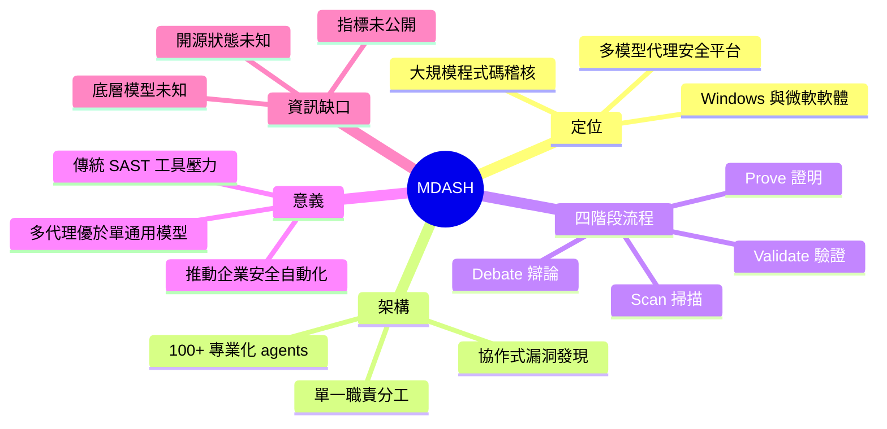

## Microsoft Introduces MDASH for Large-Scale AI Vulnerability Research

微軟發佈 MDASH（多模型代理安全平台），用於自動化 Windows 及其他微軟軟體環境的大規模代碼審計與漏洞發現。MDASH 整合 100+ 個高度特化的 AI agents，每個代理專注於特定安全檢測或驗證任務，形成協作的漏洞發現流程。系統通過掃描、驗證、辯論、證明四個階段的多輪協作，提升漏洞發現的自動化程度與準確度。該系統代表了多代理架構在安全檢測領域的實踐應用，展示了專業分工與代理協作相對於單一通用模型的優勢，為企業級複雜代碼庫的無人漏洞審計提供實務解決方案。

### 重點
- 多代理架構：整合 100+ 個特化 AI agents，分工掃描→驗證→辯論→證明漏洞
- 自動化規模：支援 Windows 及微軟軟體生態複雜代碼庫的無人審計
- 協作優勢模式：展示專業分工代理協作相對於單一通用模型在漏洞發現上的優勢

**原文：** [infoq-main](https://www.infoq.com/news/2026/05/microsoft-mdash/?utm_campaign=infoq_content&utm_source=infoq&utm_medium=feed&utm_term=global)

---

<!-- deep-analysis:begin -->
## 📌 摘要 (TL;DR)

- 微軟發佈 **MDASH**（Multi-model Agentic Security Hub / 多模型代理安全平台），鎖定 Windows 與微軟自家軟體生態的自動化大規模程式碼稽核。
- 平台整合 **100+ 個專業化 AI agents**，每個 agent 只負責單一類型的偵測或驗證任務，協作完成漏洞發現。
- 工作流程分四階段：**掃描 (scan) → 驗證 (validate) → 辯論 (debate) → 證明 (prove)**，透過多輪互審壓低誤報。
- 對企業意義：把資深安全研究員的人力負擔轉向 LLM agents，可在大型 codebase 上做近乎無人值守的漏洞挖掘。
- 體現「**多代理 + 專業分工**」的架構優勢勝過單一通用大模型的趨勢。

## 🎯 核心概念

- **MDASH**：微軟新提出的多模型代理安全平台，全名於原文僅以縮寫呈現，定位為 vulnerability discovery system。
- **代理式安全平台**（agentic security platform）：以 LLM agent 為節點、可自主決策與互相呼叫的安全研究系統。
- **多輪協作**（scan / validate / debate / prove）：四階段 pipeline，後階段 agent 對前階段輸出進行交叉驗證。

## 📖 整理分析

### 1. MDASH 的定位
微軟把 MDASH 定位為**大規模程式碼稽核自動化平台**，主要鎖定 Windows 及其他自家軟體環境。重點不是取代單一靜態分析工具，而是把整個漏洞研究流程（從找疑點到證明可利用性）拆解後丟給專業 agent 群處理。

### 2. 100+ 專業化 Agent 的分工架構
與其用一個通用大模型「什麼都做」，MDASH 採取**極度分工**：每個 agent 專注一種偵測類型或驗證子任務。這降低 prompt 複雜度、提高單點準確度，也讓 agent 之間能形成 review chain。原文未細列具體 agent 類別（例：buffer overflow、auth bypass、race condition），是值得後續關注的細節缺口。

### 3. Scan → Validate → Debate → Prove 流水線
四階段設計把「找到」與「證明」分開：
- **Scan**：廣撒網找疑點
- **Validate**：先過濾顯而易見的假陽性
- **Debate**：多 agent 對保留疑點進行辯論式互審
- **Prove**：產生可重現的證據或 PoC

「辯論」階段是亮點——讓 agent 互相挑戰彼此結論，是近年多代理系統壓低 hallucination 的常見手法。

### 4. 對企業安全研究的訊號
微軟自己做這套系統，等同對外宣告：**LLM 已可在 Windows 等級複雜度的 codebase 上做 vulnerability research**。對其他企業意味著——傳統 SAST / DAST 工具如果不導入 agent 化能力，會逐步被取代。

### 5. 原文資訊限制
本則 InfoQ 為**短訊體裁**，未揭露：模型來源（GPT/Claude/自家模型）、實際漏洞挖掘數據、誤報率、是否會開源、與 Microsoft Security Copilot 的關係。深入評估需等微軟原始論文或官方部落格。

## 🧠 Mindmap

<!-- deep-analysis:end -->
### 📄 原文內容

點此展開 / 收合

Microsoft has introduced a new AI-driven vulnerability discovery system called MDASH, a multi-model agentic security platform designed to automate large-scale code auditing across Windows and other Microsoft software environments. The system combines more than 100 specialized AI agents that work together to scan, validate, debate, and prove vulnerabilities across complex codebases. By Robert Krzaczyński

