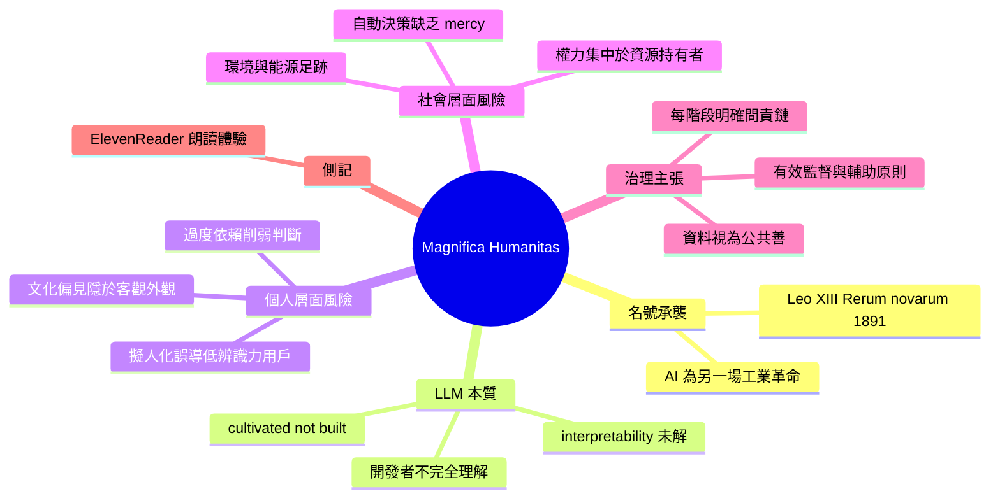

## A few notes on Pope Leo XIV's encyclical on AI

教宗 Leo XIV 發佈《Magnifica Humanitas》宣言，系統闡述 AI 時代人類尊嚴與社會正義的議題，被認為是當代最清晰的 AI 倫理文獻。宣言強調 LLM 的根本黑箱特性：這些模型被「培養」而非「設計」，開發者無法完全控制其內部機制，導致可解釋性嚴重受限（第 98 段）。指出 AI 系統反映並放大了設計者的文化偏見，通過虛假模擬人類溝通易誤導辨識力低的用戶（第 100 段）。警示自動化決策系統在就業、信貸、公共服務等關鍵領域缺乏人性同情，製造新型社會排斥（第 102 段）。強調數據應視為公共善而非私人商品，呼籲建立明確問責鏈與有效監督，確保 AI 尊重人類尊嚴並服務共同善（第 105、108 段）。

### 重點
- LLM 可解釋性困局：系統被「培養」而非「設計」，內部機制未知（第 98 段）
- 文化偏見與虛偽風險：AI 回應反映設計者偏見，虛假互動模擬誤導用戶（第 100 段）
- 數據公共善原則：數據應被管理為共享商品而非私人資產，由多貢獻者協作治理（第 108 段）

**原文：** [simon-willison](https://simonwillison.net/2026/May/25/encyclical-on-ai/#atom-everything)

---

<!-- deep-analysis:begin -->
## 📌 摘要 (TL;DR)

- 教宗 Leo XIV 發布《Magnifica Humanitas》通諭（encyclical），副標題為「論在人工智慧時代守護人之為人」，西蒙·威利森（Simon Willison）認為這是他見過關於 AI 倫理整合進現代社會「最清晰」的文獻之一。
- 教宗名號「Leo」承襲自 Leo XIII 的 1891 年《新事》（Rerum novarum）通諭——後者處理第一次工業革命下的勞資權利義務；本次 Leo XIV 明示要以同樣立場回應「另一場工業革命」即 AI。
- 第 98 段直指 LLM 可解釋性（interpretability）根本問題：現代 AI 是「被培養」（cultivated）而非「被建造」（built），開發者只搭框架、智能自己「長出來」，連設計者都不完全理解內部表徵與計算過程。
- 文件點名數項風險：訓練資料的文化偏見、擬人化溝通對辨識力低用戶的誤導（第 100 段）、自動決策缺乏「compassion, mercy, forgiveness」（第 102 段）、能源與水資源負擔（第 101 段）、權力集中於既有資源持有者（第 108 段）。
- 政策建議：問責鏈須在設計、開發、使用每一階段明確指派（第 105 段）；資料應視為公共善（common good）而非私有商品，需公共監理（第 108 段）。
- Simon 本人也順手記錄一次工具經驗：用 ElevenReader iPhone app 朗讀整份通諭，貼 URL 即可高品質朗讀並逐段高亮。

## 🎯 核心概念

- **通諭**（encyclical）：教宗對全教會發布的正式書信，本份名為《Magnifica Humanitas》。
- **被培養而非被建造**（cultivated, not built）：第 98 段對 LLM 訓練性質的描述——不是逐元件設計，而是搭框架讓智能在其中「生長」。
- **可解釋性**（interpretability）：理解模型內部表徵與決策過程的能力，文件指出目前仍屬未知領域。
- **共同善**（common good）／**公共善**：天主教社會訓導核心概念，文件主張資料應以此原則治理。
- **輔助原則**（subsidiarity）：第 108 段使用的傳統社會訓導詞，主張決策應由最貼近受影響者的層級執行。

## 📖 整理分析

### 1. 名號承襲：對標 Leo XIII《新事》

新教宗向樞機團解釋選名理由：Leo XIII 的 1891 年《Rerum novarum》在第一次工業革命脈絡下處理勞資社會問題；Leo XIV 自陳「在我們的時代，教會面對另一場工業革命與 AI 發展對人類尊嚴、正義、勞動帶來的新挑戰，同樣提出社會訓導的寶藏」。意義在於明確把 AI 治理放進天主教社會教義的延伸譜系，而非另立新框架。

### 2. 第 98 段：LLM 的根本不可知

文件以兩點開頭：(a) 任何關於 AI 的陳述都快速過時；(b) 包括設計者在內，所有人對 AI 實際運作只有有限理解。關鍵句：「current AI systems are more 'cultivated' than 'built'」——開發者不直接設計每個細節，而是建立讓「智能」生長的框架，因此內部表徵與計算過程等基礎科學問題「目前仍屬未知」。這段被 Simon 標為對 interpretability 問題最有用的官方描述之一。

### 3. 第 100 段：擬人化與輕信風險

指出 AI 個人使用中三個應審慎的面向：(1) 結果取得的容易性導致過度依賴、削弱判斷力；(2) 表面客觀性掩蓋訓練者的文化假設（cultural assumptions）；(3) 對人類正向溝通的模仿——建議、同理、友誼、甚至愛——對辨識力較低用戶會「製造與真實人格主體有關係的幻覺」。文件直言：「當話語被模擬時，它們不建立真實關係，只建立關係的外貌。」

### 4. 第 102 與 105 段：自動決策與問責鏈

第 102 段警告就業、信貸、公共服務、聲譽等「重要而敏感」決策有被完全委派給自動系統的風險，引用原句指出這些系統不知「compassion, mercy, forgiveness, and above all, the hope that people are able to change」，會製造新形式的排斥。第 105 段要求從設計者、開發者到使用者的責任鏈在每一階段都明確界定；當內部流程不透明時，accountability（可被追究、可被質疑、可被補救）變成關鍵。

### 5. 第 101 與 108 段：環境足跡與權力集中

第 101 段點名 LLM 對能源、水、運算與儲存的密集需求，呼籲更永續的技術方案。第 108 段警告 AI 放大「已擁有經濟資源、專業知識、資料存取權」者的權力，少數高度影響力的群體可能形塑資訊與消費模式、影響民主程序與經濟動態。延伸主張：資料所有權「不能單純留在私人手中」，必須適當監管，並引用聖若望保祿二世（Saint John Paul II）關於集體善的提示，把資料視為共有或共享之善（common or shared good）。

### 6. 工具側記：ElevenReader 試用

Simon 在散步遛狗時用 ElevenReader iPhone app 聽完大部分通諭：貼上文件 URL 即可高品質語音朗讀並逐段高亮。屬非主題側記但顯示一個實用工作流：長文獻 → URL 貼入 → TTS 朗讀 + 視覺同步。

## 🧠 Mindmap

<!-- deep-analysis:end -->
### 📄 原文內容

點此展開 / 收合

Dropped this morning by the Vatican: Magnifica Humanitas of His Holiness Pope Leo XIV on Safeguarding the Human Person in the Time of Artificial Intelligence . This is a very interesting document. It's some of the clearest writing I've seen on the ethics of integrating AI into modern society. 
 Pope Leo XIV chose the name Leo in honor of Pope Leo XIII, who is known for his 1891 Rerum novarum encyclical on "Rights and Duties of Capital and Labor". 
 This story on Vatican News further clarifies the significance of that decision: 
 
 Meeting with the College of Cardinals for their first formal encounter after his election, Pope Leo XIV explained part of the reason for the choice of his papal name. "There are different reasons for this," he said, before going on to explain that he chose the name Leo "mainly because Pope Leo XIII, in his historic encyclical Rerum novarum addressed the social question in the context of the first great industrial revolution." 
 "In our own day," he continued, "the Church offers to everyone the treasury of her social teaching in response to another industrial revolution and to developments in the field of artificial intelligence that pose new challenges for the defence of human dignity, justice, and labour." 
 
 And now we get Pope Leo XIV's own encyclical on the AI revolution. There's a lot in here, but the writing style is very approachable, including to non-Catholics. 
 A few of my highlights 
 (I listened to most of the encyclical on a walk with our dog, my first time trying the ElevenReader iPhone app . It worked very well: I pasted in a URL to the document and it read it to me in a very high quality voice, highlighting each paragraph as it went.) 
 Here are some of my highlights. In each case below emphasis is mine. 
 Here's a useful description of the interpretability problem for LLMs in section 98: 
 
 First, any statement regarding AI risks becoming quickly outdated, given the remarkable pace at which these systems are developing. Second, all of us, including those who design them, possess only a limited understanding of their actual functioning. Indeed, current AI systems are more “cultivated” than “built,” for developers do not directly design every detail, but instead create a framework within which the intelligence “grows.” As a result, fundamental scientific aspects — such as the internal representations and computational processes of these systems — remain, at present, unknown. 
 
 I liked section 83's description of the relationship between development and dignity: 
 
 For individuals as well as for nations, development is both a duty and a right. Minimum conditions are required for enabling every person and people to flourish in accord with their dignity, without being kept in a state of dependence or excluded from access to necessary goods. Development is truly human when it places people at the center instead of the accumulation of wealth, and when it concerns peoples as well as individuals. Justice demands the recognition of the rights of society and the rights of peoples, and includes a responsibility toward future generations. Development is not truly human if it increases consumption for some while shifting costs and burdens onto others, or relegates entire regions to subordinate roles, preventing them from realizing their full potential . 
 
 Baked in cultural biases and sycophancy get a mention in section 100: 
 
 In personal use, three aspects in particular deserve careful consideration: the ease with which results are obtained, the impression of objectivity and the simulation of human communication. The speed and simplicity with which information, complex analyses, media content and practical assistance can be accessed undoubtedly makes life easier. Yet they can also encourage excessive reliance and the search for ready-made answers, and weaken personal creativity and judgment. The apparent objectivity of the responses and suggestions these systems provide can lead us to overlook the fact that they reflect the cultural assumptions of those who designed and trained them, with all their strengths and limitations . The artificial imitation of positive human communication — words of advice, empathy, friendship and even love — can be engaging and at times genuinely helpful. However, for less discerning users, it can also be misleading, creating the illusion of a relationship with a real personal subject . When words are simulated, they do not build genuine relationships, but only their appearance. The artificial imitation of care or support can become particularly risky when it enters contexts where real relationships and emotional bonds are lacking. 
 
 101 touches on the environmental impact: 
 
 Current AI systems require enormous amounts of energy and water, significantly influencing carbon dioxide emissions, and place heavy demands on natural resources. As their complexity increases, especially in the case of large language models, the need for computing power and storage capacity grows too, which requires an extensive network of machines, cables, data centers and energy-intensive infrastructure . For this reason, it is essential to develop more sustainable technological solutions that reduce environmental impact and help protect our common home. 
 
 102 covers the risks of algorithmic systems making decisions that impact people's lives without "compassion, mercy, forgiveness": 
 
 The use of AI is never a purely technical matter: when it enters processes that affect people’s lives, it touches on rights, opportunities, status and freedom . Important and sensitive decisions — concerning employment, credit, access to public services or even a person’s reputation — risk being fully delegated to automated systems that do not know “compassion, mercy, forgiveness, and above all, the hope that people are able to change,” and can therefore give rise to new forms of exclusion. 
 
 105 emphasizes the need for human accountability in how these systems are applied: 
 
 For AI to respect human dignity and truly serve the common good, responsibility must be clearly defined at every stage: from those who design and develop these systems to those who use them and rely on them for concrete decisions . In many cases, however, the internal processes leading to a result remain opaque, making it harder to assign responsibility and correct errors. This is where accountability becomes crucial: the possibility of identifying who must “account” for decisions, justify them, monitor them, and, when necessary, challenge them and remedy any harm caused . 
 
 And 108 touches on the way AI amplifies the power of those with resources: 
 
 In fact, as with every major technological shift, AI tends to amplify the power of those who already possess economic resources, expertise and access to data . In light of the common good and the universal destination of goods, this raises serious concerns, since small but highly influential groups can shape information and consumption patterns, influence democratic processes and steer economic dynamics to their own advantage, undermining social justice and solidarity among peoples. For this reason, it is essential that the use of AI, especially when it touches on public goods and fundamental rights, be guided by clear criteria and effective oversight, grounded in participation and subsidiarity. 
 
 That same section explicitly calls out data as something that should be thought of more as a public good: 
 
 [...] Moreover, ownership of data cannot be left solely in private hands but must be appropriately regulated. Data is the product of many contributors and should not be treated as something to be sold off or entrusted to a select few . It is necessary to think creatively in order to manage data as a common or shared good, in a spirit of participation, as Saint John Paul II already suggested regarding collective goods. 
 
 Another 2026 prediction down 
 On 6th January this year I joined the Oxide and Friends 2026 predictions podcast episode to talk about predictions for 2026, 2029 and 2032. I wrote mine up here , with hindsight they weren't nearly ambitious enough - it's already undeniable that LLMs write good code, we've made huge advances in sandboxing and New Zealand kākāpō have indeed had a truly excellent breeding season . 
 There's one segment from the episode that I didn't bother to include in my write-up, but that I can't resist providing as a lightly-edited transcript here: 
 
 Bryan Cantrill: 37:13 
 I think that AI has created some real public perception problems for itself. And I think that you are gonna have one of the frontier model companies, this year, have a white paper explaining how the proliferation of AI will mean prosperity for everybody. They will be trying to make some economic argument - because this is gonna be a 2026 election issue, how we think of these things and how they are regulated and it's a big mess. There's more heat than light in this debate. 
 Simon Willison: 38:05 
 I'd like to tag something on to that one: I think that only works if they can sort of wash that through existing trusted experts. Sam Altman and Dario are constantly publishing essays about this stuff and nobody believes a word they say. Get Barack Obama's signature on one of these position papers and maybe you've got something people might start to trust a little bit. 
 Adam Leventhal: 38:27 
 Otherwise, it's just like "leaded gas is good for you", says Exxon. 
 Bryan Cantrill: 38:31 
 I mean, yeah. God. Obama... let's go with that, that's a great one because if it's like Bill Clinton everyone's gonna kind of roll their eyes, so it's gotta be someone who's got real credibility saying that this is gonna be broad-based... I'd say if they get that person to do it, it's gonna be revealed that that's also a bit crooked. 
 Simon Willison: 38:57 
 How about the Pope? 
 Bryan Cantrill: 39:01 
 The Pope is very into this stuff! That's a great prediction. We've hit pay dirt. The Pope weighing in on LLMs and their economic impact on the world. 
 Simon, I'm giving you full credit if the Pope weighs in believing that this is gonna be economic devastation. 
 
 My prediction here looks a whole lot less insightful given the Leo XIV/Leo XIII relationship, which I was unaware of when we recorded the episode! 
 
 Tags: ai , generative-ai , llms , ai-ethics

