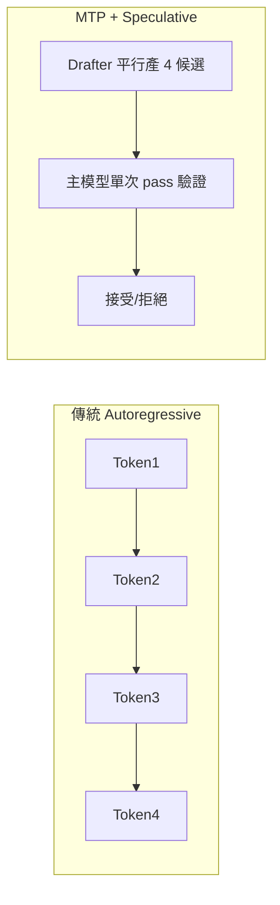
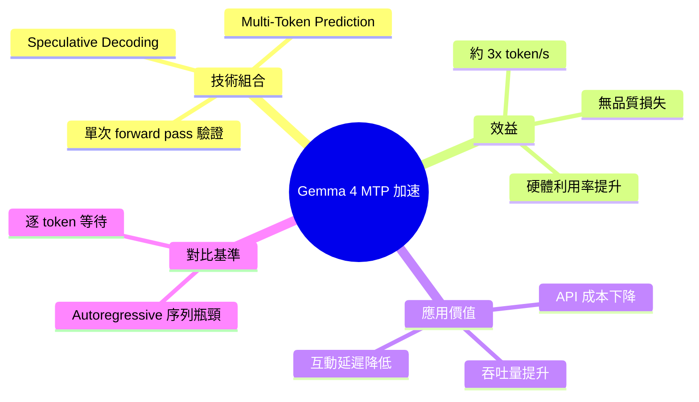

## Gemma 4 Multi-Token Prediction Delivers Up to ~3x Faster Token Generation

Google Gemma 4 模型搭載推測解碼與多令牌預測（MTP）技術，可達到約 3 倍令牌生成加速且無品質損失。此技術通過投機執行允許模型並行生成多個候選令牌，所有候選在單次前向傳播中批量驗證，避免傳統自迴歸解碼的序列延遲瓶頸。推測解碼充分利用現代硬體的並行能力，有效降低推論延遲。該優化對 API 成本控制、吞吐提升及使用者體驗有直接正面影響，尤其在高並發推論場景中效益明顯。

### 重點
- 推測解碼 + 多令牌預測（MTP）組合：無品質損失達 3× 推論加速
- 並行令牌生成與單次批量驗證機制降低每令牌計算開銷
- 推論延遲改善直接提升 API 吞吐、成本效益與實時應用體驗

**原文：** [infoq-main](https://www.infoq.com/news/2026/05/gemma4-multi-token-prediction/?utm_campaign=infoq_content&utm_source=infoq&utm_medium=feed&utm_term=global)

---

<!-- deep-analysis:begin -->
## 📌 摘要 (TL;DR)

- Google **Gemma 4** 可搭配多令牌預測（Multi-Token Prediction，簡稱 MTP）drafter，透過推測解碼（speculative decoding）達到約 **3 倍** token 生成加速。
- 多個候選 token 由 drafter 平行產生，主模型在**單次 forward pass** 內批次驗證，繞過自迴歸（autoregressive）一次一 token 的序列瓶頸。
- 加速為**無品質損失**（lossless）：驗證機制保證輸出分布等同原模型。
- 對 API 成本、推論吞吐、使用者延遲三方面同時受益，高並發場景效益最明顯。
- 文章作者 Sergio De Simone，刊於 InfoQ（2026/05）。

## 🎯 核心概念

- **推測解碼**（Speculative Decoding）：由較小或較快的 drafter 模型先猜測接下來數個 token，再由主模型一次性驗證並接受/拒絕。
- **多令牌預測**（Multi-Token Prediction, MTP）：drafter 在單一步驟內輸出多個候選 token，而非逐個產生。
- **自迴歸解碼**（Autoregressive Decoding）：傳統 LLM 推論方式，每生成一個 token 都要跑一次完整 forward pass，是延遲主因。

## 📖 整理分析

### 1. 傳統推論的延遲瓶頸

自迴歸解碼下，每個新 token 都必須等前一個 token 算完才能開始，GPU 的平行算力大量閒置。token 序列越長，累積延遲越線性增長，這是聊天、Agent、長文生成情境最痛的點。

### 2. MTP Drafter 如何切入

Gemma 4 搭配的 MTP drafter 一次性產出多個後續候選 token。這些候選不必等彼此，可在同一個推論批次內生成，把原本「序列」工作轉成「平行」工作。

### 3. 單次 Forward Pass 驗證

主模型不再逐 token 計算，而是把 drafter 給的整串候選一次餵入做驗證。被接受的 token 直接採用，拒絕點之後重新生成。一次 pass 可推進多個 token，這是 3× 加速的來源。

### 4. 為何「無品質損失」

推測解碼的接受/拒絕規則設計成輸出機率分布等同於原模型自迴歸生成。也就是說，加速來自硬體利用率提升，而非犧牲精度或改寫模型行為。

### 5. 應用層影響

推論延遲下降意味著：互動式 LLM 應用反應更即時、單位時間內可服務更多請求（吞吐提升）、按 token 計費的 API 在固定算力下成本攤薄。對高並發部署（chatbot、Agent fleet、批次摘要）效益最大。

## 🧭 流程對比

## 🧠 Mindmap

<!-- deep-analysis:end -->
### 📄 原文內容

點此展開 / 收合

Gemma 4 can be paired with multi-token prediction (MTP) drafters that use speculative decoding to generate multiple tokens in parallel, allowing the model to verify them in a single pass and achieve up to ~3× faster inference without quality loss. By Sergio De Simone

