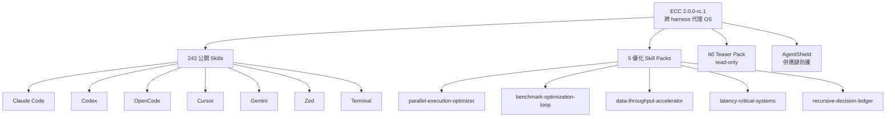
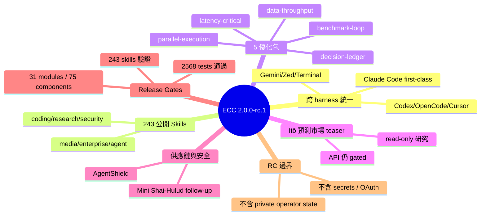

## v2.0.0-rc.1

ECC 2.0.0-rc.1 首次將技能包平台從 Claude Code 專用工具升級為跨多 IDE 統一層（支援 Codex、OpenCode、Cursor、Gemini、Zed、終端工作流）。涵蓋 243 項公開技能、5 項新優化技能包（平行執行優化、基準優化迴圈、資料吞吐加速、延遲關鍵系統分析、遞迴決策帳冊）。統一 MCP 慣例、Hooks、釋出把關（含供應鏈檢查、簽署驗證）。核心價值：將可重複代理行為轉化為可移植跨平台基礎設施，終止碎片化提示工程與本地習慣依賴。2568 項測試全數通過，243 項技能驗證完成。

### 重點
- 跨 IDE 統一基礎設施：243 項技能在 Claude Code、Codex、OpenCode、Cursor、Gemini、Zed、終端間共享 MCP 慣例、Hooks、釋出把關
- 5 項代理優化技能：parallel-execution-optimizer（安全平行分片、併發讀取）、benchmark-optimization-loop（測量變體、推廣把關）、data-throughput-accelerator（索引化檢查點）、latency-critical-systems（p50/p95/快取命中率/冷啟動分析）、recursive-decision-ledger（歷史勝者複用）
- 驗證通過：2568 項測試、243 項技能驗證、31 模組 75 元件、供應鏈檢查無密鑰洩漏

**原文：** [ecc-releases](https://github.com/affaan-m/ECC/releases/tag/v2.0.0-rc.1)

---

<!-- deep-analysis:begin -->
## 📌 摘要 (TL;DR)

- **ECC 2.0.0-rc.1** 首個將 ECC 定位為「跨 harness 代理工作作業系統」的 release candidate，Claude Code 從唯一目標降為「first-class target」之一
- 支援執行面擴及 **Codex、OpenCode、Cursor、Gemini、Zed 與終端工作流**，共用同一套 skills / rules / hooks / MCP 慣例 / release gates
- 打包 **243 項公開技能**，涵蓋 coding、research、security、media、enterprise ops、agent workflows
- 新增 **5 項優化技能包**：parallel-execution-optimizer、benchmark-optimization-loop、data-throughput-accelerator、latency-critical-systems、recursive-decision-ledger
- 釋出 **Itô 預測市場 teaser skill pack**（read-only 研究、籃子比較、oracle 市場情報、風險審查），但 Itô API 仍 gated、與 ECC Tools 計費分離
- 驗證閘門：**2568 tests 通過**、243 skills 驗證、31 modules、75 components、6 profiles 全綠

## 🎯 核心概念

- **Cross-harness（跨執行環境）**：同一份 skill / hook / rule 能在 Claude Code、Codex、Cursor、Gemini、Zed 等不同代理執行器跑
- **Release-readiness gates（釋出就緒閘門）**：preview packs、public-action approvals、release URL ledgers、operator readiness、Linear roadmap 覆蓋、supply-chain 檢查的自動驗證關卡
- **AgentShield**：因應 Mini Shai-Hulud / TanStack 供應鏈攻擊事件後續強化的安全層
- **Decision ledger（決策帳冊）**：將重複 rollout prompting 轉成可重用的決策紀錄，內含 prior winners 與明確 promotion 條件

## 📖 整理分析

### 1. 從 Claude Code 配置包到跨平台基礎設施
ECC 1.x 定位是 Claude Code 專屬 config pack。2.0.0-rc.1 把 Claude Code 列為 first-class target 之一，與 Codex、OpenCode、Cursor、Gemini、Zed、terminal workflows 平起平坐。每個 harness 都被視為「執行面」（execution surface），共用同一套 skills、rules、hooks、MCP conventions、release gates、operator workflows。語意上等於宣告 ECC 不再是某個 IDE 的擴充，而是代理工作的可移植中介層。

### 2. 243 項技能與 5 項優化包
243 項公開 skills 跨越 coding / research / security / media / enterprise ops / agent workflows。新增的 5 項優化 skill 各有具體目標：
- `parallel-execution-optimizer`：拆工作為平行 lane、獨立 worktree、並發讀取、可合併輸出
- `benchmark-optimization-loop`：把模糊的速度目標轉成 measured variants、baseline、promotion gates、rollback notes
- `data-throughput-accelerator`：大型掃描與 corpus 工作改走 indexed、checkpointed、manifest-driven pipeline
- `latency-critical-systems`：先 profile p50 / p95 / queue time / cache hit rate / cold starts / freshness，再改 runtime path
- `recursive-decision-ledger`：把重複的 rollout prompting 轉成可重用 decision ledger

### 3. Itô 預測市場技能包（gated teaser）
首次公開 Itô prediction-market skill pack，定位為 read-only 研究工具：basket 比較、oracle 風格市場情報、風險審查。Itô API 本身仍維持 gated 存取，與 ECC Tools 計費分離 — 公開的是 skill 介面，不是 API token。

### 4. 安全與供應鏈強化
AgentShield 與供應鏈 follow-up 接續 Mini Shai-Hulud / TanStack 攻擊活動的調查工作。Release 閘門加入 `validate-no-personal-paths.js`（防止私人路徑外洩）、`preview-pack:smoke`、`npm pack --dry-run` 等檢查，明確劃出 RC 邊界：secrets、private operator state、OAuth tokens、個人資料集、未清理的本地自動化都不入公開包。

### 5. 驗證指標
本 RC 通過完整 local validation gate：`npm test` 2568 passing、`npm run lint` passing、`validate-skills.js` 243 skills、`validate-install-manifests.js` 31 modules / 75 components / 6 profiles、`validate-no-personal-paths.js` passing、`preview-pack:smoke --format json` passing、`npm pack --dry-run` 包含新優化與 Itô skill packs。

## 🧭 架構圖

## 🧠 Mindmap

<!-- deep-analysis:end -->
### 📄 原文內容

點此展開 / 收合

ECC 2.0.0-rc.1 
 ECC 2.0.0-rc.1 is the first release-candidate surface for ECC as a cross-harness operating system for agentic work. 
 Claude Code remains a first-class target. Codex, OpenCode, Cursor, Gemini, Zed, and terminal-only workflows are now treated as execution surfaces that can share the same skills, rules, hooks, MCP conventions, release gates, and operator workflows. 
 What is new 
 
 243 public skills packaged across coding, research, security, media, enterprise ops, and agent workflows. 
 A rollout-derived optimization pack for agents that need measured speedups instead of one-shot prompting. 
 A public teaser Itô prediction-market skill pack for read-only research, basket comparison, oracle-style market intelligence, and risk review. Itô API access stays gated and separate from ECC Tools billing. 
 AgentShield and supply-chain follow-up surfaces after the Mini Shai-Hulud/TanStack campaign work. 
 Cross-harness package surfaces for Claude Code, Codex, OpenCode, Cursor, Gemini, Zed, and terminal workflows. 
 Release-readiness gates for preview packs, public-action approvals, release URL ledgers, operator readiness, discussion state, Linear roadmap coverage, and supply-chain checks. 
 
 New optimization skills 
 
 parallel-execution-optimizer : splits work into safe parallel lanes, separate worktrees, concurrent reads, and mergeable outputs. 
 benchmark-optimization-loop : turns vague speed goals into measured variants, baselines, promotion gates, and rollback notes. 
 data-throughput-accelerator : pushes large scans and corpus work into indexed, checkpointed, manifest-driven pipelines. 
 latency-critical-systems : profiles p50, p95, queue time, cache hit rate, cold starts, and freshness before changing runtime paths. 
 recursive-decision-ledger : converts repetitive rollout prompting into reusable decision ledgers with prior winners and explicit promotion criteria. 
 
 Why this matters 
 ECC is no longer just a Claude Code config pack. The release candidate packages the reusable layer underneath agent work: skills, hooks, rules, MCP conventions, command surfaces, test gates, and operator discipline that can move across harnesses. 
 The goal is simple: stop rewriting the same prompts, stop relying on fragile local habits, and turn working agent behavior into portable infrastructure. 
 Download 
 
 Release tarball: https://github.com/affaan-m/ECC/releases/download/v2.0.0-rc.1/ecc-universal-2.0.0-rc.1.tgz 
 Full changelog: v1.10.0...v2.0.0-rc.1 
 
 Additional registry and directory surfaces will follow the remaining publication gates. For this RC, the GitHub prerelease and tarball are the public packaged artifact. 
 Verification 
 This release candidate passed the local validation gate used for the final packaging work: 
 
 npm test : 2568 passing 
 npm run lint : passing 
 node scripts/ci/validate-skills.js : 243 skills 
 node scripts/ci/validate-install-manifests.js : 31 modules, 75 components, 6 profiles 
 node scripts/ci/validate-no-personal-paths.js : passing 
 npm run preview-pack:smoke -- --format json : passing 
 npm pack --dry-run : includes the new optimization and Itô skill packs 
 
 RC boundary 
 This is a release candidate, not the final GA claim. Secrets, private operator state, OAuth tokens, personal datasets, and unsanitized local automations are not part of the public package.

