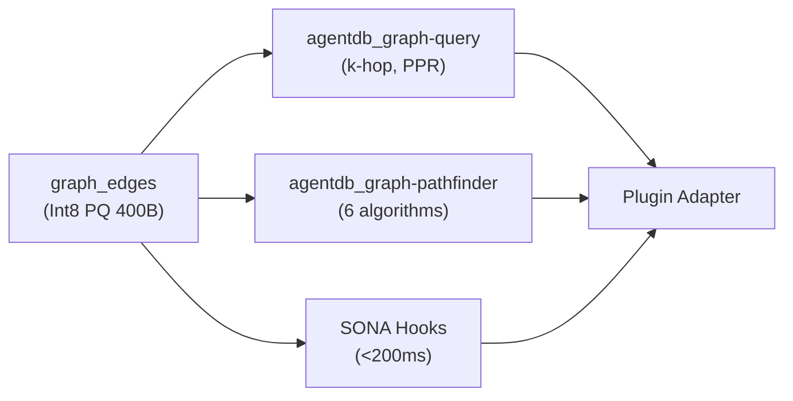

## v3.9.0 — ADR-130 Unified Graph Intelligence Backend

RuFlo v3.9.0 實現 ADR-130 統一知識圖後端全部 6 階段，將 4 個既有圖層（graph-node、AgentDB、ruflo-knowledge-graph、ruflo-graph-intelligence）統一到共享 graph_edges sql.js 表。P1 定義 graph_edges schema，含時間列（confidence、decay_rate、last_reinforced、witness_id、embedding_ref），以及 Int8 全局標量 PQ 編碼（400 bytes/384-dim），零解碼餘弦相似度內聯計算。P2 agentdb_graph-query MCP 工具提供 k-hop 遞迴 CTE 遍歷、Personalized PageRank 冪次疊代、語意餘弦排序、複雜度預算強制。P3 SONA trajectory hooks 火即忘邊寫，<200ms 延遲保持。P5 agentdb_graph-pathfinder 工具支援 6 演算法變體。Benchmark 達成：2345 ops/sec 寫入、578 bytes/edge SQLite、k-hop depth-1 p99 4.9ms。

### 重點
- graph_edges 統一表：時間列 + Int8 PQ 編碼（400 bytes），零解碼內聯餘弦相似度
- agentdb_graph-query MCP 工具：k-hop CTE、PPR 冪次、語意排序；agentdb_graph-pathfinder 6 演算法
- SONA trajectory hooks 火即忘，<200ms 延遲；Benchmark：2345 ops/sec、578 bytes/edge、4.9ms k-hop depth-1

**原文：** [ruflo-releases](https://github.com/ruvnet/ruflo/releases/tag/v3.9.0)

---

### 📄 原文內容

點此展開 / 收合

ADR-130 — Unified Knowledge Graph Backend (All 6 Phases) 
 Gives all 4 existing graph layers ( graph-node , AgentDB , ruflo-knowledge-graph , ruflo-graph-intelligence ) a shared graph_edges sql.js table with PQ-encoded embeddings, two new MCP tools, SONA trajectory hooks, and a plugin adapter contract. 
 New features 
 Phase 1 — graph_edges schema + PQ encoder 
 
 graph_edges table with temporal columns: confidence , decay_rate , last_reinforced , witness_id , embedding_ref 
 embedding-quantization.ts : Int8 global-scalar PQ (400 bytes/384-dim); inlineCosine() for zero-decode similarity 
 graph-edge-writer.ts : thin sql.js accessor with fire-and-forget writes 
 
 Phase 2 — agentdb_graph-query MCP tool 
 
 k-hop traversal via recursive CTE (sql-cte backend) 
 Personalized PageRank (PPR) power iteration 
 Semantic cosine ranking on inline PQ embeddings 
 complexityBudget enforcement: maxNodesVisited , maxDepth , maxMillis 
 
 Phase 3 — SONA trajectory-to-graph hooks 
 
 hooks_intelligence_trajectory-step : writes trajectory-caused edges fire-and-forget 
 hooks_post-task (success=true): writes reinforced-by edges fire-and-forget 
 Neither write blocks tool response (&lt;200ms latency preserved) 
 
 Phase 4 — Plugin adapter contract 
 
 GraphEdgesSource class: default KnowledgeGraphSource reading from graph_edges 
 createAutoGraphAdapter() : zero-boilerplate autoRegister path 
 graph_adapter field in plugin.json schema (documented in ruflo-plugin-creator SKILL.md) 
 
 Phase 5 — agentdb_graph-pathfinder MCP tool 
 
 6 algorithm variants: personalized-pagerank , dynamic-mincut , spectral-sparsify , temporal-centrality , connected-component-churn , witness-chain-divergence 
 Depth &gt; 5 clamped; non-existent seed returns empty paths not error 
 
 Phase 6 — Benchmark + CI 
 
 benchmark-graph.mjs : 6/6 targets met (2345 ops/sec write, 578 bytes/edge, k-hop depth=1 p99=4.9ms) 
 5 new CI jobs in v3-ci.yml gating all phases 
 
 Benchmark 
 
 
 
 Metric 
 Result 
 Target 
 
 
 
 
 Write throughput 
 2345 ops/sec 
 ≥500 ✓ 
 
 
 SQLite footprint 
 578 bytes/edge 
 ≤1024 ✓ 
 
 
 k-hop depth=1 p99 
 4.9ms 
 &lt;10ms ✓ 
 
 
 k-hop depth=3 p99 
 0.1ms 
 &lt;50ms ✓ 
 
 
 PQ encode p99 
 0.063ms 
 &lt;1ms ✓ 
 
 
 PQ decode p99 
 0.031ms 
 &lt;0.5ms ✓ 
 
 
 
 Test baseline 
 1999 passed | 46 skipped — no regression 
 PR: #2129 | Tracking: #2128

