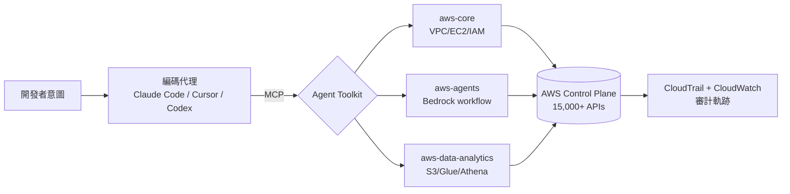
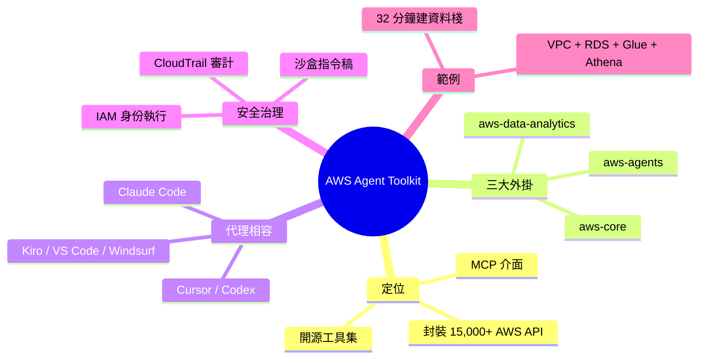

## Introducing the Agent Toolkit for Amazon Web Services

AWS 發布開源 Agent Toolkit，涵蓋 15,000+ AWS API 調用，分為三大外掛：aws-core（通用開發）、aws-agents（Bedrock 代理工作流）、aws-data-analytics（S3 Tables、Glue、Athena、向量儲存）。工具透過 MCP 伺服器實現，提供策劃任務特定指令、即時文檔存取、沙盒指令碼執行和 IAM 身份驗證控制，相容 Claude Code、Cursor、Codex、Kiro、VS Code、Windsurf 等多種編碼代理。實例展示 32 分鐘內自動供應完整棧：VPC、安全群組、RDS 資料庫、IAM 角色、Glue ETL 作業和 Athena 目錄，透過 CloudWatch/CloudTrail 審計。

### 重點
- AWS Agent Toolkit 開源，15,000+ API 調用覆蓋，三外掛架構 + MCP 伺服器實現 IAM 上下文條件金鑰和多 IDE 相容
- 端到端自動化示例：32 分鐘內完成 VPC+RDS+Glue+Athena 供應，展示代理自主基礎設施決策（檢查既有資源、避免服務特定陷阱）
- 關鍵特性：即時 AWS 文檔存取、沙盒指令碼執行、CloudWatch/CloudTrail 原生審計，支援 Claude Code/Cursor/Codex/Kiro/VS Code/Windsurf

**原文：** [medium-towards-data-science](https://towardsdatascience.com/introducing-the-agent-toolkit-for-amazon-web-services/)

---

<!-- deep-analysis:begin -->
## 📌 摘要 (TL;DR)

- AWS 釋出開源 **Agent Toolkit**，封裝超過 15,000 個 AWS API 呼叫，讓編碼代理（coding agent）能直接驅動 AWS 基礎設施。
- 工具拆成三個外掛：`aws-core`（通用開發）、`aws-agents`（Bedrock 代理工作流）、`aws-data-analytics`（S3 Tables、Glue、Athena、向量儲存）。
- 透過模型情境協定（Model Context Protocol，簡稱 MCP）伺服器暴露能力，相容 Claude Code、Cursor、Codex、Kiro、VS Code、Windsurf 等主流代理。
- 提供策劃過的任務特定指令、即時文件查詢、沙盒（sandbox）指令稿執行、以及 IAM 身份驗證控制，降低代理胡亂呼叫 API 的風險。
- 範例展示在 32 分鐘內自動供應一條完整資料棧：VPC、Security Group、RDS、IAM Role、Glue ETL job、Athena 目錄，並透過 CloudWatch／CloudTrail 留下審計軌跡。

## 🎯 核心概念

- **Agent Toolkit**：AWS 官方推出的開源工具集，把 AWS 控制面 API 包裝給編碼代理使用。
- **MCP（Model Context Protocol）**：由 Anthropic 主導的開放協定，讓 LLM 代理以統一介面呼叫外部工具與資料。
- **策劃指令（curated instructions）**：針對特定任務（如建立 RDS、跑 Glue ETL）預寫的提示與步驟模板，避免代理從零推理。
- **沙盒指令稿執行（sandboxed script execution）**：在受限環境執行代理生成的程式碼，避免直接動到正式環境。

## 📖 整理分析

### 1. 為何需要 Agent Toolkit

AWS 控制面 API 多達上萬個，編碼代理若僅靠 LLM 內部知識操作，容易產生幻覺（hallucinate）出不存在的參數或過時的服務名稱。Agent Toolkit 把 15,000+ API 預先索引並附上即時文件查詢，讓代理在每次呼叫前能取得權威依據，減少誤用。

### 2. 三大外掛分工

- **aws-core**：覆蓋一般 AWS 開發場景，例如 EC2、VPC、IAM、CloudFormation。
- **aws-agents**：聚焦 Amazon Bedrock 上的代理工作流，包含 Knowledge Base、Agent Action Group 的建立與測試。
- **aws-data-analytics**：針對資料工程場景，內建 S3 Tables、Glue、Athena 與向量儲存（vector store）的高階指令。

拆分外掛的好處是代理在啟動時只載入需要的工具集，避免 context 被一萬多個工具描述塞爆。

### 3. MCP 作為整合層

Toolkit 以 MCP 伺服器形式發佈，因此任何支援 MCP 的代理（Claude Code、Cursor、Codex、Kiro、VS Code、Windsurf）都能直接掛載，不需要各別寫整合。這把 AWS 從「特定代理才能用」變成「跨代理通用基礎設施」。

### 4. 安全與可審計性

Toolkit 強制以呼叫端的 IAM 身份執行，所有動作走 CloudTrail，可在 CloudWatch 看到代理觸發的 API 呼叫。沙盒指令稿執行則隔離代理生成的程式碼，避免直接污染既有環境。對企業而言，這把「代理操作生產 AWS」從不可接受變成可治理。

### 5. 端到端範例：32 分鐘建一條資料棧

原文示範由代理在 32 分鐘內供應：

- 新 VPC 與 Security Group
- RDS 資料庫實例
- 對應的 IAM Role 與最小權限政策
- Glue ETL job 把資料寫入 S3
- Athena 目錄與查詢介面

相較於人工點選或寫 Terraform，代理直接用自然語言驅動 Toolkit，並在 CloudTrail 留下完整審計記錄，展示了「人類定意圖、代理執行 IaC」的工作流。

## 🧭 架構圖

## 🧠 Mindmap

> 註：原文 body_md 僅含標題與一句導言，本整理主要依據既有 summary_zh 內容展開；具體 API 數量、外掛名稱與範例時長均來自摘要描述，未在原文全文中親自核對。
<!-- deep-analysis:end -->
### 📄 原文內容

點此展開 / 收合

It’s like having your own personal expert AWS solutions architect and data engineer rolled into one. 
 The post Introducing the Agent Toolkit for Amazon Web Services appeared first on Towards Data Science .

