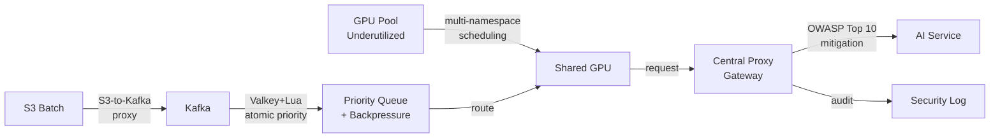

## Presentation: Realtime and Batch Processing of GPU Workloads

Joseph Stein 分享企業 AI-as-a-Service 平台設計案例，涵蓋多項具體技術決策與架構模式。GPU 資源利用透過 multi-namespace scheduling 共享未充分利用的 GPU 池；優先級隊列採用 Valkey 結合 Lua 實現原子性優先級管理與背壓控制；安全防護透過中央 proxy gateway 應對 OWASP Top 10 LLM 風險；批量處理採用自訂 S3-to-Kafka proxy 架構。該案例系統性展示了端到端企業 AI 平台應涵蓋的完整技術棧。

### 重點
- Multi-namespace scheduling 最大化 GPU 池共享效率，應對 underutilized GPU 資源
- Valkey + Lua 實現原子性優先級隊列與背壓管理，解決動態優先級調度
- 中央 proxy gateway 統一應對 OWASP Top 10 LLM 安全威脅；S3-to-Kafka proxy 驅動批量管道擴展

**原文：** [infoq-main](https://www.infoq.com/presentations/realtime-gpu-workloads/?utm_campaign=infoq_content&utm_source=infoq&utm_medium=feed&utm_term=global)

---

### 📄 原文內容

點此展開 / 收合

Joseph Stein discusses engineering an enterprise AI-as-a-Service platform within a private cloud data center. He explains how to maximize underutilized GPU pools via multi-namespace scheduling, leverage Valkey and Lua for atomic priority queuing and backpressure management, mitigate OWASP Top 10 LLM risks via central proxy gateways, and scale batch pipelines using a custom S3-to-Kafka proxy. By Joseph Stein

