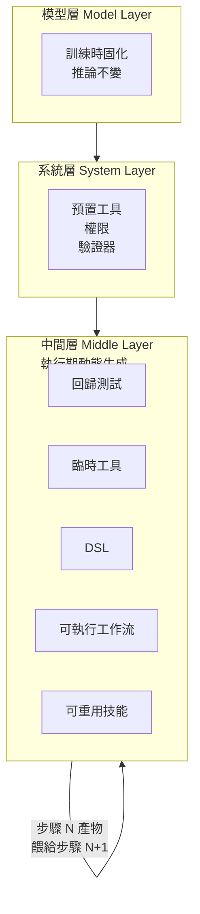
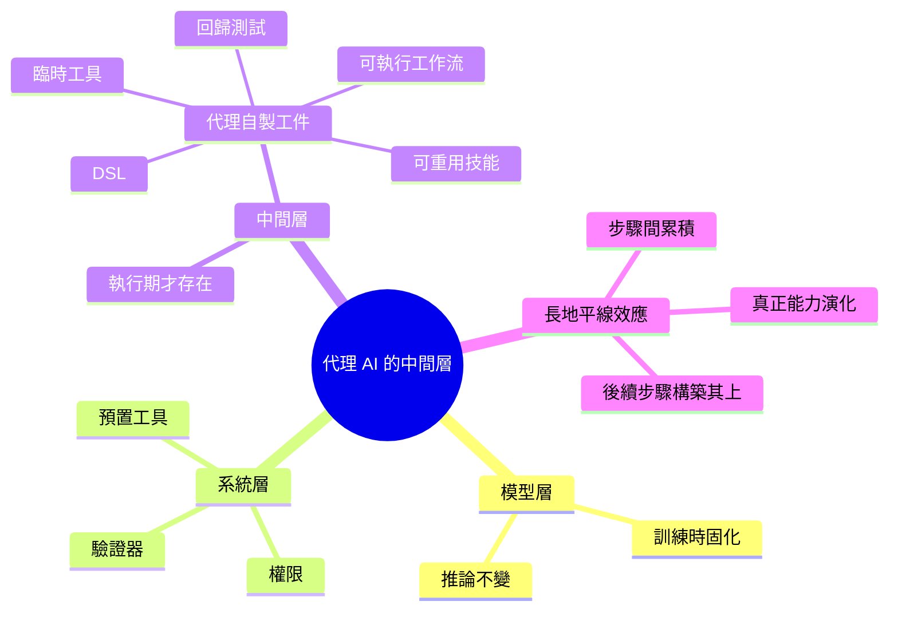

## The Emerging Middle Layer of Agentic AI

代理 AI 出現第三層架構：除了模型層（訓練時存在）與系統層（預置工具、權限、驗證器），還有執行時動態產生的「中間層」代碼。此層包含代理自動生成、執行、修改並保存的工件：回歸測試、臨時工具、領域特定語言、可執行工作流、可重用技能。與傳統兩層架構不同，中間層只在任務執行期間存在。關鍵效果：代理於長任務中改進，因其能在先前步驟基礎上構築，實現真正的長地平線能力進化。

### 重點
- 三層架構：模型層 + 系統層 + 執行時產生的中間層（代碼、測試、技能）
- 中間層特性：僅在任務執行期存在，代理可迭代修改與保存
- 能力進化機制：後續任務利用先前產生工件，避免從零開始

**原文：** [medium-tag-llm](https://cobusgreyling.medium.com/the-emerging-middle-layer-of-agentic-ai-0d634832336b?source=rss------large_language_models-5)

---

<!-- deep-analysis:begin -->
## 📌 摘要 (TL;DR)

- Cobus Greyling 提出代理 AI（agentic AI）正浮現第三層架構：除了既有的「模型層」與「系統層」，還有執行時動態生成的「中間層」（middle layer）。
- 模型層在訓練時就已固化；系統層由開發者預先配置工具、權限與驗證器（validators）；中間層則是代理在任務執行期間自己產出、執行、修改並保存的工件。
- 中間層工件包含：回歸測試（regression tests）、臨時工具（ad-hoc tools）、領域特定語言（domain-specific languages，DSL）、可執行工作流（executable workflows）、可重用技能（reusable skills）。
- 與傳統雙層架構不同，中間層只存在於任務執行期間——它隨任務啟動、隨任務結束。
- 關鍵效果：代理能在長任務（long-horizon task）中持續改進，因為後續步驟可建構在先前自製的工件之上，達成真正的長地平線能力演化。

## 🎯 核心概念

- **模型層** (Model Layer)：訓練時定型的能力，推論時不再改變。
- **系統層** (System Layer)：開發者事先配置的工具、權限、驗證器——靜態鷹架。
- **中間層** (Middle Layer)：代理在任務執行期間動態生成的程式碼與工件，任務結束即消失。
- **長地平線任務** (long-horizon task)：跨越多步驟、需要累積成果的任務型態。

## 📖 整理分析

### 1. 從雙層到三層的視角轉換

作者觀察到目前多數討論只描述兩層：模型層（訓練時存在）與系統層（預置工具、權限、驗證器）。這種視角忽略了代理在「執行當下」實際發生的事——代理會自己寫程式、跑程式、改程式。把這一塊獨立命名為中間層，才能完整描述代理運作。

### 2. 中間層的工件類型

依摘要列舉，中間層產物涵蓋五類：回歸測試、臨時工具、領域特定語言、可執行工作流、可重用技能。共通點是「都是代理自製的可執行物」，不是預先寫好被呼叫的 API，而是任務當下由代理生成、執行、調整、保存以供後續步驟引用。

### 3. 為什麼是「執行期才存在」

中間層與模型層、系統層的關鍵差異是生命週期。模型層在訓練時固定、系統層在部署時固定，兩者都先於任務。中間層相反：任務啟動才有，任務結束就消散（或被保留為技能）。這讓代理擁有任務專屬的工作記憶與工具集，而非僅依賴預置資源。

### 4. 對長地平線能力的意義

摘要指出此架構讓代理「於長任務中改進」。機制是：每一步驟產生的工件（測試、工具、DSL）成為下一步驟的輸入，代理因此能在同一任務內累積複利效果，而不是每步都從零開始。這被作者稱為真正的長地平線能力演化。

## 🧭 三層架構對比

## 🧠 Mindmap

> 註：本整理基於提供的 `summary_zh` 與標題；原文 Medium 全文因 403 無法抓取，故未引用全文段落或新增未明示的數字／人名。
<!-- deep-analysis:end -->
### 📄 原文內容

點此展開 / 收合

It feels like currently most conversations about AI agents only describe two things&#x2026; Continue reading on Medium »

