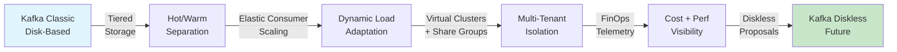

## Article: Architecting Cloud-Native Kafka: From Tiered Storage Towards a Diskless Future

文章檢視 Kafka 向雲原生架構轉型的路徑與經濟模式演變。分層儲存 (tiered storage) 降低即時成本；彈性消費者擴展 (elastic consumer scaling) 適應動態負載；虛擬叢集 (virtual clusters) 和共享組群 (Share Groups) 隔離租用戶與工作負載；FinOps 遙測整合運營與成本可見性。文章進一步分析新興無磁碟儲存提案的架構權衡，指出 Kafka 向「無磁碟未來」的演進方向已成為業界共識。

### 重點
- 分層儲存與彈性消費者擴展調整 Kafka 經濟模式與運營複雜度的關鍵杠桿
- 虛擬叢集與 Share Groups 提升多租用戶隔離與資源共享密度
- 無磁碟儲存提案標記 Kafka 長期架構轉向方向，涉及性能與成本的權衡決策

**原文：** [infoq-main](https://www.infoq.com/articles/architecting-cloud-native-kafka/?utm_campaign=infoq_content&utm_source=infoq&utm_medium=feed&utm_term=global)

---

### 📄 原文內容

點此展開 / 收合

This article explores Kafka's transition toward a cloud-native architecture, examining how tiered storage, FinOps telemetry, elastic consumer scaling, virtual clusters, and Share Groups reshape the operational and economic model of event streaming platforms. It also analyzes emerging diskless-storage proposals and their architectural trade-offs. By Viquar Khan

