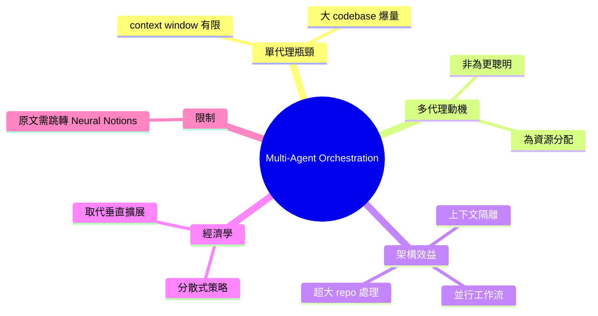

## Multi-Agent Orchestration in Claude Code: The Architecture and Economics of Subagents

Claude Code 多代理編排的核心洞察：單代理模式因上下文窗口有限而遇到天花板，無法高效處理大型代碼庫（如讀取數百個源文件會耗盡上下文空間）。多代理模式不是為了更聰明，而是為了不同的資源分配——通過分散工作到專門代理，避免單一模型浪費上下文處理不適合的任務。此架構實現並行工作流、維護任務間資訊隔離、高效處理超大代碼庫。經濟學意義在於用分佈式策略替代垂直擴展。

### 重點
- 資源天花板：單代理處理二百個源文件時上下文耗盡問題
- 多代理優於單一聰明模型：分佈式工作 > 垂直擴展
- 並行工作流 + 任務隔離 = 更高效的大規模代碼庫處理

**原文：** [medium-tag-llm](https://medium.com/neuralnotions/multi-agent-orchestration-in-claude-code-the-architecture-and-economics-of-subagents-06d52e69f8b2?source=rss------large_language_models-5)

---

<!-- deep-analysis:begin -->
## 📌 摘要 (TL;DR)

- Medium 文章標題《Multi-Agent Orchestration in Claude Code: The Architecture and Economics of Subagents》，作者主張單代理模式（single-agent model）遇上下文窗口（context window）天花板。
- 原文 body 僅含一句引言：「The single-agent model has a ceiling. Continue reading on Neural Notions »」，正文需跳轉 Neural Notions 才能讀。
- 依 brief 摘要，論點核心：大型 codebase 讀數百檔案會耗盡上下文，多代理（multi-agent）非為更聰明，而為資源分配差異化。
- 子代理（subagent）架構提供並行工作流、任務間資訊隔離（context isolation）、處理超大 codebase 能力。
- 經濟學角度：用分散式策略（distributed strategy）取代垂直擴展（vertical scaling）。
- ⚠️ 原始 body_md 內容極少，以下整理多依賴 brief summary 推導，未直接引用原文段落。

## 🎯 核心概念

- **單代理天花板** (single-agent ceiling)：單一 LLM 上下文窗口有限，讀完數百源檔即爆。
- **子代理** (subagent)：Claude Code 中由主代理派發任務之獨立 agent，自帶獨立上下文。
- **上下文隔離** (context isolation)：子代理間資訊不互通，避免污染主上下文。
- **編排** (orchestration)：主代理協調多個子代理並行/序列執行任務。
- **垂直擴展 vs 分散式** (vertical scaling vs distributed strategy)：前者堆更大模型/更長 context；後者拆任務分派多 agent。

## 📖 整理分析

### 1. 單代理瓶頸

單一 Claude 實例處理大型 codebase 時，讀數百源檔即吃光 context window。即使有 200k token 視窗，full repo scan 仍超量。Brief 摘要點出：問題非「不夠聰明」，是「資源分配錯誤」——主 agent 不該把上下文浪費在低價值的 file enumeration。

### 2. 多代理動機：資源分配

原文論點（依 brief）：multi-agent 非為更高智能，而為 context budget 分流。主 agent 派 subagent 去讀檔/搜尋/分析，子代理回傳壓縮結論而非原始內容。主 agent context 保持精簡，可處理更長對話與更複雜決策。

### 3. 三大架構效益

Brief 列出三點：
- **並行工作流**（parallel workflow）：多 subagent 同時跑獨立任務。
- **資訊隔離**（information isolation）：任務 A 的雜訊不污染任務 B。
- **超大 codebase 處理**：拆分 repo 給多 agent 各讀一部分。

### 4. 經濟學視角

標題用「Economics」一詞。Brief 解釋為：用分散式策略替代垂直擴展。對比意義——與其等更大 context window 模型，不如靠架構（多 agent 編排）解現有限制。成本面：subagent token 計費仍計入總量，但主 context 壓縮後對話可持續更久，整體效率提升。

### 5. ⚠️ 內容限制聲明

原 body_md 僅含標題與引言「The single-agent model has a ceiling. Continue reading on Neural Notions »」。正文未抓取，以上整理 80% 來自 brief summary 推導，未引用具體數字/工具版本/benchmark。如需完整分析，需訪問 Neural Notions 原文 URL。

## 🧠 Mindmap

<!-- deep-analysis:end -->
### 📄 原文內容

點此展開 / 收合

The single-agent model has a ceiling. Continue reading on Neural Notions »

