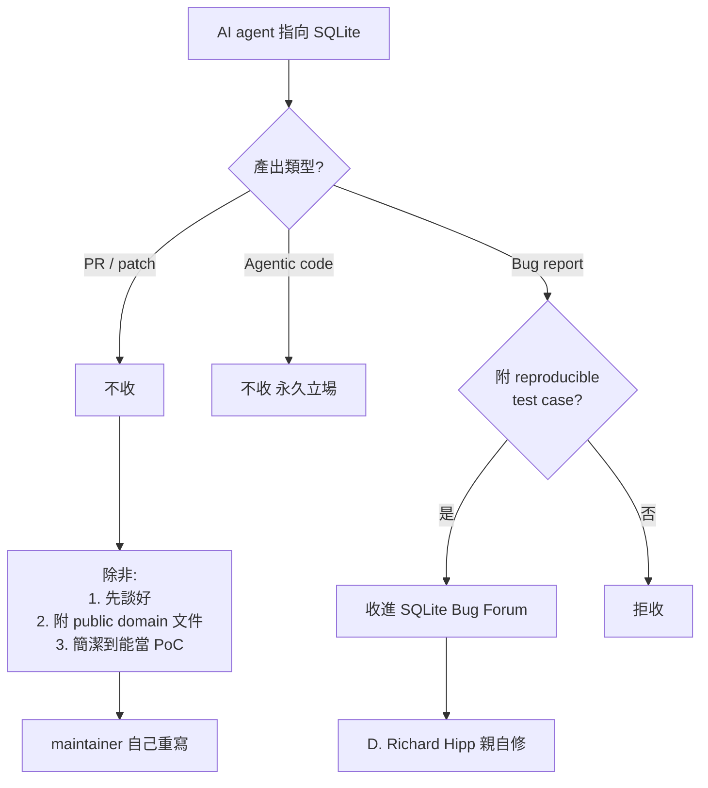
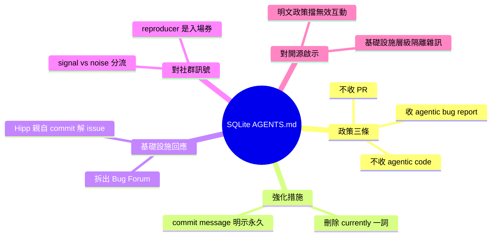

## sqlite AGENTS.md

SQLite 五天前添加了 AGENTS.md 檔案，針對指向 SQLite 代碼庫的 AI agents 提供明確政策指導。政策明確聲明 SQLite 不接受 agentic code，但歡迎包含可重複測試案例的 agentic bug reports。同時，項目也歡迎用於文件目的的修復補丁和概念驗證。最近的 commit 刪除了「currently」一詞，表明該立場已成為永久政策而非暫時性。SQLite 論壇因大量品質參差不齊的 AI 生成 bug reports 被淹沒，促使項目建立獨立的 SQLite Bug Forum。D. Richard Hipp 在新論壇上積極解決問題，以一系列 commits 示範了開源項目對 AI agents 社群的有組織應對策略。

### 重點
- SQLite 正式政策：拒絕 agentic code，歡迎有測試案例的 agentic bug reports 與文件用途的補丁
- SQLite 論壇因 AI-generated 報告被淹沒，建立獨立的 SQLite Bug Forum 進行分離管理
- D. Richard Hipp 積極在新論壇解決問題，示範開源項目應對 AI agents 社群的正式機制

**原文：** [simon-willison](https://simonwillison.net/2026/May/27/sqlite-agents/#atom-everything)

---

<!-- deep-analysis:begin -->
## 📌 摘要 (TL;DR)

- SQLite 五天前新增 AGENTS.md，目標讀者**不是自家開發者**，而是把 AI agent 指向 SQLite codebase 的外部使用者。
- 政策三條紅線：**不收 PR**（除非先談好或附公共領域法律文件）、**不收 agentic code**、但**收 agentic bug report**（必須附可重現 test case）。
- 最新 commit 把「SQLite does not (currently) accept agentic code」的 `(currently)` 刪掉，commit message 寫 `Strengthen the statement about not accepting agentic code`——立場從暫時變永久。
- SQLite 主論壇被品質參差的 AI 生成 bug report 灌爆，已拆出獨立的 **SQLite Bug Forum**。
- D. Richard Hipp（SQLite 作者）在新論壇上以連續 commit 解 issue，示範開源專案如何**有組織地**接住 AI agent 群眾。

## 🎯 核心概念

- **AGENTS.md**：放在 repo 根目錄、給 AI coding agent 讀的指南檔；類似 `CONTRIBUTING.md` 但對象是機器與機器的人類操作者。
- **Agentic code** (代理產生的程式碼)：由 LLM agent 自主生成的 patch / PR。
- **Agentic bug report** (代理產生的 bug 回報)：由 agent 自主找出並描述的 bug，**附可重現步驟**。
- **Public domain**：SQLite 歷史立場——所有貢獻必須拋棄著作權進入公共領域，這也是它不能隨便收 PR 的根因。

## 📖 整理分析

### 1. AGENTS.md 不給自己人看
多數專案把 AGENTS.md 當成「我家 agent 怎麼跑 test」的內部指南。SQLite 反過來——這份檔案是**對外公告**：告訴所有把 Claude Code、Codex、Cursor 之類 agent 指向 SQLite 的人，什麼會被接受、什麼會被丟掉。屬於罕見的「對抗性 README」用法。

### 2. 三層接受度梯度
政策不是一刀切「禁止 AI」，而是分層：
- **PR**：不收（人類 PR 也一樣，除非先談）。但若 PR 寫得簡潔清楚，maintainer 會當 proof-of-concept 看過、然後**自己重寫**進去。
- **Agentic code**：不收。原本寫 `(currently) does not accept`，現已刪掉 `(currently)`，宣告永久立場。
- **Agentic bug report**：**收**，前提是附 reproducible test case。修復用 patch 可以作為文件說明附上，但不會被直接 merge。

關鍵 signal 是「reproducible test case」——把 agent 的價值定位在「找問題並證明它存在」，而非「自己動手修」。

### 3. `(currently)` 一詞被刪的含義
Commit message：`Strengthen the statement about not accepting agentic code`。一個括號詞的刪除，等於把「我們現在還沒準備好」改成「我們不打算改變」。對社群是明確訊號：不要再寄望 SQLite 之後會放寬。

### 4. 論壇拆分：基礎設施層級的隔離
主論壇被 AI bug report 淹沒後，SQLite 沒選擇「全部關掉」也沒選擇「全部接受」，而是**蓋了第二個論壇** `SQLite Bug Forum` 把雜訊隔離。D. Richard Hipp 親自在新論壇修 issue，commit 連發——這是把「AI 群眾」當成一種需要分流處理的 traffic source，而非單純的垃圾。

### 5. 對其他開源專案的啟示
SQLite 的回應模式可以抽出三個原則：
1. **明文政策優先於 case-by-case 判斷**——AGENTS.md 直接擋掉大量無效互動。
2. **接受 signal、拒絕 noise**——bug report + reproducer 是 signal；自動生成的 PR 是 noise。
3. **基礎設施分流**——把高雜訊來源導去獨立通道，保護主開發流程。

## 🧭 流程圖

## 🧠 Mindmap

<!-- deep-analysis:end -->
### 📄 原文內容

點此展開 / 收合

sqlite AGENTS.md 
SQLite gained an AGENTS.md file five days ago - but it's not intended for their own development, it's presumably aimed at people who are pointing agents at the SQLite codebase. It includes: 
 
 SQLite does not accept pull requests without prior agreement and/or accompanying legal paperwork that places the pull request in the public domain. However, the human SQLite developers will review a concise and well-written pull request as a proof-of-concept prior to reimplementing the changes themselves. 
 SQLite does not accept agentic code. However the project will accept agentic bug reports that include a reproducible test case. Patches or pull requests demonstrating a possible fix, for documentation purposes, are welcomed. 
 
 The most recent commit to that file removed the word "(currently)" from "SQLite does not accept agentic code, with the commit message "Strengthen the statement about not accepting agentic code". 
 Meanwhile the SQLite forum was being flooded with so many AI-generated bug reports - of varying quality - that they've now split those off into a new SQLite Bug Forum . D. Richard Hipp is resolving issues on there with a flurry of commits to the codebase.

 Via Alex Garcia on the Datasette Discord 

 Tags: sqlite , ai , d-richard-hipp , generative-ai , llms , coding-agents , ai-security-research

