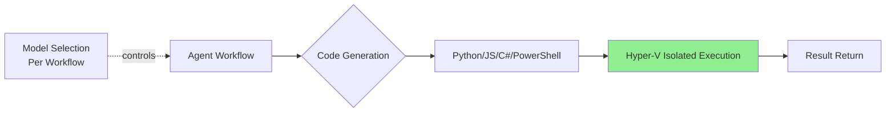

## Azure Logic Apps Adds Sandboxed Code Interpreters to Agent Workflows

Microsoft 在 Azure Logic Apps 中新增沙盒化代碼執行器，支援在 Hyper-V 隔離環境執行 Python、JavaScript、C#、PowerShell 程式碼。Agent workflows 可動態生成並運行程式碼，架構師可按工作流程級別精細控制模型選擇。此舉將 Logic Apps 定位為 integration 領域的 agent 平台，與 Copilot Studio 和 Foundry 競爭。

### 重點
- Hyper-V 隔離環境執行多語言程式碼（Python/JS/C#/PowerShell），隔離安全風險
- Agent workflows 內置代碼生成與執行，消除外部工具依賴，加快集成速度
- 工作流級模型選擇控制，使 Logic Apps 從集成工具進化為 agentic 平台

**原文：** [infoq-main](https://www.infoq.com/news/2026/05/azure-logic-apps-agents/?utm_campaign=infoq_content&utm_source=infoq&utm_medium=feed&utm_term=global)

---

### 📄 原文內容

點此展開 / 收合

Microsoft added sandboxed code interpreters to Azure Logic Apps, enabling agents within integration workflows to generate and execute Python, JavaScript, C#, and PowerShell in Hyper-V isolated sessions. Architects get full control over model selection per workflow. The capability positions Logic Apps as an agent platform for integration alongside Foundry and Copilot Studio. By Steef-Jan Wiggers

