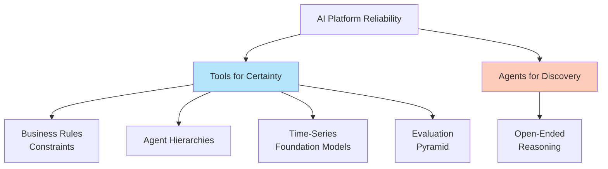
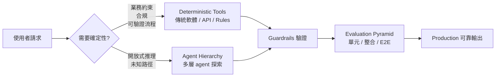
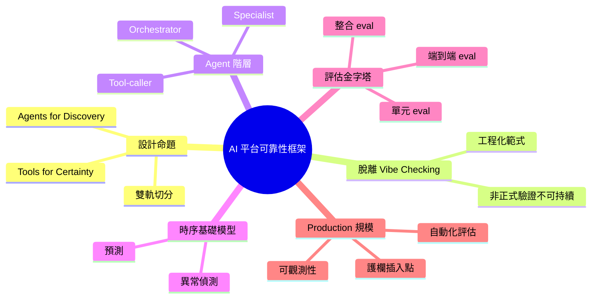

## Presentation: Designing AI Platforms for Reliability: Tools for Certainty, Agents for Discovery

Aaron Erickson 在演講中提出 AI 平台可靠性的新設計框架。核心理念為「Tools for Certainty, Agents for Discovery」：用確定性工具保證業務約束與可預測性，用 agent 探索處理開放式推理。框架涵蓋 agent 階層優化、時序基礎模型應用、多層評估金字塔等實踐方法，旨在從「氛圍感受」演進到嚴格的多 agent 系統設計，實現生產規模的可靠性。

### 重點
- 「確定性工具 + 探索性 agent」二元框架：Tools 保證邊界與可控性，Agents 驅動創新與適應性
- 從主觀決策（vibe checking）轉向嚴格架構：Agent 階層設計、時序模型應用、多層評估體系
- 可操作的設計原則：時序基礎模型用於預測性 agent 決策，評估金字塔確保多層次品質驗證

**原文：** [infoq-main](https://www.infoq.com/presentations/ai-platforms-reliability/?utm_campaign=infoq_content&utm_source=infoq&utm_medium=feed&utm_term=global)

---

<!-- deep-analysis:begin -->
## 📌 摘要 (TL;DR)

- Aaron Erickson 在 InfoQ Presentation 提出 AI 平台可靠性設計框架，核心口號為 **"Tools for Certainty, Agents for Discovery"**（確定性交給工具、發現性交給 agent）
- 主張產業需從「氛圍檢查」（vibe checking）演進到嚴格的多 agent 系統設計，把確定性軟體護欄（deterministic guardrails）與 agentic 探索結合
- 提出四個工程實踐：agent 階層優化、時序基礎模型（time-series foundation models）應用、多層評估金字塔（evaluation pyramid）、生產規模架構
- 適合需要把 LLM 從 demo 推進到 production-grade 系統的平台工程師、AI infra 架構師

## 🎯 核心概念

- **確定性工具**（Tools for Certainty）：用傳統軟體實作可預測、可驗證的業務約束
- **探索性 Agent**（Agents for Discovery）：把開放式推理、未知路徑探索交給 LLM agent 處理
- **氛圍檢查**（Vibe Checking）：演講中用來描述目前多數團隊驗證 AI 系統的非正式方式
- **Agent 階層**（Agent Hierarchies）：多 agent 之間的層級組織與責任切分
- **時序基礎模型**（Time-Series Foundation Models）：針對時間序列資料預訓練的基礎模型
- **評估金字塔**（Evaluation Pyramid）：類似測試金字塔的多層 eval 策略

## 📖 整理分析

### 1. 設計命題：確定性 vs 發現性的雙軌切分

Erickson 的核心論點是：AI 平台不應該全用 agent，也不應全用硬編碼規則。**業務約束、合規、可預測的流程**應交給 deterministic tools（傳統軟體 / API / rule engine），確保結果可驗證；而**開放式推理、未知路徑探索**才交給 agent。這個切分讓系統在規模化後仍可被推理與除錯。

### 2. 從 Vibe Checking 演進到嚴格框架

演講摘要指出，目前許多團隊驗證 AI workflow 仍停在「跑幾個 prompt 看起來 OK 就上線」的 vibe checking 階段。Erickson 主張這在 production 規模下不可持續，需要轉換到**多 agent 框架 + 結構化評估**的工程範式，把可靠性當作架構屬性而非事後檢查。

### 3. Agent 階層優化

摘要提到 agent hierarchy optimization 是框架一環。意指多 agent 系統需要明確的層級分工（如 orchestrator / specialist / tool-caller），並針對該階層做效能與正確性調優，避免 agent 之間互相觸發產生不可控的呼叫鏈。

### 4. 時序基礎模型的角色

演講把 time-series foundation models 列為實踐工具之一。這類模型針對時間序列預訓練（例如 Google TimesFM、Amazon Chronos 等屬此類別，但演講摘要未指名），可用於需要預測 / 異常偵測的可靠性決策，補足純 LLM 在數值預測上的弱項。

### 5. 多層評估金字塔

摘要描述 rigorous evaluation pyramids 為框架支柱。對應傳統軟體測試金字塔的概念：底層多、輕量的單元級 eval，中層 integration eval，頂層少量但深度的端到端 / 人工 eval。目的是讓 AI 系統的回歸測試與可靠性度量能被工程化執行。

### 6. 生產規模架構的關注點

演講的最終目標是**架構在 production 規模仍能 scale**。摘要未列具體規模數字，但強調設計時就要考慮多 agent 系統的可觀測性、評估自動化、以及在何處插入確定性護欄。

> 註：本整理依據 InfoQ 提供的演講摘要與標題；具體案例、benchmark 數字、引用的工具品牌名稱未在來源中列出，故未補充。

## 🧭 流程圖

## 🧠 Mindmap

<!-- deep-analysis:end -->
### 📄 原文內容

點此展開 / 收合

Aaron Erickson discusses the evolution of AI workflows, shifting from "vibe checking" to building reliable, multi-agent frameworks. He explains how to combine deterministic software guardrails with agentic discovery, optimize agent hierarchies, leverage time-series foundation models, and implement rigorous evaluation pyramids to ensure architecture scales effectively in production. By Aaron Erickson

