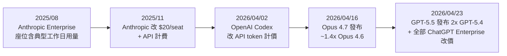
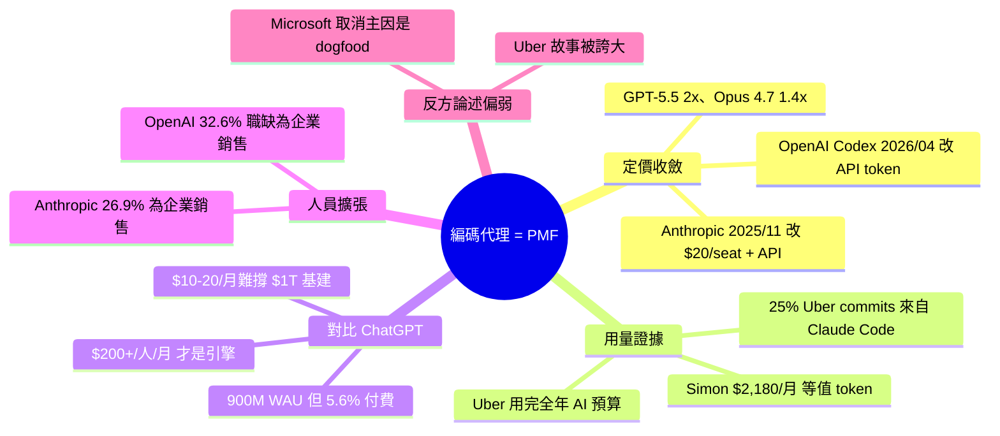

## I think Anthropic and OpenAI have found product-market fit

Simon Willison 發表深度分析認為 Anthropic 和 OpenAI 已在編碼代理領域達成產品市場適配（product-market fit），理由是企業客戶現已支付 API 級別的定價而非昔日的優惠企業方案。Anthropic 於 2025 年 11 月、OpenAI 於 2026 年 4 月改變定價模式，從無限使用改為 $20/座位/月 + 按 API 用量計費；新模型 GPT-5.5 比 GPT-5.4 貴 2 倍，Opus 4.7 比 4.6 貴約 1.4 倍（計入新 tokenizer）。Willison 個人月耗成本達 $2,180（Claude Code $1,199.79 + Codex $980.37），但訂閱僅需 $200，形成鮮明對比；企業客戶則按 API 計費，導致 Uber 等公司第一季用完全年預算。相較 ChatGPT 900M 週活用戶但僅 50M 付費使用者（5.6%）的困境，編碼代理為高薪專業人士的日常工具，每位用戶月成本達 $200+，才是真正的營收轉折點。兩公司企業銷售招聘加碼（OpenAI 703 職位中 229 個為企業銷售 32.6%，Anthropic 390 職位中 105 個 26.9%），進一步驗證 B2B 代理是增長引擎。

### 重點
- 企業定價改變（Nov 2025 Anthropic/Apr 2026 OpenAI）：$20/座位/月 + API 用量計費；GPT-5.5 vs 5.4 價差 2 倍，Opus 4.7 vs 4.6 價差 ~1.4 倍（含新 tokenizer）
- 編碼代理已轉為企業營收引擎：使用者月成本 $2,180/人（vs. 訂閱 $200），Uber 25% code commits 源自 Claude Code；vs. ChatGPT 消費者模式的 $10-20/月難以規模化
- 企業銷售加碼：OpenAI 703 職位開放中 229 個（32.6%）為企業銷售，Anthropic 390 職位中 105 個（26.9%）為企業銷售，驗證 B2B 代理增長策略

**原文：** [simon-willison](https://simonwillison.net/2026/May/27/product-market-fit/#atom-everything)

---

<!-- deep-analysis:begin -->
## 📌 摘要 (TL;DR)

- Simon Willison 主張 Anthropic 與 OpenAI 已透過編碼代理（coding agent）找到產品市場適配（product-market fit），核心證據是企業客戶開始支付 API 級別定價，不再享受過去的無限制吃到飽。
- Anthropic 於 2025 年 11 月、OpenAI 於 2026 年 4 月 2 日將企業方案改為 $20/座位/月 + 按 API token 計費；4 月 23 日 OpenAI 把這條件擴展到所有既有 ChatGPT Enterprise（含 Edu、Health、Gov、Teachers）。
- 新模型同步漲價：GPT-5.5（4/23 發布）API 價格是 GPT-5.4 的 2 倍；Opus 4.7（4/16 發布）計入新 tokenizer 後約為 Opus 4.6 的 1.4 倍。
- Simon 自己用 ccusage 量出過去 30 天等值 token 消費 $2,180.16（Claude Code $1,199.79 + Codex $980.37），訂閱卻只付 $200，企業用戶現在則是按真實 API 價格買單。
- ChatGPT 900M 週活但只有 50M 付費（5.6%），$10–20/月難以支撐 $1T 基礎設施；編碼代理把單用戶月支出推到 $200+，才是真正的營收引擎。
- 招聘數據佐證：OpenAI 703 個職缺中 229 個（32.6%）為企業銷售相關；Anthropic 390 個職缺中 105 個（26.9%）類似。

## 🎯 核心概念

- **產品市場適配（product-market fit）**：產品與付費市場真正匹配、客戶願意按真實成本買單的階段。
- **編碼代理（coding agent）**：如 Claude Code、OpenAI Codex，能自動完成軟體工程任務的 LLM 代理，token 消耗遠高於 chatbot。
- **座位 + 用量定價（seat + usage pricing）**：每使用者收固定月費（$20/seat），疊加按實際 API token 計費。
- **ccusage**：本地工具，估算若以 API 計價，過去 30 天 Claude Code 真實消耗成本。

## 📖 整理分析

### 1. 企業方案從吃到飽改成 API 計價

Anthropic 原本的 Enterprise 條款（2025 年 8 月版）寫的是「Claude 座位包含一個典型工作日的用量」，相當於變相吃到飽。根據 The Information 2026/4/14 報導與 Anthropic 發言人，這條款在 2025 年 11 月已悄悄改為 $20/座位/月加 API 用量計費，現有客戶在續約時才發現。OpenAI Codex 的官方 rate card 也註明 2026/4/2 把計價從 per-message 改為 API token usage，並於 4/23 套用到所有既存的 ChatGPT Enterprise。Simon 比對 OpenAI 用「credits」表達的價格，發現與該模型的公開 API 價完全一致。

### 2. 新模型同步漲價，把高價鎖進長約

2026 年 4 月兩家同步出新模型且調高 API 單價：GPT-5.5（4/23）是 GPT-5.4 的 2 倍；Opus 4.7（4/16）計入新 tokenizer 後約為 Opus 4.6 的 1.4 倍。由於企業合約通常是一年期，這代表他們把客戶鎖在更高的 API 價格上，而不是過去的深度折扣。Simon 認為這不是巧合，是兩家走向 IPO 前刻意執行的定價收斂。

### 3. 為什麼是編碼代理而不是 ChatGPT

ChatGPT 在 2026/2 揭露 900M 週活、但只有 50M（5.6%）是付費消費者；$10–20/月的訂閱要靠 1–2B 用戶持續四年才能攤平 $1T 基建。編碼代理改寫了這條曲線：Simon 自己中等強度使用就燒掉 $2,180/月等值 token，企業裡軟體工程師作為高薪專業人士，每人月支出輕鬆 $200+。Simon 認為 2025/11 發布的那一批模型才真正把代理推到「可用」門檻，企業花了六個月才把它變成日常工具，正好對應現在的營收爆發。

### 4. 招聘加碼驗證 B2B 轉向

Simon 用 Claude Code 爬職缺、再以 Datasette Agent 分析：OpenAI 703 個職缺中 229 個（32.6%）是 account executives、Go To Market、Forward Deployed Engineers 等企業銷售職位；Anthropic 390 個中 105 個（26.9%）也屬企業導向。他補一句諷刺：AI 實驗室最後選的商業模式，竟然極度依賴人類銷售完成合約。

### 5. 「AI 失敗」故事其實很薄

Simon 認為近期熱炒的 Uber 案例被誇大。CTO Praveen Neppalli Naga 說 Uber「2026 才幾個月就用完全年 AI 預算」，主要來自 Claude Code——但 Simon 指出 Claude Code 是 2025/11 才真正好用，2025 年定的預算當然會低估 2026 的需求。COO Andrew Macdonald 在 Rapid Response podcast 真正講的是「上一季 25% code commits 來自 Claude Code，但很難把這 25% 對應到 25% 多的消費者功能」，被媒體扭曲成「AI tokenmaxxing 不划算」。另一個 Microsoft 取消 Claude Code 授權的故事，The Verge 的 Tom Warren 也說財務只是動機之一，主因是 Microsoft 要員工 dogfood 自家 Copilot CLI。

## 🧭 定價變動時間線

## 🧠 Mindmap

<!-- deep-analysis:end -->
### 📄 原文內容

點此展開 / 收合

Anthropic are strongly rumored to be about to have their first profitable quarter. Stories are circulating of companies surprised at how expensive their LLM bills are becoming from usage by their staff. I think this is because OpenAI and Anthropic have both found product-market fit. 

 
 Enterprise customers are now paying API prices 
 I think they've found product-market fit 
 And they're ramping up 
 The AI-failure stories around this are pretty thin 
 We also know the labs are spending a lot 
 API revenue is becoming less important 
 April is a new inflection point 
 

 Enterprise customers are now paying API prices 
 I currently subscribe to the $100/month Max plan from Anthropic and the $100/month Pro plan from OpenAI. If you are a heavy user of coding agents these plans are a fantastic deal. I just ran the ccusage tool on my laptop to get an estimate of how much I would have spent if I were to pay for API tokens in the past 30 days and got: 
 
 $1,199.79 for Anthropic Claude Code 
 $980.37 for OpenAI Codex 
 
 That's $2,180.16 worth of tokens for $200 - not bad at all! I'm a moderately heavy user of these tools, but I'm certainly not running agents every hour of the day and night. 
 I had assumed that companies making extensive use of agents were getting similar discounts. It turns out I could not have been more wrong about that. 
 I haven't been able to track down the exact date, but at some point in the last six months Anthropic switched their Enterprise plan (originally "Claude seats include enough usage for a typical workday" back in August 2025 ) to $20/seat/month plus API pricing for usage. This story about the change from The Information is dated Apr 14, 2026, but cites an Anthropic spokesperson claiming that the pricing change occurred in November 2025. Existing customers are finding out about the change as they renew their contracts. 
 OpenAI made a similar pricing change in April. The Codex rate card ( Internet Archive copy ) currently says: 
 
 Note : On April 2, 2026, we updated Codex pricing to align with API token usage, instead of per-message pricing. This change was applicable to new and existing Plus, Pro, ChatGPT Business and new ChatGPT Enterprise plans. 
 On April 23, 2026, we made this update for all existing ChatGPT Enterprise plans as well, inclusive of Edu, Health, Gov, and ChatGPT for Teachers. 
 
 It's a little harder to decode as they quote prices in "credits", but as far as I can tell those credit costs are an exact match for the API token costs listed for those models. 
 All of which is to say that as of April 2026 the "Enterprise" cost for both OpenAI Codex and Anthropic Claude Code/Cowork is the same as the listed API price. 
 GPT-5.5 (released April 23rd) is 2x the API price of GPT-5.4. Opus 4.7 (April 16th) is around 1.4x the price of Opus 4.6 when you take their new tokenizer into account. 
 So April saw both leading model companies release new frontier models with a higher API price, and both companies now have measures to lock their enterprise customers (who tend to sign year-long deals) at those API prices, not the previous extreme discounts. 
 I think they've found product-market fit 
 Why these sudden aggressive moves on pricing? Both Anthropic and OpenAI are planning to IPO, but I suspect there's a more important factor here: I think they've finally found product-market fit, with the coding/general-purpose agent products embodied by Claude Code/Cowork and Codex. 
 Tools like ChatGPT are wildly popular, but that wild popularity has been difficult to turn into revenue. In February OpenAI boasted more than 900 million weekly active users for ChatGPT, but only 50 million - 5.6% of that - were paying consumer subscribers. 
 Charging $10-$20/month per user is an OK business, but you'd need 1-2 billion subscribers sticking around for four years to cover $1 trillion in infrastructure . 
 Companies spending $200+/month/user will get you there a whole lot faster - and as noted above, as a power-user I'm at ~$1,000/month in API costs per vendor already. 
 Coding agents really did change everything. These are tools which burn vastly more tokens, but are also quickly becoming daily drivers for the work carried out by extremely well-compensated professionals. Right now that's still mostly software engineers, but a coding agent is a tool that can automate anything you can do by typing commands into a computer... so they are clearly applicable to a much wider set of skilled knowledge workers. 
 As I've discussed on this site at length , the models released in November 2025 elevated agents to being genuinely useful. We've had six months to get used to that idea now - it's no wonder companies are beginning to spend real money on this technology. 
 You could argue that ChatGPT achieved product-market fit when it became the fastest-growing consumer app in history back in February 2023... but it certainly wasn't making any actual money back then. Coding agents plus enterprise pricing marks the point when these companies start making very real revenue. Maybe even enough to start covering their costs! 
 And they're ramping up 
 As further evidence that enterprise agents represent product-market fit for these companies, consider their open job listings. 
 OpenAI have 703 open jobs right now, of which I'd categorize 229 (32.6%) as relating to enterprise sales and support - account executives, "Go To Market", "Forward Deployed Engineers" and the like. 
 Anthropic have 390 open jobs , 105 (26.9%) of which look enterprisey to me. 
 It's pleasingly ironic that these AI labs have picked a business model with such a heavy demand on human labor - enterprise sales contracts don't close themselves without a whole lot of humans in the mix! 
 (I ran this analysis by scraping their job sites with Claude Code, then having it use Datasette's JSON API to pipe that data into Datasette Cloud where I used Datasette Agent for the analysis, exported here . Dogfood!) 
 The AI-failure stories around this are pretty thin 
 I started digging into this in response to a growing volume of stories claiming that large companies were sounding the alarm because their AI usage costs had grown so large. 
 The most widely cited of these stories appear quite overblown to me. 
 The most discussed has been Uber, based on this report where CTO Praveen Neppalli Naga indicated that Uber had "maxed out its full year AI budget just a few months into 2026", mostly thanks to Claude Code. 
 Given that Claude Code only got really good in November it's entirely unsurprising to me that a budget set in 2025 may have failed to predict demand for that tool in 2026! 
 That Uber story was further fueled by comments made by Uber's COO, Andrew Macdonald, on the Rapid Response podcast. I tracked down the segment and there really isn't much there. Here's what Andrew said: 
 
 But then you sometimes go and talk to your senior engineering leaders and you're saying, OK, how many projects that were on the cutting room floor got moved above the line because of the productivity gains because 25% of our code commits were via Claude Code last quarter? 
 That link is not there yet, right? I think maybe implicitly there's more that is getting shipped. But it's very hard to draw a line between one of those stats and, OK, now we're actually producing like 25% more useful consumer features, right? And that line is hard to draw. 
 
 Somehow this fragment turned into headlines like Uber's COO says it's getting harder to justify the money spent on AI tokenmaxxing , because the market for stories about AI failures remains enormous. 
 The other popular story around this is Microsoft starts canceling Claude Code licenses , ostensibly to encourage their engineers to dogfood their own Copilot CLI agent instead - but The Verge reporter Tom Warren says "sources tell me the decision is also a financial one", triggered by the June 30th end of Microsoft's financial year. 
 I think both of these stories support my "product-market fit" hypothesis. The best advice I ever heard on pricing a product was that your customer should suck air through their teeth and then say yes. Uber's budget overrun and Microsoft's seat cancellations look like that effect playing out in practice. 
 We also know the labs are spending a lot 
 The big AI labs spend billions of dollars on both training and inference. Credible figures are hard to come by, but we did get one huge hint as to the figures involved from, oddly enough, the recent SpaceX S-1 : 
 
 [...] in May 2026, we entered into Cloud Services Agreements with Anthropic PBC (“Anthropic”), an AI research and development public benefit corporation, with respect to access to compute capacity across COLOSSUS and COLOSSUS II . Pursuant to these agreements, the customer has agreed to pay us $1.25 billion per month through May 2029 [...] 
 
 The Anthropic announcement said that this deal meant they could "increase our usage limits for Claude Code and the Claude API", heavily implying that Colossus is being used for inference, not model training. 
 Anthropic already have vast amounts of compute from other providers. The fact that they're willing to spend $1.25 billion per month for extra capacity from just one of their vendors hints at how big these inference budgets have become. 
 API revenue is becoming less important 
 Over the past two years my impression has been that OpenAI made more of their income from subscription revenue while Anthropic made more from their API. 
 Anthropic's API revenue was historically quite dependent on a small number of large API customers - this VentureBeat story from August 2025 quotes "sources familiar with the matter" suggesting that just Cursor and GitHub Copilot were responsible for $1.2 billion of the company's then-$4 billion revenue. 
 Today Anthropic are rumored to hit $10.9 billion in the second quarter , potentially even operating at a profit for the first time. 
 This pivot-to-Enterprise suggests that the labs have realized that the real money lies in cutting out the middlemen. Anthropic's Claude Code directly competes with Cursor and Copilot. No wonder Cursor are investing in their own models ! 
 April is a new inflection point 
 I've called November 2025 the November inflection point because that was when GPT-5.1 and Opus 4.5, combined with their respective coding agent harnesses, got good - good enough that we've spent the last six months adapting to agent systems that can reliably get useful work done. 
 I think April 2026 is a new inflection point where the revenue implications of this have started to land, to the benefit of the frontier AI labs and with material impacts on the budgets of large companies. 
 We'll know for sure how real this moment is when the S-1 documents for the upcoming Anthropic and OpenAI IPOs give us some real, audited numbers to get our teeth into. 
 
 Tags: ai , datasette , openai , generative-ai , llms , anthropic , llm-pricing , coding-agents , claude-code , codex , claude-cowork , november-2025-inflection , datasette-agent

