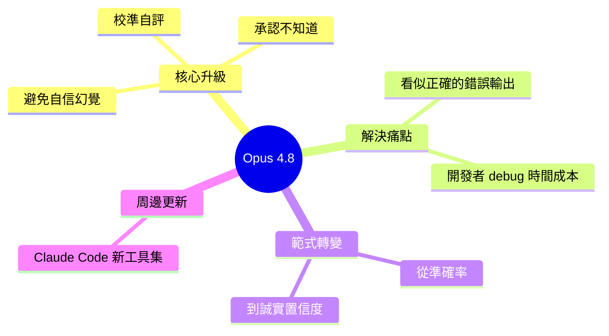

## Opus 4.8 Just Landed — and It Admits When It’s Wrong

Anthropic 发布 **Claude Opus 4.8**（即日上线）。升级核心：模型能**主动承认不确定性**——不再过度自信输出错答。问题背景：开发者最大成本不是模型输错，而是输出「看起来对但错误」的代码，需花费数小时排查才意识到被误导。Opus 4.8 引入内部不确定性信号机制，使模型在无把握时说「我不知道」或标注可信度。Claude Code 亦获新工具集（文章未展详）。这是从「追求准确率」向「诚实表述置信度」的范式转变。

### 重點
- 核心创新：模型输出附带**置信度/不确定性标记**，减少「高置信错误」导致的开发时间浪费
- 问题定义：错代码可被发现，问题在于看起来对的错代码（高置信幻觉）
- Claude Code 增强：新工具集（细节待深入）

**原文：** [medium-tag-claude](https://medium.com/@jh.baek.sd/opus-4-8-just-landed-and-it-admits-when-its-wrong-f73c869ce6ca?source=rss------claude-5)

---

<!-- deep-analysis:begin -->
## 📌 摘要 (TL;DR)

- Anthropic 發布 **Claude Opus 4.8**，即日上線，重點不是 benchmark 分數，而是模型會主動承認「我不確定」。
- 開發者最大痛點不是模型答錯，而是模型自信輸出「看起來對但實際錯誤」的程式碼，事後耗費數小時 debug 才發現被誤導。
- Opus 4.8 引入內部不確定性訊號（uncertainty signal）機制，無把握時直接說不知道或標註可信度。
- Claude Code 也獲新工具集（原文未展開細節）。
- 代表從「追求準確率」轉向「誠實表述置信度（calibrated confidence）」的範式轉變。

## 🎯 核心概念

- **校準自評（calibrated self-assessment）**：模型內部能評估自己答案的可信度，而非一律以高信心輸出。
- **誠實不確定性（honest uncertainty）**：模型主動標示「不知道」，避免自信幻覺（confident hallucination）。

## 📖 整理分析

### 1. 真正的開發成本：被誤導的時間
原文點出開發者最大成本不是模型輸錯一行 code，而是 LLM 輸出「表面正確、實則錯誤」的內容。看起來合理的程式碼會直接被採用，問題在跑出來後才浮現，往往需要數小時排查才意識到根源是模型胡謅。

### 2. Opus 4.8 的範式轉變
過去模型版本疊代主要比拼 benchmark 分數（如 SWE-Bench、MMLU 等）。Opus 4.8 把競爭焦點移到「誠實度」——模型不再為了完整性而自信補完未知內容，改為在無把握時明說。這對需要把 LLM 輸出直接送進 production 的工作流影響最大。

### 3. Claude Code 工具更新（細節待補）
原文提到 Claude Code 同步獲得新工具集，但 teaser 段未展開內容。需追原文全文或官方 release notes 才能確認具體工具範圍。

> ⚠️ 本文輸入僅含 Medium 摘要片段（teaser），完整技術細節（不確定性訊號實作方式、效能對比、新工具清單）需查閱原文或 Anthropic 官方公告。

## 🧠 Mindmap

<!-- deep-analysis:end -->
### 📄 原文內容

點此展開 / 收合

Claude&#x2019;s newest model is out today. The upgrade that matters isn&#x2019;t a higher score &#x2014; it&#x2019;s a model that finally tells you when it&#x2019;s unsure&#x2026; Continue reading on Medium »

