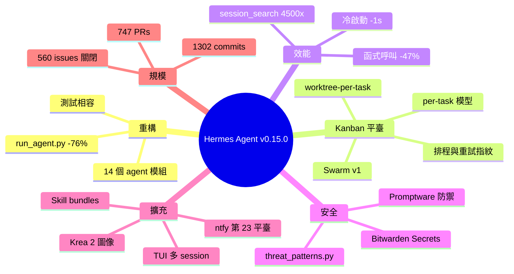

## Hermes Agent v0.15.0 (2026.5.28) — The Velocity Release

Hermes Agent v0.15.0（「速度發布」）多維度突破。核心 run_agent.py 16,083→3,821 行（-76%），拆分 14 模組化子代理，外部相容性與測試路徑保留。Kanban 演進為真正多代理平臺（104 PR），支援任務樹自動分解、per-task 模型覆蓋、worktree 隔離、排程、重試指紋。冷啟動 -1 秒，函式呼叫 -47%（399k→213k），hermes --version 性能反超 Codex CLI。session_search 去輔助 LLM，4,500 倍快、成本零。新增 Promptware 防禦抵禦 Brainworm 注入、Bitwarden 密鑰集中（一令牌替代多組 API）、Skill bundles、ntfy 推送、TUI 多工作階段、Krea 圖像、OpenHands 編制。15 P0 + 65 P1 修正。

### 重點
- run_agent.py 重構 -76%、14 模組，冷啟動 -1 秒、函式呼叫 -47%，hermes --version 勝 Codex CLI 性能對標
- Kanban 多代理平臺完整特性：任務樹自動分解、per-task 模型選擇、worktree 隔離、重試指紋、stale 偵測，支援 104 PR 一致構築
- session_search 重構無 LLM + 4,500× 加速；Promptware 三層防禦；Bitwarden 密鑰集中；skill bundles 一命令多工作流；ntfy/TUI 多工作階段編制

**原文：** [hermes-agent-releases](https://github.com/NousResearch/hermes-agent/releases/tag/v2026.5.28)

---

<!-- deep-analysis:begin -->
## 📌 摘要 (TL;DR)

- Hermes Agent v0.15.0（代號 Velocity Release）自 v0.14.0 起累計 1,302 commits、747 PRs、1,746 檔案變動，關閉 560+ issues（含 15 P0、65 P1、19 security）。
- 核心檔 `run_agent.py` 從 16,083 行重構為 3,821 行（-76%），拆成 14 個 `agent/*` 模組，外部 caller 與測試 patch 路徑全保留相容。
- Kanban 多代理平臺一次 104 PRs：triage 自動分解任務樹、`hermes kanban swarm` 生成 Swarm v1 圖、per-task 模型覆蓋、worktree 隔離、排程啟動、retry 指紋。
- 冷啟動再砍一秒：`hermes --version` 701ms → 258ms（-63%），對 Codex CLI 基準從 5/11 翻成 6/11；31 turn 對話的函式呼叫從 399k → 213k（-47%）。
- `session_search` 拋棄輔助 LLM 改三模式（discovery/scroll/browse），20ms 取代 30s，成本從 ~$0.30/call → 0；快 4,500 倍。
- 新增 Brainworm/Promptware 注入防禦（arxiv 2601.09625）、Bitwarden Secrets Manager 中央化、Skill bundles、ntfy 第 23 推送平臺、Krea 2 圖像（$0.03/$0.06）。

## 🎯 核心概念

- **多代理蜂群拓樸**（Swarm topology）：根代理派發給平行 worker，再經 gated verifier 與 synthesizer，共享 blackboard 狀態板。
- **任務樹自動分解**（task auto-decomposition）：Kanban triage 將單一任務切成多層子任務，每層可獨立指派模型與工作目錄。
- **工作樹隔離**（worktree-per-task）：每個任務在獨立 git worktree/branch 內執行，避免多代理互踩。
- **重試指紋**（retry fingerprinting）：辨識相同失敗特徵避免無窮重試。
- **Promptware 攻擊**（Promptware Kill Chain）：透過工具輸出、記憶回憶或預存技能注入惡意指令的攻擊鏈，又稱 Brainworm。
- **技能組合包**（Skill bundles）：一個 slash command 載入多個 skill 的具名集合，如 `/writing-day` 同時啟用 humanizer + ideation + obsidian + youtube-content。

## 📖 整理分析

### 1. 核心檔案瘦身 76%

`run_agent.py` 是 Hermes 對話迴圈的心臟。本版從 16,083 行縮到 3,821 行，抽出的程式碼分散到 14 個 `agent/` 子模組（PR #27248）。relase notes 強調行為不變：`AIAgent` 上保留 thin forwarder，每個測試 patch path 仍可用，外部 caller 不需改動。直接效益是編輯器載入時間從 90 秒變瞬開，plugin 作者終於能 grep 整個 codebase。

### 2. Kanban 進化為多代理平臺

總計 104 PRs（#27572、#28443、#28364、#28394、#28462、#28384、#28467、#28455、#28452、#28432、#28468、#28420 等）把 Kanban 從待辦板提升為調度器。新功能：triage 自動把單一任務拆成子任務樹；`hermes kanban swarm` 一行指令生成 Swarm v1 完整圖（root、平行 worker、gated verifier、gated synthesizer、共享 blackboard）；任務支援 per-task 模型覆蓋（樣板代碼用便宜模型、難題用昂貴模型）、board 級預設 workdir、per-task worktree 與 branch、排程啟動時間、可調 claim TTL、retry 指紋、stale-task 偵測、respawn 守衛、拖拉刪除垃圾區。worker 透過 `/workers/active`、`/runs/{id}`、`/inspect` endpoint 回報。

### 3. 冷啟動三波最佳化

第三波效能改進累計再省一秒（#28864、#28866、#28957、#29006、#29419、#30121、#30609、#31968）：延遲 `openai._base_client` import 省 240ms / 17MB；hot-path 把 31 turn 對話函式呼叫從 399k 砍到 213k（-47%）；延遲壓縮可行性檢查省 170–290ms；自適應 subprocess polling 每個工具呼叫省 195ms、每輪省 1+ 秒。Termux 冷啟動 2.9s → 0.8s。`hermes --version` 冷啟動 701ms → 258ms（-63%），對 Codex CLI 11 項基準從 5 勝翻為 6 勝。

### 4. session_search 去 LLM 化

舊版 `session_search` 用輔助 LLM 摘要三個 session 要 ~30 秒、~$0.30/call，FTS5 命中清單沒包含正確 session 時還會幻想。新版改為單一工具三模式（discovery、scroll、browse），由參數推斷模式，不需 mode 參數、不需輔助 LLM、無設定旋鈕、無 companion skill。discovery 約 20ms、scroll 約 1ms，等同免費且快 4,500 倍（PR #27590）。

### 5. 安全與密鑰防線

受 Origin HQ 的 Brainworm/Promptware Kill Chain 研究（arxiv 2601.09625）啟發，Hermes 在三個入口防注入：`tools/threat_patterns.py` 統一來源加 ~15 個 Brainworm/C2 pattern；recalled memory 載入時掃描；工具輸出加 delimiter marker 避免惡意檔案冒充 Hermes 系統訊息。搭配新 `security-guidance` plugin pattern-match 危險寫入（#32269、#33131、#9151）。

Bitwarden Secrets Manager 整合（#30035、#31378、#30364）以單一 `BWS_ACCESS_TOKEN` bootstrap token 取代 `~/.hermes/.env` 內所有 per-provider API key；`bws` CLI 首次使用時 lazy install；預設 source-of-truth，rotate 後實際生效；可用 `secrets.bitwarden.override_existing: false` 反轉；支援 EU Cloud 與自架 server URL。

### 6. 平臺、工具、模型擴充

- **ntfy** 成為第 23 個訊息平臺（#30867，源自 #30625 / #4043），不需註冊與 API key，只需 topic URL，cron、kanban 完工、`send_message` 都能推播。
- **Skill bundles**（#28373、#32345、#32240、#32261、#32265）以一個 slash command 啟動一組 skill；新增 `code-wiki`（Karpathy LLM-Wiki 風格持久 dev wiki）、`openhands`（委派給 OpenHands 平行 coding agent）、`web-pentest`（OWASP 風格 pentest recipe）。
- **TUI 多 session 編排**（#32980、#30084，源自 #27642）：Ink TUI 加入 active-session 切換 overlay，可列出/切換/刷新/關閉多個本地 session，並用 session-scoped 模型選擇器派發新 session。
- **image_gen 雙新供應商**：Krea 2 Medium $0.03、Krea 2 Large $0.06，可從 hermes tools → Image Generation → Krea 選用；同時透過 FAL.ai catalog 提供。FAL backend 從單體 image-generation 工具拆到 `plugins/image_gen/fal/`，與 web、browser、video_gen 達成四方架構對稱。

## 🧠 Mindmap

<!-- deep-analysis:end -->
### 📄 原文內容

點此展開 / 收合

Hermes Agent v0.15.0 (v2026.5.28) 
 Release Date: May 28, 2026 
 Since v0.14.0: 1,302 commits · 747 merged PRs · 1,746 files changed · 282,712 insertions · 36,699 deletions · 560+ issues closed (15 P0, 65 P1, 19 security-tagged) · 321 community contributors (including co-authors) 
 
 The Velocity Release. Hermes gets dramatically faster — to start, to run, to ship work, and to grow. The 16,083-line run_agent.py collapses to 3,821 (-76%) across 14 cohesive agent/* modules. Kanban grew into a real multi-agent platform across 104 PRs — orchestrator auto-decomposition, swarm topology, scheduled tasks, worktree-per-task, per-task model overrides. The cold-start perf wave keeps going: another second shaved off launch, 47% fewer per-conversation function calls, hermes --version flipping the head-to-head benchmark against Codex CLI. session_search is 4,500× faster and free now. Promptware defense lands against Brainworm-class attacks. Bitwarden Secrets Manager replaces N per-provider API keys with one bootstrap token. Skill bundles let one slash command load a whole workflow. The Ink TUI gets a multi-session orchestrator. Two new image_gen providers (Krea 2 Medium + Large, FAL ported to plugin), the Nous-approved MCP catalog with an interactive picker, an OpenHands orchestration skill, ntfy as the 23rd messaging platform, and a deep xAI integration round (Web Search plugin, xai-oauth hermes proxy upstream, retired-May-15 model detection + hermes migrate xai , natural TTS speech-tag pauses, base_url leak guard, OpenAI-style execution guidance for Grok). 15 P0 + 65 P1 closures alongside. 
 
 
 ✨ Highlights 
 
 
 The Big Refactor — run_agent.py is no longer 16,000 lines — The file at the heart of Hermes — the agent conversation loop — has been reduced from 16,083 lines to 3,821 (-76%), with the extracted code redistributed across 14 cohesive modules under agent/ . Behavior is unchanged: every extraction keeps a thin forwarder on AIAgent , every test patch path still works, every external caller is compatible. The reason you care: future Hermes development moves faster, plugin authors can finally grep the codebase, and the file that took 90 seconds to load in your editor opens in a blink. ( #27248 ) 
 
 
 Kanban grew into a real multi-agent platform — 104 PRs end to end — Triage auto-decomposes one task into a tree of sub-tasks. hermes kanban swarm creates a full Swarm v1 graph in one command — root, parallel workers, gated verifier, gated synthesizer, shared blackboard. Tasks support per-task model overrides (cheap models for boilerplate, expensive ones for hard sub-tasks), board-level default workdirs, per-task worktree paths and branches, scheduled start times, configurable claim TTL, retry fingerprinting, stale-task detection, respawn guards, and a drag-to-delete trash zone. Workers report through /workers/active , /runs/{id} , and /inspect endpoints. ( #27572 , #28443 , #28364 , #28394 , #28462 , #28384 , #28467 , #28455 , #28452 , #28432 , #28468 , #28420 ) 
 
 
 Cold-start perf wave keeps going — another second saved, 47% fewer per-turn function calls — Three new optimization rounds: defer openai._base_client import (-240ms / -17MB on every CLI invocation), hot-path optimizations cut 47% of per-conversation function calls (399k → 213k for 31-turn chat), defer compression-feasibility check (-170 to -290ms on every agent construction), adaptive subprocess polling (-195ms per tool call, 1+ second per turn). Termux cold start drops from 2.9s to 0.8s. hermes --version cold drops 63% (701ms → 258ms), flipping the head-to-head benchmark against Codex CLI from 5/11 wins to 6/11. ( #28864 , #28866 , #28957 , #29006 , #29419 , #30121 , #30609 , #31968 ) 
 
 
 session_search rebuilt — no LLM, no cost, 4,500× faster — The old session_search was an aux-LLM-powered tool that cost ~$0.30/call and took ~30 seconds to summarize three sessions, sometimes confabulating when the right session wasn't even in the FTS5 hit list. The new shape is one tool with three modes (discovery, scroll, browse) inferred from which args are set — no mode parameter, no aux-LLM, no config knob, no companion skill. Discovery is ~20ms instead of ~90s; scroll is ~1ms. Searching your past sessions for context is now free and instant. ( #27590 ) 
 
 
 Promptware defense — Brainworm-class attacks blocked at three chokepoints — Inspired by recent Brainworm / Promptware Kill Chain research (Origin HQ, arxiv 2601.09625), Hermes now defends the context window against prompt-injection attacks that try to hijack the agent via tool output, recalled memory, or stored skills. Single source of truth ( tools/threat_patterns.py ) with ~15 new Brainworm/C2 patterns; recalled memory is scanned at load time; tool results get delimiter markers so a malicious file or remote service can't impersonate Hermes' own system content. Paired with a new security-guidance plugin that pattern-matches dangerous code writes. ( #32269 , #33131 , #9151 ) 
 
 
 Bitwarden Secrets Manager — one bootstrap token replaces every per-provider API key — Stop keeping plaintext API keys in ~/.hermes/.env . Install Bitwarden Secrets Manager ( bws auto-installs lazily on first use), point Hermes at it with one bootstrap token ( BWS_ACCESS_TOKEN ), and every credential you need comes from Bitwarden at startup. Rotate a key in the Bitwarden web app and the rotation actually takes effect — Bitwarden defaults to source-of-truth so its values overwrite matching env vars on startup. Flip secrets.bitwarden.override_existing: false to invert. EU Cloud and self-hosted Bitwarden server URLs supported. Detected credentials are now labeled with their source so you can see at a glance which keys came from Bitwarden vs. the local env. ( #30035 , #31378 , #30364 ) 
 
 
 ntfy as the 23rd messaging platform — push notifications without an account — ntfy is the self-hostable push-notification service with no signup, no API key, just a topic URL. Hermes now adapts to it as a platform plugin (zero edits to core), so your agent can send you push notifications from any cron job, kanban task completion, or chat send_message — to your phone, your watch, your desktop, your homelab. (salvages #30625 → originally #4043 ) ( #30867 ) 
 
 
 Skill bundles — /&lt;name&gt; loads multiple skills at once — A skill bundle is a named group of skills that loads them all together with one slash command. Set up your "writing day" bundle (humanizer + ideation + obsidian + youtube-content) and /writing-day activates all four for the session. Skills Hub now has health checks, a freshness badge, and a watchdog cron. Three new optional skills land: code-wiki (Karpathy's LLM-Wiki, persistent indexed dev wiki), openhands (delegate to OpenHands for parallel coding agents), and web-pentest (OWASP-style web pentest recipes). ( #28373 , #32345 , #32240 , #32261 , #32265 ) 
 
 
 TUI session orchestrator — multiple live sessions in one TUI window — The Ink TUI gained an active-session switcher overlay. List, switch between, refresh, and close multiple live process-local sessions without leaving the TUI; dispatch a new session with a session-scoped model picker. Plus a wave of TUI polish — mouse-tracking DEC mode presets, scrollback preservation across branches and termux, slash-dropdown fixes, x.com link rendering, and CJK / IME input rendering improvements. (salvages #27642 ) ( #32980 , #30084 ) 
 
 
 Two new image_gen providers — Krea 2 Medium + Large, FAL ported to plugin — Krea joins the image_gen lineup as a built-in plugin: Krea 2 Medium ($0.03) and Krea 2 Large ($0.06), auto-discovered, selectable via hermes tools → Image Generation → Krea. Available through both the native Krea plugin and the FAL.ai catalog. The FAL.ai backend got pulled out of the monolithic image-generation tool into plugins/image_gen/fal/ , completing the four-way architectural parity already established by web, browser, and video_gen — new image providers are now one file, not a fork. ( #33236 , #30380 , #33506 ) 
 
 
 Nous-approved MCP catalog with interactive picker — A curated catalog of Nous-vetted MCP servers, mirroring the optional-skills shape. Run hermes mcp and you get an interactive picker; install with one keystroke, credentials prompted at install time and written to ~/.hermes/.env . Ships with the n8n manifest first. Closes the discovery gap that left users hunting GitHub for trusted MCP servers. ( #30870 ) 
 
 
 OpenHands orchestration skill — A new optional skill under optional-skills/autonomous-ai-agents/openhands/ lets the agent delegate coding tasks to the OpenHands CLI alongside claude-code , codex , and opencode . OpenHands is the model-agnostic member of that family — any LiteLLM-supported provider works (OpenAI, Anthropic, OpenRouter, your own), so you can route a sub-task to the cheapest model that can finish it. Drop-in worker for kanban swarms and /delegate flows. (closes #477 ) ( #32261 ) 
 
 
 Deep xAI integration round — Web Search plugin, OAuth proxy upstream, May 15 retirement detection, natural TTS, security hardening — Six interlocking xAI improvements: 
 
 xAI Web Search lands as a plugins/web/xai/ provider, slots alongside Brave / Tavily / Exa / SearXNG / DDGS / Firecrawl — reuses your existing Grok OAuth or XAI_API_KEY credentials, no new env vars. ( #29042 ) 
 hermes proxy gains an xAI upstream — your local OpenAI-compatible endpoint can now be backed by SuperGrok OAuth, no PKCE-refresh code to write in your client. ( #28356 ) 
 May 15 model retirement detection — grok-4 , grok-4-fast{,-reasoning,-non-reasoning} , grok-3 , grok-code-fast-1 , grok-imagine-image-pro etc. are detected in doctor and chat startup, with hermes migrate xai to one-shot config migration to the supported model. No more silent 404s after the retirement date. ( #29277 ) 
 Opt-in auto_speech_tags for xAI TTS — inserts light [pause] tags between paragraphs and sentences for more natural-sounding voice replies. Default OFF. ( #29376 ) 
 xai-oauth base_url pinned to x.ai origin — closes a silent credential-leak vector where XAI_BASE_URL could repoint OAuth-authenticated inference to an attacker-controlled host. ( #28952 ) 
 OpenAI-style execution guidance applied to Grok models — Grok and xai-oauth now get the same family-specific execution discipline block GPT/Codex have, so the model stops claiming completion without tool calls and stops suggesting workarounds instead of using existing tools. ( #27797 ) 
 Plus x_search degraded-results surfacing, tier-gated 403 with API-key fallback, PKCE code_challenge round-trip fix, dead-token quarantine on terminal refresh failure, MiniMax-style short-token refresh on per-request, and WKE=unauthenticated honor at both classifier sites. ( #29484 , #28351 , #27560 , #28116 , #30619 , #30872 ) 
 
 
 
 
 🏗️ Core Agent &amp; Architecture 
 The Big Refactor — run_agent.py 16k → 3.8k 
 
 run_agent.py from 16,083 → 3,821 lines (-76%), extracted into 14 cohesive agent/* modules. run_conversation alone was 3,877 lines before the refactor. Every extraction keeps a thin forwarder on AIAgent , every test-patch path is preserved, every external caller stays compatible. ( #27248 ) 
 
 Agent loop &amp; conversation 
 
 Auxiliary task layered fallback (primary → chain → main agent → graceful fail) on capacity errors (402/429/connection). (salvages #26811 + #26998 ) ( #27625 ) 
 Buffer retry/fallback status; surface only on terminal failure (no more noisy "retrying..." spam in mid-run output). ( #33816 ) 
 Host contract for external context engines — condenses 5 prior PRs into one extension surface. ( #33750 ) 
 Fallback immediately on provider content-policy blocks. ( #33883 ) 
 Re-pad reasoning_content on cross-provider fallback to require-side providers. (salvage #33784 ) ( #33795 ) 
 Per-turn tool-outcome verifier — patch tool gets indent preservation, CRLF preservation, per-file failure escalation. ( #32273 ) 
 Single-knob native vision for custom-provider models. ( #29679 ) 
 Background review fork isolate

[... truncated for safety ...]

