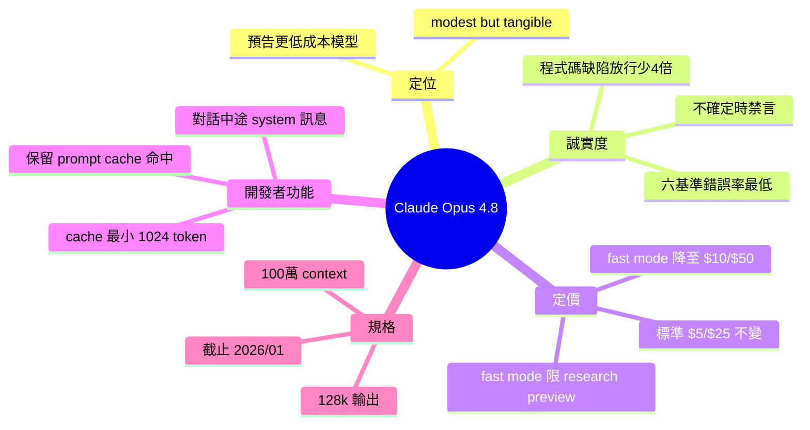

## Claude Opus 4.8: \"a modest but tangible improvement\"

Claude Opus 4.8 發布，官方自述為「modest but tangible improvement」。最核心改進是 honesty（誠實度）：透過訓練模型在不確定時主動禁言（abstaining on uncertain questions）而非盲目作答，使代碼缺陷未被標記的概率降低約 4 倍。系統評估顯示 Opus 4.8 在六個基準上的錯誤率最低，主要透過減少不確定領域的回答而達成。定價維持 $5M input / $25M output，但 fast mode 定價大幅下調至 $10/$50（前版本 $30/$150）。新增 mid-conversation system messages，允許在長對話中插入更新指令同時保留 prompt cache 命中率。Prompt cache 最小長度降至 1,024 tokens（前版本 4,096）。

### 重點
- 核心改進：honesty - 模型在不確定時主動禁言，代碼缺陷未檢出率約降低 4 倍
- 定價調整：fast mode 從 $30/$150 降至 $10/$50；標準模式維持 $5M input / $25M output
- 技術增強：mid-conversation system messages + prompt cache 最小長度 1,024 tokens，降低 agent loop 成本並保留 cache 命中

**原文：** [simon-willison](https://simonwillison.net/2026/May/28/claude-opus-4-8/#atom-everything)

---

<!-- deep-analysis:begin -->
## 📌 摘要 (TL;DR)

- Anthropic 發布 **Claude Opus 4.8**，官方罕見地自述為「modest but tangible improvement（小幅但實在的進步）」，並預告正開發成本更低、能力接近 Opus 的模型。
- 最大改進是**誠實度（honesty）**：早期測試者回報 Opus 4.8 更會主動標記不確定性，使其寫的程式碼缺陷未被標出而放行的機率，比前代降低約 **4 倍**。
- 系統卡顯示 Opus 4.8 在六個基準上的 incorrect-rate（答錯率）皆為最低，但主要靠**對不確定問題禁言（abstaining）**達成，而非答對更多題。
- 定價不變：輸入 $5／百萬 token、輸出 $25／百萬。但 fast mode 大砍至 $10／$50（前代 4.6/4.7 為 $30／$150），且僅開放 research preview 組織。
- 新增 **mid-conversation system messages**：對話中途可插入 `role: "system"` 訊息更新指令，同時保留先前 turn 的 prompt cache 命中，降低 agentic loop 的輸入成本。
- Prompt cache 最小長度從 4.7 的 4,096 token 降到 **1,024 token**。知識截止與訓練資料截止維持 2026 年 1 月，context window 仍 100 萬 token、最大輸出 128,000 token。

## 🎯 核心概念

- **誠實度** (honesty)：訓練模型不做無證據支撐的宣稱，不確定時禁言而非硬答。
- **禁言** (abstaining)：模型對沒把握的問題選擇不回答，是 Opus 4.8 壓低答錯率的主要手段。
- **對話中途系統訊息** (mid-conversation system messages)：在 user turn 後插入 system 角色訊息以更新指令，不需重述整段 system prompt。
- **Fast mode**：以約兩倍價格換更快回應，目前僅限 research preview 組織。

## 📖 整理分析

### 1. 一次「誠實」的發布公告
Simon Willison 最欣賞的是 Anthropic 老實把這次更新講成「小幅漸進改進」，而非誇大行銷。公告同時點名誠實度是主題：模型常會在證據薄弱時就自信宣稱有進展，而 Opus 4.8 更傾向標記不確定、少做無根據宣稱。

### 2. 4 倍少放行程式碼缺陷
官方評估指出，Opus 4.8 讓自己寫的程式碼缺陷「未被標出而通過」的機率約為前代的 1/4。這對 agentic coding 場景意義大——模型更會說「我這裡不確定」而非假裝完成。

### 3. 靠禁言而非答對換來的低錯誤率
系統卡寫得很明白：Opus 4.8 在六個模型中、每個基準的 incorrect-rate 都最低，是衡量事實幻覺最直接的指標。但它主要靠**對不確定題目禁言**達成，而不是答對更多題。這是取捨：少犯錯，但也少回答。

### 4. 定價與規格：fast mode 大降
標準定價維持 Opus 4.5/4.6/4.7 的水準（輸入 $5／百萬、輸出 $25／百萬）。變化在 fast mode：從 $30／$150 降到 $10／$50，但僅 research preview 組織可用，需找 account manager 申請。其餘規格（100 萬 context、128k 輸出、2026/01 截止）與 4.7 相同。

### 5. 對開發者友善的兩個小改動
一是 mid-conversation system messages，可在長對話中途追加指令而不破壞前段 prompt cache，省 agentic loop 的輸入成本；Anthropic Python SDK 已配合更新。二是 prompt cache 最小長度從 4,096 降到 1,024 token，更短的 prompt 也能享快取。

### 6. 鵜鶘騎腳踏車與一個 43 美分的 max
Willison 照例用「鵜鶘騎腳踏車」SVG 測五個 thinking level（low/medium/high/xhigh/max）。他用 LLM CLI 跑、匯出 Markdown，再讓 Opus 4.8 寫一個能把 SVG fenced code block 渲染出來的 HTML 工具（事後請 Codex 裡的 GPT-5.5 xhigh 補掉 XSS 漏洞）。max 等級畫得最好，但花了 25 input／17,167 output token，共 **43 美分**。

## 🧭 定價與快取對比

| 項目 | Opus 4.6/4.7 | Opus 4.8 |
|---|---|---|
| 標準輸入／輸出 | $5／$25（百萬 token） | $5／$25（不變） |
| Fast mode 輸入／輸出 | $30／$150 | $10／$50 |
| Prompt cache 最小長度 | 4,096 token | 1,024 token |
| Context／最大輸出 | 1,000,000／128,000 | 1,000,000／128,000（不變） |

## 🧠 Mindmap

<!-- deep-analysis:end -->
### 📄 原文內容

點此展開 / 收合

Anthropic shipped Claude Opus 4.8 today. My favourite thing about it is this note in the release announcement: 
 
 Users will find Opus 4.8 to be a modest but tangible improvement on its predecessor. There’s still more to be done: we’re working on developing and releasing models that provide many of the same capabilities as Opus at a lower cost. 
 
 It's so refreshing to see an AI lab honestly describe a release as a minor incremental improvement over the previous model! 
 Honesty seems to be a theme. Here's my other favorite note from that announcement: 
 
 One of the most prominent improvements in Opus 4.8 is its honesty . We train all our models to be honest---for instance, to avoid making claims that they can't support. But a general problem with AI models is that they sometimes jump to conclusions, confidently claiming to have made progress in their work despite the evidence being thin. Early testers report that Opus 4.8 is more likely to flag uncertainties about its work and less likely to make unsupported claims. This is borne out in our evaluations , which show that Opus 4.8 is around four times less likely than its predecessor to allow flaws in code it has written to pass unremarked. 
 
 That linked system card includes the following: 
 
 Claude Opus 4.8 had the lowest incorrect-rate of the six models on every benchmark—the most direct measure of factual hallucination. It achieved this mainly by abstaining on questions about which it was uncertain rather than by answering more questions correctly. 
 
 Model characteristics 
 Not much has changed since 4.7. 
 It's priced the same as Opus 4.5/4.6/4.7 - $5/million input and $25 per million output. "Fast mode" is twice that price, which is a significant reduction from their previous models - fast mode on 4.6/4.7 remains at $30/$150. Note that fast mode is only available to organizations that are part of the research preview, "Contact your account manager to request access". 
 Both the reliable knowledge cutoff and the training data cutoff are January 2026, the same as for 4.7. 
 The context window is still 1,000,000 tokens, and the max output is 128,000 tokens. 
 The What's new in Claude Opus 4.8 document has some of the more interesting details. These caught my eye: 
 
 Mid-conversation system messages . Claude Opus 4.8 accepts role: "system" messages immediately after a user turn in the messages array (subject to placement rules ). This lets you append updated instructions later in a long-running conversation without restating the full system prompt, which preserves prompt cache hits on the earlier turns and reduces input cost on agentic loops. 
 
 See also this update to the Anthropic Python SDK. Being able to steer the system prompt mid-conversation sounds really powerful. I was worried this would be incompatible with the abstraction provided by my own LLM library , which expects a single system prompt per conversation... but it turns out my recent redesign should handle that just fine . 
 
 Lower prompt cache minimum . The minimum cacheable prompt length on Claude Opus 4.8 is 1,024 tokens, lower than on Claude Opus 4.7. 
 
 I checked and 4.7's minimum was 4,096 . 
 And some pelicans 
 Here are pelicans riding bicycles for all five thinking levels, low , medium , high , xhigh , and max : 

 
 
 
 
 low 
 
 
 
 
 
 medium 
 
 
 
 
 
 high 
 
 
 
 
 
 xhigh 
 
 
 
 
 max 
 
 

 This time I ran them using the LLM CLI , exported the logs to Markdown and then had Claude Opus 4.8 build me an HTML tool that could render that Markdown with the svg fenced code blocks displayed as SVGs on the page. 

 (I later had GPT-5.5 xhigh in Codex update that code to remove any XSS holes. I'm sure Claude could have done that if I'd asked, but GPT-5.5 is my code security blanket at the moment.) 

 The max one was clearly the best, but it did take 25 input, 17,167 output tokens for a total cost of 43 cents ! 
 
 Tags: ai , generative-ai , llms , anthropic , claude , pelican-riding-a-bicycle , llm-release

