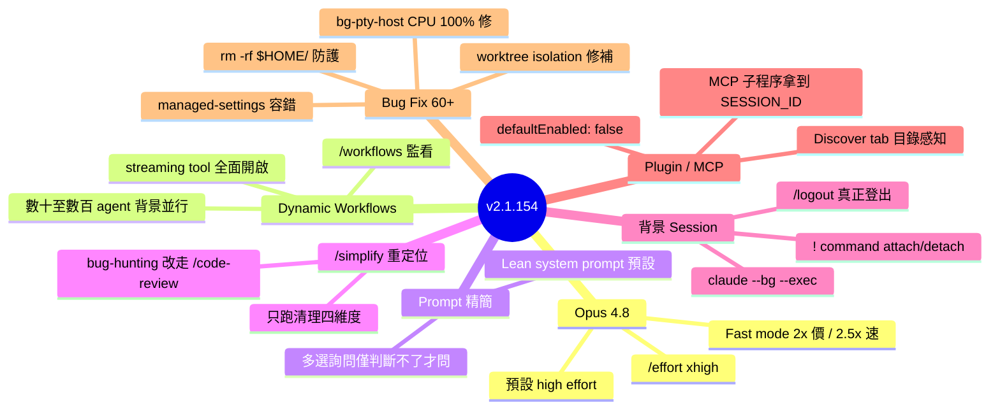

## v2.1.154

Claude Code v2.1.154 推出 Opus 4.8 並預設高難度模式（/effort xhigh），支援動態 workflows 自動編排數十至數百個 agent 在背景執行。Fast mode 成本降至 2 倍標準費率、速度提升 2.5 倍。系統提示詞精簡版成為 Haiku/Sonnet/Opus 4.7 以外所有模型的預設，多選提示詞改為僅在 Claude 無法自主判斷時才詢問。/simplify 命令簡化為清理導向（代碼重用、簡化、效率、高度），直接應用修復。Vim 背景執行、Chrome 多瀏覽器支援、plugin defaultEnabled 選項、MCP 伺服器環境變數傳遞等功能已上線。60+ bug 修復涵蓋記憶體洩漏（session 復原時達數 GB）、MCP 伺服器重連迴圈、API 閘道認證洩漏等關鍵問題。

### 重點
- Opus 4.8 預設 high effort，fast mode 以 2 倍標準費率達 2.5 倍速度
- 動態 workflows 編排 tens–hundreds of agents，支援 /workflows 檢視進度
- 60+ bug 修復：記憶體洩漏（多 GB 在 session 復原）、MCP 伺服器重連迴圈、API 閘道認證洩漏

**原文：** [claude-code-releases](https://github.com/anthropics/claude-code/releases/tag/v2.1.154)

---

<!-- deep-analysis:begin -->
## 📌 摘要 (TL;DR)

- **Opus 4.8 上線**，預設高難度模式（high effort），最難任務用 `/effort xhigh`
- **Dynamic workflows 登場**：叫 Claude 建 workflow，背景編排數十到數百個 agent，跑大型複雜任務；`/workflows` 看執行狀態
- **Fast mode on Opus 4.8** 降價：2 倍標準費率換 2.5 倍速度（前版便宜很多）
- **Lean system prompt 變預設**（除 Haiku、Sonnet、Opus 4.7 及以前）
- **`/simplify` 改為清理導向**：只跑 reuse / simplification / efficiency / altitude，不再做 `/code-review --fix` 全 bug 掃描
- **背景 session shell 命令**：claude agents 內輸入 `! <command>` 跑背景，可 attach/detach；或 `claude --bg --exec '<cmd>'`
- **60+ bug fix** 涵蓋記憶體洩漏、MCP 重連迴圈、worktree-isolation 繞過、auto mode 誤判等

## 🎯 核心概念

- **動態工作流（dynamic workflows）**：Claude 自主編排 agent 群，可跑數十至數百個 agent 背景並行
- **Effort 滑桿（effort slider）**：標籤從 "Speed"/"Intelligence" 改為 "Faster"/"Smarter"；新增 `xhigh` 等級
- **Lean system prompt**：精簡版系統提示詞，新模型預設用
- **Altitude review**：`/simplify` 新增的清理維度，與 reuse、simplification、efficiency 並列
- **Background session**：背景跑的 shell 任務，可 attach/detach
- **Fast mode**：Opus 4.8 加速模式，2x 價換 2.5x 速度

## 📖 整理分析

### 1. Opus 4.8 與 effort 系統翻新

Opus 4.8 預設啟用高 effort，搭配新增的 `/effort xhigh` 給最硬任務用。Effort 滑桿標籤從 "Speed"/"Intelligence" 改成 "Faster"/"Smarter"，語意更直白。Fast mode 在 4.8 上重新定價：2x 標準費率換 2.5x 速度，比前版便宜很多。Opus 4.6 的舊環境變數 `CLAUDE_CODE_OPUS_4_6_FAST_MODE_OVERRIDE` 2026/06/01 移除，改用 `/model claude-opus-4-6[1m]` + `/fast on`。

### 2. Dynamic Workflows：背景多 agent 編排

核心新功能：叫 Claude 建 workflow，它自動編排數十到數百個 agent 在背景跑，使用者可同時推進其他工作。`/workflows` 看執行紀錄。配合 streaming tool execution 全面開啟（連 telemetry disabled、Bedrock/Vertex/Foundry 也有），背景 agent 不再受 feature flag 限制。

### 3. 提示詞精簡與多選詢問收斂

Lean system prompt 變預設（除 Haiku/Sonnet/Opus 4.7 及更早）。多選提示詞改為「真的判斷不了才問」——Claude 有足夠 context 就自己決定，不再頻繁打斷使用者。

### 4. `/simplify` 改清理導向

從 `/code-review --fix` 全套 bug-hunting 切到只跑四個清理維度：reuse、simplification、efficiency、altitude，並直接套用修復。要找 bug 改用 `/code-review`，分工清楚。

### 5. 背景 session 與 agents 工具改進

`claude agents` 內輸入 `! <command>` 開背景 shell session，可 attach/detach；或 `claude --bg --exec '<cmd>'`。`/logout` 真正登出（之前會被丟去背景 session）。`←←` 開 agents view 現支援 Bedrock、Vertex、Foundry 與 telemetry disabled。Chrome 多瀏覽器選擇透過 `/chrome → "Select browser..."`。

### 6. Plugin 與 MCP 強化

Plugin 可在 `plugin.json` 或 marketplace 宣告 `defaultEnabled: false`，靠 `/plugin` 或 `claude plugin enable` 開；被啟用 plugin 的依賴自動啟用。`/plugin` Discover tab 會釘住與當前目錄相關的 plugin（標註 "suggested for this directory"）。Stdio MCP server 子程序現在收到 `CLAUDE_CODE_SESSION_ID` 與 `CLAUDECODE=1` 環境變數。`claude mcp list/get` pipe 輸出時，未核可的 `.mcp.json` server 顯示 `⏸ Pending approval` 而非自動 approve。

### 7. 關鍵 bug 修復

安全層：`rm -rf $HOME` 在 `HOME` 結尾有 `/` 時不再繞過保護；auto-mode classifier 加強對 repo 大量外傳的偵測；單一錯誤的 `allowedMcpServers`/`deniedMcpServers` 不再整包丟棄 managed-settings 政策，只丟壞那筆並由 `claude doctor` 警告。穩定性：worktree 子 agent 不再繞過 isolation guard 寫到共用 checkout；macOS 上孤兒 `claude --bg-pty-host` 100% CPU 修掉；背景 session 卡在 blocked/running/working 的 idle grace 過期問題修掉；pinned 背景 session 每分鐘 respawn 修掉。模型相容：API 400（不支援 effort 參數的模型 + `CLAUDE_CODE_ALWAYS_ENABLE_EFFORT`）修掉；1M context 模型的「out of context」誤觸發修掉。

## 🧭 命令對應表

| 命令 / 設定 | 用途 |
|---|---|
| `/effort xhigh` | 最高難度模式（Opus 4.8） |
| `/workflows` | 查看動態 workflow 執行 |
| `/simplify` | 清理導向 review（reuse/simplification/efficiency/altitude）+ 修復 |
| `/code-review --fix` | 完整 bug-hunting + 修復 |
| `! <command>` | claude agents 內開背景 shell |
| `claude --bg --exec '<cmd>'` | 命令列開背景 session |
| `/chrome → Select browser...` | 多瀏覽器切換 |
| `/model claude-opus-4-6[1m]` + `/fast on` | Opus 4.6 fast mode（取代舊 env var） |
| `defaultEnabled: false` | plugin.json 宣告預設關閉 |

## 🧠 Mindmap

<!-- deep-analysis:end -->
### 📄 原文內容

點此展開 / 收合

What's changed 
 
 Opus 4.8 is here! Now defaults to high effort · /effort xhigh for your hardest tasks 
 Introducing dynamic workflows: ask Claude to create a workflow and it orchestrates work across tens to hundreds of agents in the background, so you can take on larger, more complex tasks. Run /workflows to view your runs 
 Fast mode on Opus 4.8 is now available at a fraction of its previous cost: 2x the standard rate for 2.5x the speed 
 The lean system prompt is now the default for all models except Haiku, Sonnet, and Opus 4.7 and earlier 
 Claude now reserves the multiple-choice question prompt for decisions it genuinely cannot make itself, instead of asking when it already has enough context to proceed 
 /simplify now runs a cleanup-only review (reuse, simplification, efficiency, altitude) and applies the fixes, instead of running the full /code-review --fix bug-hunting review 
 Renamed the /effort slider labels from "Speed"/"Intelligence" to "Faster"/"Smarter" for clarity 
 claude agents : type ! &lt;command&gt; to run a shell command as a background session you can attach to and detach from. Also available as claude --bg --exec '&lt;command&gt;' 
 claude agents : /logout now signs you out instead of being sent to a background session 
 ←← to open the agents view now works on Bedrock, Vertex, Foundry, and with telemetry disabled 
 Claude in Chrome: pick which connected browser to use via /chrome → "Select browser...", or in-chat when a browser action runs with multiple connected 
 Plugins can now declare defaultEnabled: false in plugin.json or a marketplace entry; enable them with /plugin or claude plugin enable . Dependencies of enabled plugins are still enabled automatically 
 The /plugin Discover tab now pins plugins whose relevance signals match the current directory with a "suggested for this directory" annotation 
 Streaming tool execution is now always enabled, including when telemetry is disabled or on Bedrock/Vertex/Foundry (previously behind a feature flag) 
 Stdio MCP server subprocesses now receive CLAUDE_CODE_SESSION_ID and CLAUDECODE=1 in their environment 
 claude mcp list / get now show unapproved .mcp.json servers as ⏸ Pending approval instead of auto-approving and connecting when output is piped 
 /remote-control autocomplete now shows "Disconnect Remote Control" when Remote Control is already active 
 Added Claude Opus 4.8 support and 4.7 → 4.8 migration guidance to the /claude-api skill 
 Deprecated CLAUDE_CODE_OPUS_4_6_FAST_MODE_OVERRIDE (will be removed on 06/01). To use fast mode on Opus 4.6, switch with /model claude-opus-4-6[1m] and then /fast on 
 Improved the auto-mode classifier's detection of data exfiltration, particularly bulk transfers of repository contents 
 Fixed rm -rf $HOME not being blocked as a dangerous path when HOME has a trailing slash 
 Fixed $TMPDIR resolving to different directories in sandboxed vs unsandboxed Bash commands within the same session 
 Fixed unreadable highlighted-row text in claude agents when the Claude Code theme doesn't match the terminal background 
 Fixed background-agent completion notifications triggering premature "out of context" behavior on some 1M-context models 
 Fixed background-session classifier losing the user's goal when a scheduled /command fires 
 Fixed pinned background sessions respawning every minute after a Claude Code update, causing repeated agent-start notifications and process churn at idle 
 Fixed background sessions stuck at "blocked", "running", or "working" not retiring after the idle grace period 
 Fixed subagents in background sessions bypassing the worktree-isolation guard and writing to the shared checkout 
 Fixed orphaned claude --bg-pty-host processes spinning at 100% CPU after the daemon exits on macOS 
 Fixed number key shortcuts not working for options shown below the divider in option dialogs 
 Fixed worktree.baseRef: "head" resolving to the main checkout's HEAD instead of the current worktree's HEAD when spawning subagents or calling EnterWorktree from inside a linked worktree 
 Fixed a stray leading space on wrapped lines when the previous line ended exactly at the terminal width 
 Fixed intermittent terminal rendering corruption in VS Code by capping the number of distinct colors the thinking spinner produces 
 Fixed plan file names including [Image #N] / [Pasted text #N] placeholders when a plan-mode prompt starts with pasted images or text 
 Fixed a phantom expand/click affordance on colored tool output: short ANSI-colored lines that fit on screen no longer show a "ctrl+o to expand" hint 
 Fixed a single invalid allowedMcpServers / deniedMcpServers entry in managed settings discarding all managed-settings policy; the bad entry is now dropped with a claude doctor warning 
 Fixed API 400 errors on models that don't support the effort parameter when CLAUDE_CODE_ALWAYS_ENABLE_EFFORT is set 
 Windows: Fixed update failures caused by claude.exe being in use showing a generic error instead of telling you to close other sessions and retry 
 Removed the stale "&amp; for background" hint from the shortcuts help panel 
 [VSCode] Auto mode no longer requires the bypass-permissions setting to appear in the mode picker, and a dismissable notice on the new-session screen explains auto mode the first time it's active 
 Fixed the task panel below the prompt showing a stray unselectable "main" row when only a workflow is running 
 Fixed /mcp tools list and tool detail rendering when MCP servers have long or multi-line tool names or long descriptions 
 Fixed the /model picker not showing fast mode pricing on the Default option for API (pay-as-you-go) users when fast mode is on 
 Fixed auto mode incorrectly blocking actions with "could not evaluate this action" when the safety classifier ran out of output tokens while reasoning

