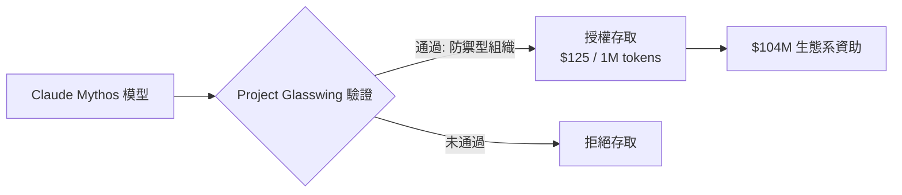
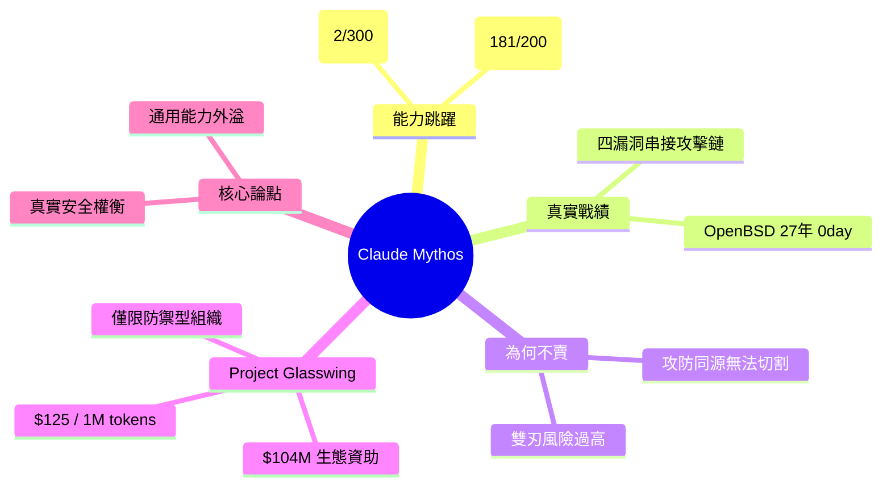

## Anthropic Built an AI So Powerful They Refuse to Sell It

Claude Mythos 是 Anthropic 開發最強大的模型，但絕不向公眾發售。該模型在安全漏洞挖掘能力上出現質的飛躍：相比 Opus 4.6 成功率 0.67%（2/300），Mythos Preview 達成 90%+（181/200）的 Firefox 漏洞利用率；並獨立發現 OpenBSD 中 27 年未被發現的 0day。Anthropic 通過 Project Glasswing 計畫，將訪問權限限制給經過驗證的防禦型組織，以每百萬 tokens 125 美元計價，並投入 1.04 億美元支援符合條件的生態夥伴。模型能力來自編碼和推理的通用進步，不存在「有漏洞發現無漏洞利用」的可能，呈現真實的安全/風險權衡。

### 重點
- Firefox 漏洞利用成功率：Opus 4.6 = 0.67%（2/300），Mythos = 90%+（181/200），為質的躍進非量化改進
- OSS-Fuzz Tier 5（完全控制流劫持）：10 個完全修補目標各 1 次運行即可達成；發現 OpenBSD 27 年 0day
- Project Glasswing 資源配置：$125/百萬 tokens；$1 億獎金給驗證組織；$400 萬捐款開源安全基礎設施；無公開商業發售

**原文：** [medium-tag-claude](https://medium.com/@hardik.goel214/anthropic-built-an-ai-so-powerful-they-refuse-to-sell-it-8819d2bc0840?source=rss------claude-5)

---

<!-- deep-analysis:begin -->
## 📌 摘要 (TL;DR)

- 文章宣稱 Anthropic 打造出代號 **Claude Mythos** 的最強模型，但拒絕公開發售，理由是其資安攻擊能力過於危險。
- 漏洞挖掘出現質變：相較 Opus 4.6 在測試中成功率僅 **0.67%（2/300）**，Mythos Preview 對 Firefox 的漏洞利用成功率達 **90%+（181/200）**。
- 模型獨立發現 OpenBSD 中一個潛伏 **27 年未被察覺的 0day**，並能將多個漏洞串接（chain）成單一攻擊鏈。
- Anthropic 以 **Project Glasswing** 計畫控管：只開放給經驗證的防禦型（defensive）組織，定價 **每百萬 tokens 125 美元**。
- 投入 **1.04 億美元** 支援符合資格的生態系夥伴。
- 作者論點：能力來自編碼與推理的「通用進步」，不存在「能找漏洞卻不能寫 exploit」的切割，呈現真實的安全／風險權衡。

> 註：本文為 Medium 評論文章，「Claude Mythos」之名稱、數據與計畫均為該文敘述，非經 Anthropic 官方此處驗證；以下整理依文章所述。

## 🎯 核心概念

- **零時差漏洞**（0day）：尚未被公開、未有修補的安全漏洞，被利用前防禦方毫無準備。
- **漏洞利用**（exploit）：能實際觸發漏洞並取得控制的可運作攻擊程式碼，比「發現漏洞」更進一步。
- **漏洞串接**（vulnerability chaining）：把多個單獨看不嚴重的漏洞組合，達成完整入侵。
- **Project Glasswing**：文章所述的受控存取計畫，只授權通過驗證的防禦型組織使用該模型。

## 📖 整理分析

### 1. 能力出現非線性跳躍
文章核心論點是 Mythos 在資安任務上並非漸進改善，而是質變。對照組 Opus 4.6 在 300 次嘗試中僅 2 次成功（0.67%），而 Mythos Preview 對 Firefox 的 200 次嘗試成功 181 次（90%+），差距超過兩個數量級。

### 2. 真實世界的 0day 與攻擊鏈
除受控測試外，文章稱模型獨立挖出 OpenBSD 中潛伏 27 年的 0day，並能將四個漏洞串接成單一攻擊鏈。重點不在「找到」而在「能寫出可運作的 exploit 並組合利用」，這是攻防分界的關鍵。

### 3. 為何拒絕公開販售
作者主張，這種能力源自編碼與推理的通用提升，無法只保留「防禦用途」而閹割「攻擊用途」——找漏洞與寫 exploit 是同一套能力。因此公開等於把高效攻擊工具交給任意一方，故 Anthropic 選擇不賣。

### 4. Project Glasswing 的受控發放
取代公開販售的是限制性發放：僅授權給通過驗證的防禦型組織，定價每百萬 tokens 125 美元（遠高於一般模型），並以 1.04 億美元資金扶植符合資格的生態夥伴，把存取權與防禦目的綁定。

### 5. 安全與風險的權衡
文章把此事定位為 AI 能力外溢的縮影：模型越強，攻擊與防禦的價值同步放大。Anthropic 的選擇（不賣、限發、綁防禦）被呈現為對「雙刃能力」的現實回應，而非行銷話術。

## 🧭 流程圖 / 架構圖

## 🧠 Mindmap

<!-- deep-analysis:end -->
### 📄 原文內容

點此展開 / 收合

Claude Mythos is real. It can find 27-year-old bugs, write working exploits overnight, and chain four vulnerabilities into a single&#x2026; Continue reading on Medium »

