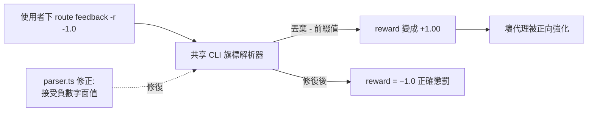
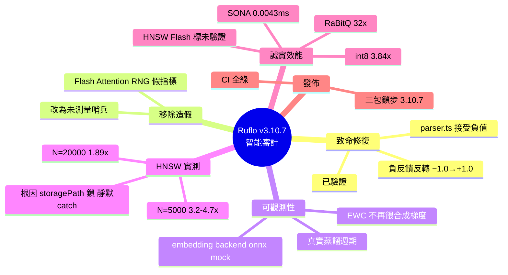

## v3.10.7 — intelligence audit, hardening fixes & honest perf numbers

Ruflo v3.10.7 進行自學習/智能系統的全面實證審計，修復優先級 bug 並重寫所有效能聲明為測量值。致命修復：route feedback -r -1.0 與 --reward -1.0 被誤解為 +1.00（共享 CLI 旗標解析器丟棄負值前綴），導致負反饋反而強化壞代理，現已修復並驗證；移除虛假指標（Flash Attention 「加速」源自兩份注意力協調複本中的執行時 RNG）；Embedding 可觀測性：generateEmbedding 回傳 backend: onnx|mock，防止 mock 被誤標；MCP 學習：trajectory-end 不再給 EWC 合成梯度，hooks_intelligence_learn 執行真實蒸餾週期。HNSW 優化（真實測量）：根本原因：ruvector 未傳 storagePath、檔案鎖被守護進程持有、靜默 catch 退化到蠻力，修復後 N=5000 達 3.2–4.7×、N=20000 達 1.89×（recall@10 0.88–0.99）。誠實效能數字：int8 量化 3.84×、RaBitQ 32×、SONA adapt 0.0043 ms、MoE 收斂 0.13→0.88；HNSW 「150×–12,500×」與 Flash 「2.49–7.47×」標記未驗證。三包鎖步 3.10.7，CI 29/29 綠。

### 重點
- 致命修復：負獎勵反轉 bug（-1.0 被解析為 +1.0，導致反饋反向強化）
- HNSW 實際測量優化：N=5000 達 3.2–4.7×、N=20000 達 1.89× 加速（recall@10 0.88–0.99）
- 誠實效能框架：移除虛假指標、標記未驗證聲稱（「150×–12,500×」不可複現），Int8 3.84×、MoE 收斂 0.13→0.88 是實測值

**原文：** [ruflo-releases](https://github.com/ruvnet/ruflo/releases/tag/v3.10.7)

---

<!-- deep-analysis:begin -->
## 📌 摘要 (TL;DR)

- Ruflo v3.10.7 對自學習／智能系統做了一次全面實證審計（empirical audit），把所有效能聲明改寫為實測值，並附上可重用的 benchmark harness（`scripts/benchmark-intelligence.mjs`）。
- 🔴 致命修復：`route feedback -r -1.0`（與 `--reward -1.0`）被解析成 `+1.00`——共享的 CLI 旗標解析器丟棄任何 `-` 開頭的值，導致「給負反饋」反而強化了壞代理（agent）。已在 `parser.ts` 修正，三種語法現在都正確產生 −1.0，並在已發布產物中驗證。
- 移除一個造假指標：Flash Attention 的「加速」數字其實來自兩份注意力協調器（attention-coordinator）副本裡的執行時 RNG，現改為誠實的「未測量」哨兵值。
- HNSW 過去根本沒在跑（adapter 沒傳 storagePath、檔案鎖被守護進程持有、靜默 `catch{}` 退化成蠻力搜尋）；修復後同 harness 實測 N=5000 達 3.2–4.7×、N=20000 達 1.89×（recall@10 0.88–0.99）。
- 誠實效能數字：int8 量化 3.84×、RaBitQ 省 32× 記憶體、SONA adapt 0.0043 ms、MoE gate 收斂 0.13→0.88；而 HNSW「150×–12,500×」與 Flash「2.49–7.47×」明確標記為未重現／未驗證。
- 三個套件（latest / alpha / v3alpha）鎖步發佈於 3.10.7，CI 全綠。

## 🎯 核心概念

- **負反饋反轉（negative-reward inversion）**：因旗標解析器丟棄負號，本應懲罰壞行為的負獎勵被當成正獎勵，學習方向整個顛倒。
- **EWC**（Elastic Weight Consolidation）：持續學習中用來防止災難性遺忘的機制；此版移除了 trajectory-end 餵給它的合成梯度。
- **HNSW**（Hierarchical Navigable Small World）：近似最近鄰（ANN）向量索引演算法，用於加速向量檢索。
- **RaBitQ**：向量量化方法，此處用於壓縮記憶體用量。
- **MoE**（Mixture of Experts）gate：專家混合模型的路由閘門，收斂指標 0.13→0.88。

## 📖 整理分析

### 1. 負反饋反轉：最嚴重的修復
這是承接 issue #2222 的後續修復。`route feedback -r -1.0` 與 `--reward -1.0` 都被解析為 `+1.00`，原因是共享的 CLI 旗標解析器會丟棄任何以 `-` 開頭的值。後果嚴重：使用者想對表現差的代理給負反饋，系統卻把它當正向強化，等於主動獎勵壞代理。修正落在 `parser.ts`（現在接受負數字面值作為旗標值），三種語法都正確輸出 −1.0，且在已發布的產物中驗證過。

### 2. 移除造假指標與提升可觀測性
審計揪出 Flash Attention 的「加速」數字並非真實測量，而是來自兩份 attention-coordinator 副本中的執行時 RNG（亂數），現已改為誠實的「未測量」哨兵值。Embedding 也加上可觀測性：`generateEmbedding` 現在回傳 `backend: onnx|mock`，並在 `memory_bridge_status` / import 中曝露，避免 mock（hash-fallback）嵌入被誤標成真正的 ONNX 模型輸出。

### 3. MCP 學習改為真實蒸餾
在 MCP（Model Context Protocol）學習路徑上，trajectory-end 不再餵給 EWC 一個合成梯度（synthetic gradient）；`hooks_intelligence_learn` 現在執行真正的蒸餾／鞏固（distill/consolidate）週期，讓「學習」名實相符。

### 4. HNSW 根因修復與實測
根本原因是 HNSW 從來沒真正運作：ruvector adapter 沒傳 `storagePath`、原生 DB 的檔案鎖被守護進程持有、再加上一個靜默 `catch{}` 直接退化成蠻力搜尋。修正方式包含使用唯一 `storagePath`、設定 `hnswConfig {m:32, efConstruction:200}`，並把 fallback 改成可見的警告。同一 harness 前後對照：N=5000 從 0.92× 提升到 3.2–4.7×、N=20000 從 0.95× 提升到 1.89×，recall@10 落在 0.88–0.99。

### 5. 誠實效能數字
README 與 CLAUDE.md 的效能表改為來自新 benchmark 腳本的實測值：int8 量化 3.84×（重建餘弦相似度 0.99999）、RaBitQ 省 32× 記憶體、SONA adapt 0.0043 ms、MoE gate 收斂 0.13→0.88。同時誠實標記：HNSW「150×–12,500×」與 Flash「2.49–7.47×」為「未重現／未驗證」，因為沒有任何 benchmark 支持。完整審計見 `docs/reviews/intelligence-system-audit-2026-05-29.md`。

## 🧭 流程圖 / 架構圖

負反饋反轉 bug 的因果鏈：

## 🧠 Mindmap

<!-- deep-analysis:end -->
### 📄 原文內容

點此展開 / 收合

Ruflo v3.10.7 — intelligence self-learning audit, hardening fixes &amp; honest performance numbers 
 A full empirical audit of the self-learning/intelligence system, the prioritized fixes it surfaced, and a rewrite of all performance claims to measured values. Audit + reusable benchmark harness included. 
 🔴 Critical fix — negative-reward inversion (follow-up to #2222 ) 
 route feedback -r -1.0 (and --reward -1.0 ) was parsed as +1.00 — the shared CLI flag parser dropped any - -prefixed value, so giving negative feedback actively reinforced the bad agent. Fixed in parser.ts (negative numeric literals are now accepted as flag values); all three syntaxes yield −1.0. Verified in the published artifact. 
 Other fixes 
 
 Removed a fabricated metric — Flash Attention "speedup" was reported from a runtime RNG in both attention-coordinator copies; now an honest "unmeasured" sentinel. 
 Embedding observability — generateEmbedding returns backend: onnx|mock , surfaced in memory_bridge_status / import so a mock (hash-fallback) embedding is never mislabeled as the real ONNX model. 
 MCP learning — trajectory-end no longer feeds EWC a synthetic gradient; hooks_intelligence_learn runs a real distill/consolidate cycle. 
 
 HNSW optimization (genuine, measured) 
 Root cause: HNSW was never actually running — the ruvector adapter passed no storagePath , the native DB's file lock was held by a daemon, and a silent catch{} degraded to brute force. Fixed (unique storagePath, hnswConfig {m:32, efConstruction:200} , visible fallback warning). Same-harness before→after: N=5000 0.92×→3.2–4.7×, N=20000 0.95×→1.89× (recall@10 0.88–0.99). 
 Honest performance numbers 
 README + CLAUDE.md perf tables now show measured values from the new scripts/benchmark-intelligence.mjs : 
 
 Int8 quantization 3.84× (reconstruction cosine 0.99999) · RaBitQ 32× memory · SONA adapt 0.0043 ms · MoE gate converges (0.13→0.88) 
 HNSW "150×–12,500×" and Flash "2.49–7.47×" marked NOT reproduced / unverified (no benchmark supports them) 
 
 Full audit: docs/reviews/intelligence-system-audit-2026-05-29.md . All three packages published at 3.10.7 ( latest / alpha / v3alpha in lockstep). 
 🤖 Generated with RuFlo

