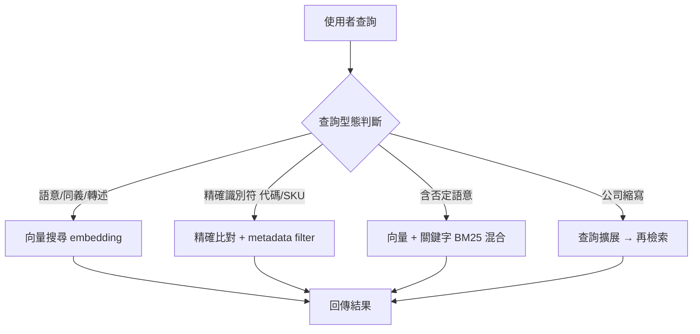
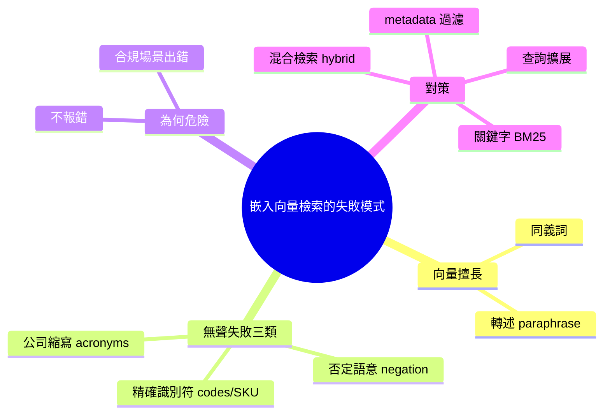

## Embeddings Aren’t Magic: The Predictable Failure Modes of RAG Retrieval

RAG 檢索中的嵌入向量搜索存在系統性失敗模式：同一套向量搜索可以正確處理同義詞和轉述，卻會在否定、精確識別符（如產品代碼）與公司縮寫上無聲失敗。本文為企業文件智能系列第一卷第二期，系統闡述這些失敗模式的根本原因，並針對各類失敗場景提供替代技術方案。實務上，使用者需認知向量搜索的邊界，在關鍵業務場景（如合規檢索、精確匹配）上選用混合策略。

### 重點
- 向量搜索在否定句、精確識別符、縮寫上自動失敗（無警示）
- 同一套向量模型對同義詞有效但對邏輯否定無法
- 企業 RAG 需混合策略應對：向量搜索 + 關鍵字搜索 + 語法規則

**原文：** [medium-towards-data-science](https://towardsdatascience.com/embeddings-arent-magic-the-predictable-failure-modes-of-rag-retrieval-enterprise-document-intelligence-vol-1-2/)

---

<!-- deep-analysis:begin -->
## 📌 摘要 (TL;DR)

- 本文是《企業文件智能》（Enterprise Document Intelligence）系列第一卷第二期，主題：嵌入向量（embedding）檢索在 RAG 中**可預測的失敗模式**。
- 核心論點：同一套向量搜尋能正確處理同義詞與轉述（paraphrase），卻會在三類情境**無聲失敗**——否定語意（negation）、精確識別符（exact identifiers，如產品代碼）、公司內部縮寫（acronyms）。
- 「無聲失敗」最危險：系統照常回傳看似相關的結果、不報錯，使用者難以察覺檢索其實已經出錯。
- 解法是混合檢索（hybrid retrieval）：依查詢類型搭配關鍵字比對、metadata 過濾、查詢擴展，而非全押向量相似度。
- 對企業關鍵場景（合規檢索、精確匹配）尤其重要——這些正是向量搜尋最容易出錯的地方。

> 註：本則來源僅提供標題與摘要層級內容，原文完整段落未隨附；以下分析依據作者明示的三類失敗模式，並以 RAG 領域既有原理補充其成因與對策。

## 🎯 核心概念

- **嵌入向量** (embedding)：把文字映射到高維向量空間，語意相近的文字在空間中距離也相近。
- **語意檢索 vs 詞彙檢索** (semantic vs lexical search)：向量搜尋抓「語意相似」；關鍵字搜尋（如 BM25）抓「字面精確匹配」。
- **無聲失敗** (silent failure)：檢索仍回傳結果，但結果是錯的，且系統不拋出任何錯誤或警告。
- **混合檢索** (hybrid retrieval)：結合向量相似度與關鍵字／結構化欄位過濾，依查詢特性取長補短。

## 📖 整理分析

### 1. 向量搜尋擅長的場景
向量搜尋在同義詞與轉述上表現好：意思相近的句子在嵌入空間中彼此靠近，所以一般自然語言問答「看起來很神」。作者要點出的是——這份直覺會讓人過度信任它，忽略它有結構性的盲區。

### 2. 否定語意：分不出肯定與否定
「X」與「not X」在嵌入空間中往往距離很近，因為兩句共用大多數 token、主題語意也相同。向量相似度抓不出否定詞翻轉的語意。對合規場景極危險，例如 “approved” 與 “not approved”、“compliant” 與 “non-compliant” 可能被判為高度相關。

### 3. 精確識別符：抓到相近但錯誤的代碼
產品代碼、SKU、型號、合約編號這類精確識別符被壓進語意空間後，字面相近的代碼向量也會相近，導致檢索回傳「長得像但其實是另一個」的型號。這類查詢需要精確字串／關鍵字比對或 metadata 查找，而非語意近似。

### 4. 公司縮寫：模型沒學過的詞彙
企業內部縮寫多半不在模型的預訓練語料中，模型對其沒有可靠語意表示，產生的向量近乎無意義或被誤映射到不相干概念。對策是查詢擴展（acronym expansion）／詞典映射，把縮寫先還原成全名，或改走關鍵字比對。

### 5. 對策：依查詢類型做路由
核心觀念是不要把所有查詢都丟給 cosine 相似度。先判斷查詢意圖與型態，再路由到合適的檢索器：語意問答走向量、精確識別符走精確比對／metadata filter、含否定或縮寫的查詢加上關鍵字與查詢擴展。混合策略才能守住關鍵業務場景。

## 🧭 檢索路由決策圖

## 🧠 Mindmap

<!-- deep-analysis:end -->
### 📄 原文內容

點此展開 / 收合

Enterprise Document Intelligence [Vol. 1 #2] Why the same vector search that handles synonyms and paraphrase silently fails on negation, exact identifiers, and your company’s acronyms, and what to use when it does. 
 The post Embeddings Aren’t Magic: The Predictable Failure Modes of RAG Retrieval appeared first on Towards Data Science .

