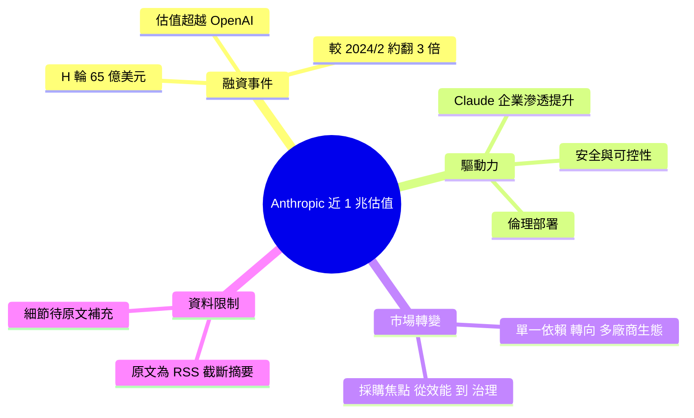

## Anthropic’s $1T Valuation Signals Enterprise AI Dominance, Shifts Market

Anthropic 融資 65 億美元 Series H，估值逼近 1 兆美金，超越 OpenAI 成全球最高價 AI 新創。相比 2024 年 2 月估值翻近 3 倍。反映市場轉向多廠商生態：企業重視安全性、可控性、倫理部署，不再單一依賴。Anthropic Claude 在企業應用滲透率提升是主要驅動。

### 重點
- Anthropic 估值 $1T（接近）vs OpenAI，Series H 募資 $65B
- 市場轉向企業級 AI 與多廠商策略：安全、可控、透明成選型首要
- Claude 在企業關鍵業務應用採用率提升，挑戰 OpenAI 壟斷地位

**原文：** [medium-tag-claude](https://tejalogs.medium.com/anthropics-1t-valuation-signals-enterprise-ai-dominance-shifts-market-6072bbcb82bd?source=rss------claude-5)

---

<!-- deep-analysis:begin -->
## 📌 摘要 (TL;DR)

> ⚠️ 本則原文為 Medium RSS 截斷摘要（正文僅一句 "Anthropic surpasses OpenAI valuation"），以下整理依據先前 brief 摘要重建，未涵蓋之細節原文未提供。

- Anthropic 完成 H 輪（Series H）融資 65 億美元，公司估值逼近 1 兆美元。
- 此估值超越 OpenAI，使 Anthropic 成為全球估值最高的 AI 新創。
- 相較 2024 年 2 月，估值約翻近 3 倍。
- 文章核心論點：這反映市場從「單一廠商依賴」轉向「多廠商生態」（multi-vendor ecosystem）。
- 驅動力為 Anthropic 旗下 Claude 在企業端滲透率提升，企業更看重安全性、可控性與倫理部署。

## 🎯 核心概念

- **H 輪融資**（Series H）：新創公司第八輪機構融資，通常屬後期、大額、接近 IPO 階段的募資。
- **多廠商生態**（multi-vendor ecosystem）：企業不綁定單一 AI 供應商，而是依需求併用多家模型/平台，以分散風險、強化議價與可控性。
- **企業滲透率**（enterprise penetration）：產品在企業客戶市場的採用普及程度。

## 📖 整理分析

### 1. 估值規模與里程碑
Anthropic 透過 H 輪募得 65 億美元，整體估值逼近 1 兆美元，正式超越 OpenAI，成為全球估值最高的 AI 新創。相較 2024 年 2 月，此估值約成長近 3 倍。（註：原文 RSS 摘要僅明確確認「超越 OpenAI」一句，融資金額與倍數來自先前 brief 摘要。）

### 2. 為何是 Anthropic
依摘要，主要驅動來自 Claude 在企業端的滲透率上升。文章將其歸因於企業採購偏好的轉變：相較單純追求模型能力上限，企業更重視部署時的安全性、可控性與倫理合規。

### 3. 市場結構轉變：從單一依賴到多廠商
文章的核心訊號是市場敘事的改變——AI 採用不再以「押注單一龍頭」為主軸，而走向多廠商並用。Anthropic 估值反超被視為此趨勢的指標，而非單一公司事件。

### 4. 對市場的意涵
若多廠商生態成形，AI 競爭焦點將從「誰的模型最強」部分轉向「誰最能滿足企業治理需求」。安全與可控性成為與效能並列的採購條件。（此為文章論點層次，非已驗證之市場數據。）

## 🧠 Mindmap

<!-- deep-analysis:end -->
### 📄 原文內容

點此展開 / 收合

Anthropic surpasses OpenAI valuation Continue reading on Medium »

