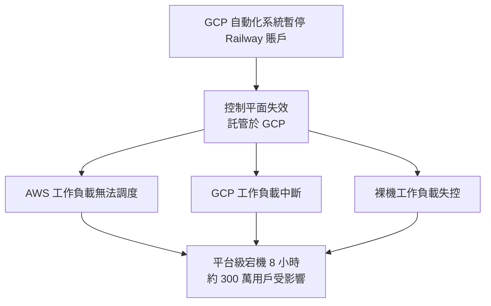
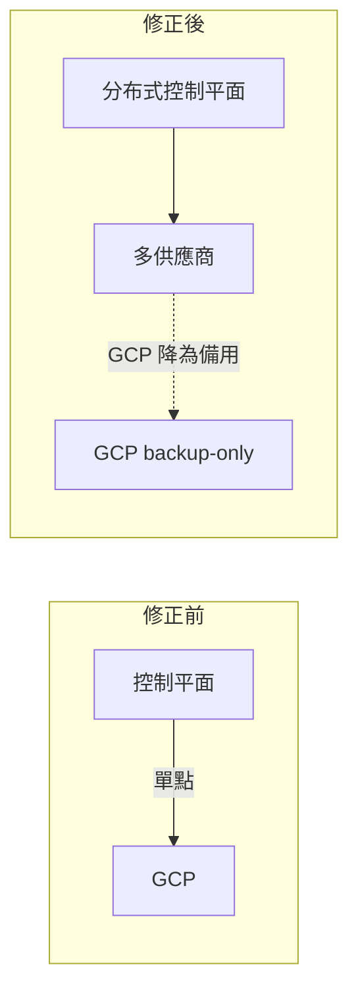
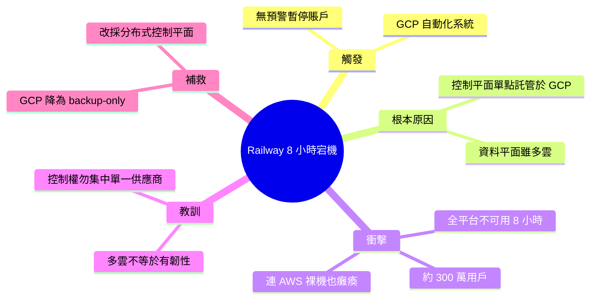

## Google Cloud Suspends Railway's Production Account, Causing Eight-Hour Platform-Wide Outage

Google Cloud 的自動化系統在完全無預警的情況下暫停了 Railway 的生產賬戶，導致該平台 8 小時內完全不可用，影響約 300 萬用戶。此次宕機的根本原因是 Railway 的控制平面（control plane）託管在 GCP 上。儘管用戶的實際工作負載分散在 AWS、GCP 和裸機等多個供應商上，但由於控制平面單點託管，GCP 的故障導致全平台級聯崩潰，連 AWS 上的服務也無法運作。這次事件暴露了多雲架構設計的關鍵風險：絕不能將基礎設施控制權集中在單一供應商。事後 Railway 宣布將 GCP 從主平台降級為備用狀態，改採分布式控制平面架構。

### 重點
- GCP 自動化系統無通知暫停生產賬戶 → 8 小時級聯故障、300 萬用戶受影響
- 控制平面單一供應商託管是設計缺陷，導致多雲架構完全失效
- Railway 反應：將 GCP 降級為備用，改採分布式控制平面以消除單點故障

**原文：** [infoq-main](https://www.infoq.com/news/2026/05/railway-gcp-account-outage/?utm_campaign=infoq_content&utm_source=infoq&utm_medium=feed&utm_term=global)

---

<!-- deep-analysis:begin -->
## 📌 摘要 (TL;DR)

- Google Cloud 的自動化系統在**完全無預警**下暫停了 Railway 的生產賬戶，引發長達 8 小時的平台級宕機。
- 受影響用戶約 **300 萬**，且故障跨越所有供應商——連跑在 AWS 與裸機（bare metal）上的工作負載也一併癱瘓。
- 根本原因：Railway 的控制平面（control plane）單點託管在 GCP 上，GCP 一掛，全平台級聯崩潰。
- 真正教訓不是「多雲」與否，而是**基礎設施控制權絕不能集中在單一供應商**。
- 事後 Railway 將 GCP 由主平台降級為**僅備用（backup-only）**，改採分布式控制平面架構。

## 🎯 核心概念

- **控制平面**（control plane）：負責調度、編排、管理工作負載的中樞；相對於實際跑客戶程式的資料平面（data plane / workloads）。
- **多雲**（multi-cloud）：把工作負載分散到多個雲供應商以降風險，但若控制層仍單點，分散就形同虛設。
- **級聯故障**（cascading failure）：單一元件失效沿依賴鏈擴散，拖垮原本健康的其他元件。

## 📖 整理分析

### 1. 無預警的賬戶暫停
Google Cloud 的**自動化系統**在沒有任何事前通知下暫停了 Railway 的生產賬戶。這不是漸進式降級，而是瞬間切斷，使 Railway 完全失去對 GCP 上資源的存取能力。

### 2. 為何 AWS 工作負載也跟著掛
Railway 用戶的實際工作負載分散在 AWS、GCP 與裸機等多個供應商上，理論上具備多雲韌性。但**控制平面只託管在 GCP**——一旦 GCP 賬戶被停，調度與管理中樞失效，連 AWS、裸機上原本健康的服務都因失去控制層而無法運作。

### 3. 8 小時、300 萬用戶的衝擊
平台全程不可用達 8 小時，約 300 萬用戶受影響。故障點不在客戶程式本身，而在管理它們的那一層——這正是單點集中的代價。

### 4. 多雲的真正風險：控制權集中
這次事件的關鍵教訓並非「該不該用多雲」，而是**把基礎設施控制權集中在單一供應商**就是隱藏的單點故障（single point of failure）。資料平面分散、控制平面集中，韌性只是假象。

### 5. 事後補救：GCP 降級為備用
Railway 宣布將 GCP 從主平台**降級為僅備用狀態**，並轉向分布式控制平面架構，使控制層本身不再依賴任何單一供應商。

## 🧭 架構圖

故障級聯路徑：

修正前後對比：

## 🧠 Mindmap

<!-- deep-analysis:end -->
### 📄 原文內容

點此展開 / 收合

Google Cloud's automated systems suspended Railway's production account without notice, triggering an eight-hour platform-wide outage affecting 3 million users. The cascade took down workloads across all providers including AWS and bare metal because Railway's control plane was hosted on GCP. Railway is demoting GCP to backup-only status. By Steef-Jan Wiggers

