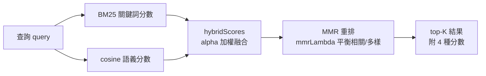
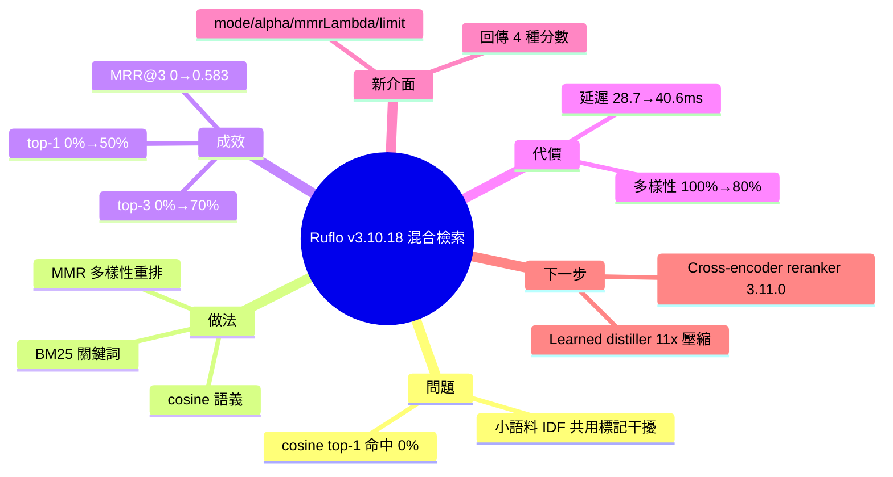

## v3.10.18 — hybrid retrieval (BM25 + cosine + MMR) — 0% → 50% top-1 relevance

Ruflo v3.10.18 引入混合檢索機制，結合 BM25 關鍵詞匹配、cosine 語義相似度和 MMR 多樣性排序。在 385 個模式、10 個查詢的基準測試中，純 cosine 檢索的 top-1 命中率為 0%，混合檢索達 50%；top-3 從 0% 提升至 70%，MRR@3 達 0.583。問題根源是小語料庫上 cosine 模型因 IDF 廉價標記分散注意力，返回看似相關但主題偏離的結果。混合方法透過結合多個信號源補償單一方法弱點。代價是查詢延遲從 28.7 ms 增加至 40.6 ms (+11.9 ms)，仍在可接受範圍。此發布標誌檢索品質從完全失敗 (0% 命中) 到部分可靠 (50% 命中) 的突破。

### 重點
- 混合檢索結合 BM25 + cosine + MMR，top-1 命中率 0% → 50%，top-3 達 70%
- MRR@3 從 0.0 改進至 0.583，解決單一方法在小語料庫的失效問題
- 查詢延遲增加 11.9 ms (28.7→40.6 ms)，可配置 alpha (cosine 權重) 和 mmrLambda 參數

**原文：** [ruflo-releases](https://github.com/ruvnet/ruflo/releases/tag/v3.10.18)

---

<!-- deep-analysis:begin -->
## 📌 摘要 (TL;DR)

- Ruflo v3.10.18 推出混合檢索（hybrid retrieval），結合 BM25 關鍵詞分數、cosine 語義相似度與 MMR 重排，修補 ADR-077 揭露的相關性缺口。
- 在 N=385 模式、10 個查詢的基準測試中，純 cosine 的 top-1 相關命中率為 **0%**，混合檢索拉到 **50%**；top-3 從 0% 升到 70%，MRR@3 從 0.000 到 0.583。
- 病灶：橋接 ONNX 雙編碼器（bi-encoder）在小語料庫上被 IDF 低成本共用標記分散注意力，回傳「貌似相關卻離題」的結果。
- 代價：每次查詢延遲 +11.9 ms（28.7 → 40.6 ms，慢約 40%），仍 <50 ms；top-1 多樣性降 20pp（100% → 80%）。
- 新增 `neural_patterns` MCP 工具參數（`mode` / `alpha` / `mmrLambda` / `limit`），並把每筆結果的 `cosineScore`、`bm25Score`、`mmrScore` 回傳供除錯。
- 同步加入預訓練採集器的「結果信號」（outcome signal），偵測被 revert 或 hotfix 的提交。

## 🎯 核心概念

- **BM25**：經典關鍵詞排序演算法，依詞頻與逆文件頻率打分，擅長字面比對。
- **餘弦相似度** (cosine similarity)：用向量夾角衡量語義接近度，擅長同義改寫但小語料庫易被廉價共用標記誤導。
- **最大邊際相關** (Maximal Marginal Relevance，簡稱 MMR)：重排機制，在「相關性」與「多樣性」間取捨，避免 top-K 結果彼此重複。
- **雙編碼器** (bi-encoder)：把查詢與文件分別編碼成向量再比對的模型，此處為 bridge ONNX embedder。
- **MRR@3**：平均倒數排名（Mean Reciprocal Rank），衡量正確答案出現在前 3 名的早晚，越高越好。

## 📖 整理分析

### 1. 問題：cosine 全軍覆沒
純 cosine 檢索在此語料庫上 top-3 相關命中率掛 0% —— 它總「找到某些東西」，卻從不是對的東西。根因是 bridge ONNX 雙編碼器在小語料庫（N=385）上，被 IDF 廉價的共用標記吸引，產出主題偏離的結果。

### 2. 做法：三信號融合
混合檢索把三種信號合一：BM25 補字面比對、cosine 補語義、MMR 做多樣性重排。核心邏輯落在 `src/memory/hybrid-retrieval.ts`，全為純函式無相依：`tokenize`、`buildCorpusStats`、`bm25Score`、`normalise`、`hybridScores`、`cosineSim`、`mmrRerank`，並有 21 個單元測試涵蓋邊界情況。

### 3. API 變更：可調與可解釋
`neural_patterns` MCP 工具新增搜尋參數：`mode`（hybrid|cosine，預設 hybrid，cosine 保留供 A/B）、`alpha`（cosine 權重 [0,1]，預設 0.6）、`mmrLambda`（1.0 純相關、0.0 純多樣，預設 0.5）、`limit`（top-K 預設 10、上限 100）。回應一併帶回 `hybridScore`、`cosineScore`、`bm25Score`、`mmrScore`，讓呼叫方能檢視排名理由。

### 4. 資料層：BM25 要有 token 可比
神經儲存新增 `Pattern.content` 欄位，持久化原始文本（上限 4096 字元），因為 BM25 需要 token 才能打分。向後相容：3.10.18 之前的模式會退回用 `name` 做 BM25 斷詞。

### 5. 結果信號：偵測 revert / hotfix
預訓練採集器新增 outcome signal，偵測兩類結果：`reverted`（後續提交主旨為 `Revert "<本提交主旨>"`）與 `hotfixed`（時間窗內的後續提交共享 ≥50% 檔案且主旨含 fix/hotfix/patch）。判定分布寫入 `summary.feed.verdictMix`，原始判定寫入每條軌跡的 `metadata.outcomeVerdict`。

### 6. 誠實的限制
N=385、10 查詢規模偏小；相關性指標是「regex 比對提交主旨」，有標註的留出集會更可靠 —— 方向穩健但幅度可能隨語料庫改變。混合模式每查詢慢約 40%，熱路徑需預算延遲。此 checkout 近 200 筆提交零 revert/hotfix，故偵測器輸出乾淨的 success=200 分布。

## 🧭 流程圖 / 架構圖

## 🧠 Mindmap

<!-- deep-analysis:end -->
### 📄 原文內容

點此展開 / 收合

What ships 
 Hybrid retrieval (BM25 + cosine + MMR) plus outcome signal for the 
pretrain harvester. Closes the relevance gap that ADR-077 exposed: cosine-only 
search was returning plausible-but-off-topic results because the bridge ONNX 
bi-encoder gets distracted on small corpora by IDF-cheap shared tokens. 
 The actual win 
 Measured on this checkout (N=385 patterns, 10 queries, real bridge ONNX 
embedder — same setup ADR-077 used): 
 
 
 
 Metric 
 Cosine (pre-3.10.18) 
 Hybrid (3.10.18) 
 Δ 
 
 
 
 
 Top-1 hit rate (RELEVANCE) 
 0% 
 50% 
 +50pp 
 
 
 Top-3 hit rate (RELEVANCE) 
 0% 
 70% 
 +70pp 
 
 
 MRR@3 
 0.000 
 0.583 
 +0.583 
 
 
 Top-1 diversity 
 100% 
 80% 
 -20pp 
 
 
 Avg query latency 
 28.7 ms 
 40.6 ms 
 +11.9 ms 
 
 
 
 Cosine was returning 0% relevant top-3 results — finding "something" but never 
the right thing. Hybrid lands a relevant top-1 50% of the time, top-3 70%. 
 What changed 
 
 
 src/memory/hybrid-retrieval.ts — pure functions, no deps: 
 tokenize , buildCorpusStats , bm25Score , normalise , hybridScores , 
 cosineSim , mmrRerank . 21 unit tests covering edge cases. 
 
 
 neural_patterns MCP tool — new search params: 
 
 mode: 'hybrid' | 'cosine' (default hybrid; cosine preserved for A/B) 
 alpha — cosine weight in [0,1] (default 0.6) 
 mmrLambda — 1.0 = pure relevance, 0.0 = pure diversity (default 0.5) 
 limit — top-K (default 10, max 100) 
 Response includes hybridScore , cosineScore , bm25Score , mmrScore 
so callers can inspect why a result ranked where it did 
 
 
 
 Pattern.content field — neural store now persists source text (cap 
4096 chars). BM25 needs tokens to score against. Backwards compatible: 
pre-3.10.18 patterns fall back to name for BM25 tokenisation. 
 
 
 Outcome signal in pretrain harvester — detects: 
 
 reverted — later commit's subject is Revert "&lt;this subject&gt;" 
 hotfixed — later commit (within window) shares ≥50% files AND has 
fix/hotfix/patch in subject 
 Verdict mix in summary.feed.verdictMix ; original outcome in 
 metadata.outcomeVerdict on each trajectory 
 
 
 
 Reproduce 
 git clone https://github.com/ruvnet/ruflo &amp;&amp; cd ruflo
npm install &amp;&amp; ( cd v3/@claude-flow/cli &amp;&amp; npx tsc -b )

 # Unit tests (no I/O) — 21 + 7 tests 
( cd v3/@claude-flow/cli &amp;&amp; npx vitest run __tests__/hybrid-retrieval.test.ts __tests__/pretrain-from-github.test.ts )

 # A/B benchmark 
node v3/@claude-flow/cli/scripts/pretrain-from-github.mjs
node v3/@claude-flow/cli/scripts/benchmark-pretrained-retrieval.mjs # hybrid (default) 
HYBRID=0 node v3/@claude-flow/cli/scripts/benchmark-pretrained-retrieval.mjs # cosine baseline 
 Honest limits 
 
 N=385 with 10 queries is small. The relevance metric is regex-over-subject — 
a labelled held-out set would be stronger. Direction is robust; magnitude 
could move on a different corpus. 
 Hybrid is 40% slower per query (28.7 → 40.6 ms). Still &lt;50 ms but worth 
budgeting on hot paths. Cosine-only mode preserved for callers who need it. 
 This checkout has zero reverts/hotfixes in the 200 most recent commits, so 
the outcome detector emits a clean success=200 distribution. Detector is 
unit-tested; the empty count reflects a clean recent history. 
 
 What's next 
 
 Cross-encoder reranker (3.11.0, MINOR — new dep): standard SOTA pattern 
for another +0.05-0.15 MRR 
 Learned distiller (paper's 11× compression target): #2241 round-D 
 Negative-reward propagation on retrieval miss : needs agent-level success 
attribution we don't yet emit reliably 
 
 Install 
 npx ruflo@3.10.18 # or @latest, @alpha, @v3alpha (all aligned) 
 Full ADR: v3/docs/adr/ADR-078-hybrid-retrieval-and-outcome-signal.md

