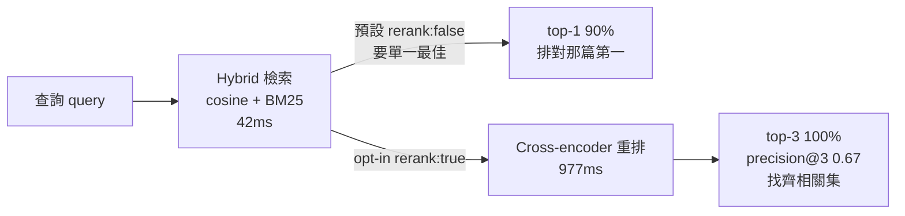
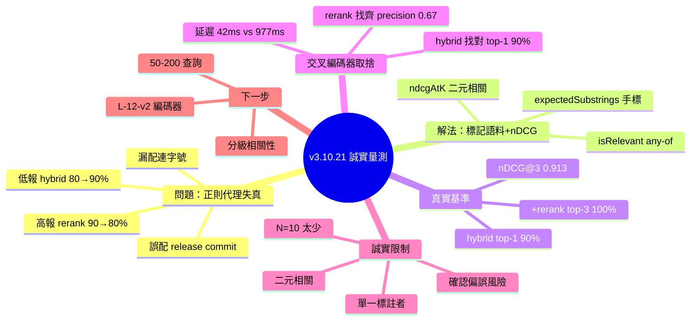

## v3.10.21 — labelled corpus + nDCG: honest 90% label top-1, 0.913 nDCG@3

Ruflo v3.10.21 引入手標記語料庫與 nDCG 度量，替代有偏差的正則表達式代理。正則表達式代理既低報（漏掉題目中的「Self-learning reports success but persists nothing」）又高報（將無關 release-bump commit 視為相關）。真實標記下：混合路徑 label top-1 90%, nDCG@3 0.900；混合+rerank top-3 100%, nDCG@3 0.913。新度量包括 label_top1HitRate, label_ndcg3, label_precision@3。揭示跨編碼器 trade-off：rerank 優化找全部相關文檔（precision@3 0.40→0.67），混合優化找最佳文檔（top-1 80%→90%）。

### 重點
- 正則表達式代理有系統性偏差：under-report（斜體變體漏匹配）和 over-report（無關 release commit）
- 真實標記度量：混合 nDCG@3 0.900, rerank nDCG@3 0.913；rerank precision@3 0.667 vs 混合 0.4
- 框架：rerank vs 混合是 single-best 優化 vs relevant-set 優化的 trade-off，無普遍優越者

**原文：** [ruflo-releases](https://github.com/ruvnet/ruflo/releases/tag/v3.10.21)

---

<!-- deep-analysis:begin -->
## 📌 摘要 (TL;DR)

- Ruflo v3.10.21 用**人工標記語料庫**＋ nDCG／precision 度量，取代 ADR 077-080 用的「正則表達式比對標題」相關性代理（regex relevance proxy）。
- 舊正則代理同時**低報又高報**：同樣 4 組設定改用標記語料後，Hybrid 配置 top-1 從 80% 升到真實的 90%（低報），Hybrid+Rerank 從 90% 跌到真實的 80%（高報）。
- 真實標記數據（新基準）：3.10.19 hybrid 為 top-1 90%、nDCG@3 0.900；3.10.20 +rerank 為 top-3 100%、precision@3 0.667、nDCG@3 0.913。
- 揭露**交叉編碼器取捨**：rerank 擅長找齊所有相關文件（precision@3 0.40→0.67），hybrid 單獨擅長把最對的那篇排第一（top-1 80→90%）。沒有誰絕對較好。
- 延遲代價：cosine 29ms、hybrid 42ms、+rerank 977ms（opt-in）。預設 `rerank: false` 對「要單一最佳」的呼叫端仍正確。
- 作者誠實列出限制：N=10 查詢太少、二元相關性、單一標註者、標籤是看過輸出後才標（有確認偏誤風險）。

## 🎯 核心概念

- **相關性代理** (relevance proxy)：用一個便宜的自動規則（這裡是正則比對標題）來近似「檢索結果是否相關」，省去人工標記。
- **標記語料庫** (labelled corpus)：每個查詢手工標好正解的 held-out 測試集，作為衡量真值。
- **nDCG@k** (normalized Discounted Cumulative Gain)：考慮排序位置的檢索品質指標，理想 DCG 正規化到 0–1；越靠前命中分數越高。
- **交叉編碼器** (cross-encoder)：把 query 與文件成對送入模型重排（rerank），精度高但慢。
- **混合檢索** (hybrid)：結合向量 cosine 與 BM25 之類訊號的檢索路徑。

## 📖 整理分析

### 1. 誠實量測：代理同時低報高報
核心發現是「想要誠實的 SOTA，得先有誠實的量測」。舊正則代理拿查詢字串去比對 issue／commit 標題，兩個方向都失真：對 hybrid 路徑它把真實 90% 的 top-1 低報成 80%；對加了 rerank 的 3.10.20 又把真實 80% 高報成 90%。改用標記語料後真相才浮現。

### 2. 正則為何錯：漏配與誤配
**低報案例**：查詢 `self-learning wiring task-completed pretrain` 的正解是 issue 標題「Self-learning reports success but persists nothing」，但因為沒有任何連字號變體匹配，正則直接漏掉。**高報案例**：查詢 `how was the Opus model alias fixed`，正則卻匹配到 release-bump 的 `chore(release): bump 3.10.10 → 3.10.11`，只因 commit body 提到 Opus——但發版 commit 並非真正修復工作。

### 3. 真實基準數據
以標記度量（新的 canonical）跨三版比較：

| 指標 | 3.10.17 cosine | 3.10.19 hybrid | 3.10.20 +rerank |
|---|---|---|---|
| Label top-1 命中率 | 0% | 90% | 80% |
| Label top-3 命中率 | 0% | 90% | 100% |
| Label MRR@3 | 0.000 | 0.900 | 0.883 |
| Label precision@3 | 0.000 | 0.400 | 0.667 |
| Label nDCG@3 | 0.000 | 0.900 | 0.913 |
| 平均查詢延遲 | 29 ms | 42 ms | 977 ms（opt-in） |

3.10.17 純 cosine 全為 0，顯示當時檢索基本沒命中標記正解。

### 4. 交叉編碼器取捨：找齊 vs 找對
現在這個取捨可被量化看見：rerank 把 precision@3 從 0.40 拉到 0.67，擅長「找齊所有相關文件」；hybrid 單獨則把 top-1 從 80% 拉到 90%，擅長「把最對那篇排第一」。因此預設 `rerank: false` 適合只要單一最佳結果的呼叫端；`rerank: true` 改為 opt-in，留給需要豐富 top-K 的消費端。

### 5. 程式改了什麼 + 誠實限制
程式面：`QUERIES` 新增 `expectedSubstrings: string[]` 手標標籤；新增 `isRelevant(name, substrings)`（大小寫不敏感、any-of 子字串比對）；新增 `ndcgAtK(rankedRelevance, k)`（二元相關 nDCG，理想 DCG 正規化，已用 fixture 煙霧測試：`[T,T,T]→1.0`、`[F,F,T]→0.5`、`[F,T,F]→0.631`、`[T,F,T]→0.920`）；summary JSON 加 6 個新指標；舊正則指標保留在 `regex proxy` 標籤下以維持歷史可重現。作者於 ADR 自承限制：N=10 太少（建議 50–200）、僅二元相關（建議分級 exact=3／close=2／related=1）、單一標註者、無真正 held-out split 故有確認偏誤風險。

## 🧭 流程圖 / 架構圖

## 🧠 Mindmap

<!-- deep-analysis:end -->
### 📄 原文內容

點此展開 / 收合

What ships 
 Labelled held-out corpus + nDCG/precision metrics replace the regex-over-subject 
relevance proxy used in ADRs 077-080. Honest SOTA needs honest measurement. 
 The honest-measurement finding 
 The regex proxy was both over- and under-reporting. When the same 4 configs run 
through the labelled corpus, the truth shifts in both directions: 
 
 
 
 Config 
 Regex top-1 
 Labelled top-1 
 Direction 
 
 
 
 
 Hybrid (3.10.19) 
 80% 
 90% 
 regex under -reported 
 
 
 Hybrid + Rerank (3.10.20) 
 90% 
 80% 
 regex over -reported 
 
 
 
 Real numbers (labelled metric, the new canonical) 
 
 
 
 Metric 
 3.10.17 cosine 
 3.10.19 hybrid 
 3.10.20 +rerank 
 
 
 
 
 Label top-1 hit rate 
 0% 
 90% 
 80% 
 
 
 Label top-3 hit rate 
 0% 
 90% 
 100% 
 
 
 Label MRR@3 
 0.000 
 0.900 
 0.883 
 
 
 Label precision@3 
 0.000 
 0.400 
 0.667 
 
 
 Label nDCG@3 
 0.000 
 0.900 
 0.913 
 
 
 Avg query latency 
 29 ms 
 42 ms 
 977 ms (opt-in) 
 
 
 
 The cross-encoder trade-off, now visible 
 The cross-encoder optimises for finding all relevant docs (precision@3 0.40 → 0.67) 
while hybrid alone optimises for finding THE right doc first (top-1 80% → 90%). 
Neither is universally better — it depends on whether the caller wants the single 
best match or a relevant set. 
 Default rerank: false is still correct for top-1-first callers; opt-in 
 rerank: true is now better-documented for richer top-K consumers. 
 Why the regex was wrong 
 
 Under-reporting : for "self-learning wiring task-completed pretrain" , the regex missed the issue title "Self-learning reports success but persists nothing" — exactly the right answer — because no hyphenation variant matched. 
 Over-reporting : for "how was the Opus model alias fixed" , the regex matched the release-bump chore(release): bump 3.10.10 → 3.10.11 (4-issue bug cluster) because its body mentioned Opus, but the release commit isn't the work. 
 
 What changed in code 
 
 QUERIES array gains expectedSubstrings: string[] — hand-curated labels per query, encoded directly in the bench script. 
 isRelevant(name, substrings) helper — case-insensitive substring match (any-of semantics). 
 ndcgAtK(rankedRelevance, k) — standard binary-relevance nDCG with ideal-DCG normalisation. Smoke-checked against canonical fixture: [T,T,T]→1.0 , [F,F,T]→0.5 , [F,T,F]→0.631 , [T,F,T]→0.920 . 
 6 new metrics in summary JSON + console output (label_top1HitRate, label_top3HitRate, label_mrr3, label_precision3, label_ndcg3, label_ndcg5). 
 Regex proxy metrics preserved under "regex proxy" labels so historical ADR 077-080 numbers stay reproducible. 
 
 Reproduce 
 git clone https://github.com/ruvnet/ruflo &amp;&amp; cd ruflo
npm install &amp;&amp; ( cd v3/@claude-flow/cli &amp;&amp; npx tsc )

 # Pretrain (415 patterns) 
node v3/@claude-flow/cli/scripts/pretrain-from-github.mjs

 # All four configs through the labelled bench 
( cd v3/@claude-flow/cli &amp;&amp; {
 HYBRID=0 BENCH_NO_WRITE=1 node scripts/benchmark-pretrained-retrieval.mjs | grep -E " ^(Top|MRR|Precision|nDCG) " 
 BENCH_NO_WRITE=1 node scripts/benchmark-pretrained-retrieval.mjs | grep -E " ^(Top|MRR|Precision|nDCG) " 
 RERANK=1 BENCH_NO_WRITE=1 node scripts/benchmark-pretrained-retrieval.mjs | grep -E " ^(Top|MRR|Precision|nDCG) " 
}) 
 Honest limits (acknowledged in ADR) 
 
 N=10 queries is still small; 50-200 would tighten confidence intervals. 
 Binary relevance — graded scheme ( exact=3, close=2, related=1 ) would distinguish "perfect" from "passable". 
 Single annotator — I curated the labels; inter-annotator agreement is a nice-to-have. 
 No truly held-out test split — labels were authored after seeing outputs, so subsequent tuning against this set has confirmation bias risk. New queries are the right next step. 
 
 What's next 
 
 Larger labelled corpus (50-200 queries) 
 Graded relevance 
 Larger cross-encoder (ms-marco-MiniLM-L-12-v2) if quality &gt; latency 
 Learned distiller ( #2241 round-D) 
 
 Install 
 npx ruflo@3.10.21 # latest / alpha / v3alpha all aligned 
 Full ADR: v3/docs/adr/ADR-081-labelled-corpus-and-ndcg.md

