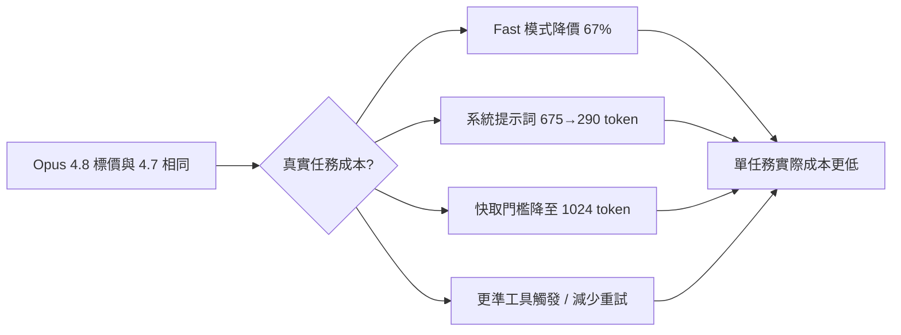
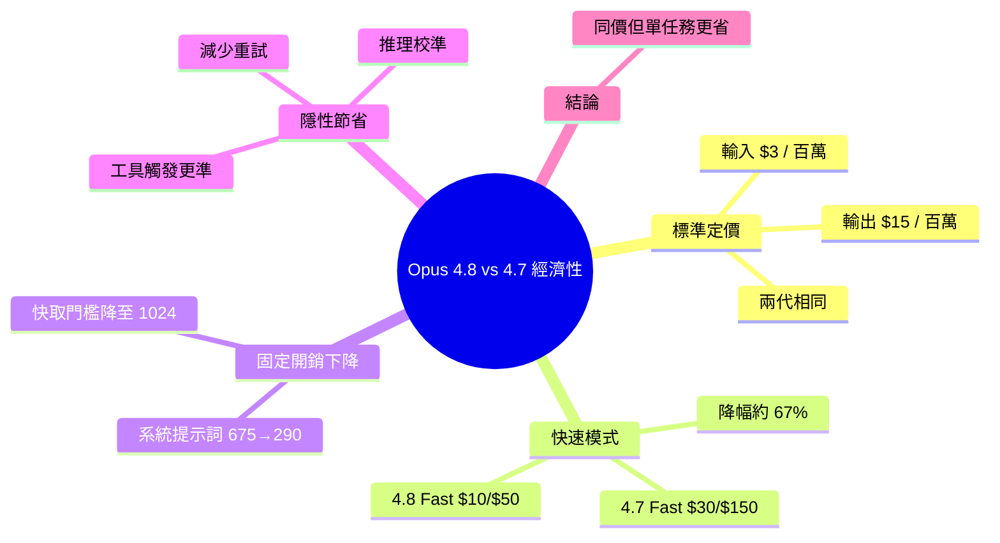

## Claude Opus 4.8 vs Opus 4.7: Same Price, Better Economics?

Opus 4.8 與 4.7 標準定價相同（輸入 $3/百萬 token、輸出 $15/百萬 token），但快速模式大幅降價：4.8 Fast 為 $10/$50，4.7 Fast 為 $30/$150，成本降幅達 67%。系統提示詞減少（4.8 為 290 token vs 4.7 的 675 token），prompt 快取最小閾值降至 1024 token，使小型頻繁提示詞快取可行。實務上，Opus 4.8 藉由更優工具觸發、推理校準、減少重試，單任成本更低，雖標價相同卻實質更經濟。

### 重點
- 快速模式定價：Opus 4.8 Fast $10/$50 vs 4.7 Fast $30/$150，成本降 67%（1M input + 250K output token 例）
- 系統提示詞優化：4.8 為 290 token，相比 4.7 的 675 token 減少 57%，降低隱藏工具成本
- Prompt 快取門檻：4.8 最小 1024 token 起快取，小型重複提示詞場景更經濟

**原文：** [medium-tag-claude](https://medium.com/@zickriann/claude-opus-4-8-vs-opus-4-7-same-price-better-economics-58ecec3955c2?source=rss------claude-5)

---

<!-- deep-analysis:begin -->
## 📌 摘要 (TL;DR)

- Claude Opus 4.8 與 Opus 4.7 的標準定價完全相同：輸入每百萬 token $3、輸出每百萬 token $15。
- 快速模式（Fast mode）大幅降價：4.8 Fast 為 $10 / $50（輸入／輸出），4.7 Fast 為 $30 / $150，降幅約 67%。
- 系統提示詞（system prompt）精簡：4.8 約 290 token，4.7 約 675 token，等於每次呼叫的固定開銷更低。
- Prompt 快取（prompt caching）最低門檻降到 1024 token，讓小型、頻繁的提示詞也能進快取。
- 核心論點：標價相同，但 4.8 靠更準的工具觸發、推理校準與減少重試，讓「單一任務」實際花費更低，因此更經濟。

## 🎯 核心概念

- **快速模式（Fast mode）**：低延遲、高吞吐的推論模式，過去單價遠高於標準模式，是這次降價主角。
- **系統提示詞（system prompt）**：每次請求都會帶上的固定指令，token 數越少、每次呼叫的基礎成本越低。
- **Prompt 快取（prompt caching）**：把重複出現的提示詞片段快取，命中後可省下重算成本；門檻越低越容易命中。

## 📖 整理分析

### 1. 標準定價未變
以標準模式（standard）計價時，Opus 4.8 與 4.7 一模一樣：輸入 $3 / 百萬 token、輸出 $15 / 百萬 token。單看價目表，升級到 4.8 不會讓帳單數字直接變動，這也是「technically not cheaper」的由來。

### 2. 快速模式降價約 67%
真正的價差在 Fast mode。4.8 Fast 為輸入 $10、輸出 $50；4.7 Fast 為輸入 $30、輸出 $150。對重度依賴低延遲推論的生產管線而言，光是切到 4.8 Fast 就能把該模式成本砍掉約三分之二。

| 模式 | Opus 4.7 (輸入 / 輸出) | Opus 4.8 (輸入 / 輸出) |
|---|---|---|
| 標準 | $3 / $15 | $3 / $15 |
| 快速 (Fast) | $30 / $150 | $10 / $50 |

### 3. 系統提示詞縮減
4.8 的系統提示詞約 290 token，遠低於 4.7 的 675 token。系統提示詞是每次請求的固定附帶成本，縮減近六成代表在高頻呼叫場景下，累積省下的輸入 token 相當可觀。

### 4. Prompt 快取門檻下降
Prompt 快取最低門檻從原本較高的數值降到 1024 token。門檻降低後，許多原本太短而無法快取的小型、重複提示詞也能命中快取，進一步壓低重複請求的實際花費。

### 5. 為何「同價卻更經濟」
作者的論點不是看價目表，而是看「完成一個任務的總成本」。4.8 透過更精準的工具觸發（tool use）、更校準的推理、以及更少的重試（retry），讓同一任務所需的 token 與來回次數下降。即使單價持平，單任務成本仍降低，因此在真實工作流中更省。

## 🧭 流程圖 / 架構圖

## 🧠 Mindmap

<!-- deep-analysis:end -->
### 📄 原文內容

點此展開 / 收合

Opus 4.8 is not technically cheaper than Opus 4.7, but in real AI workflows, it might still cost less. Continue reading on Medium »

