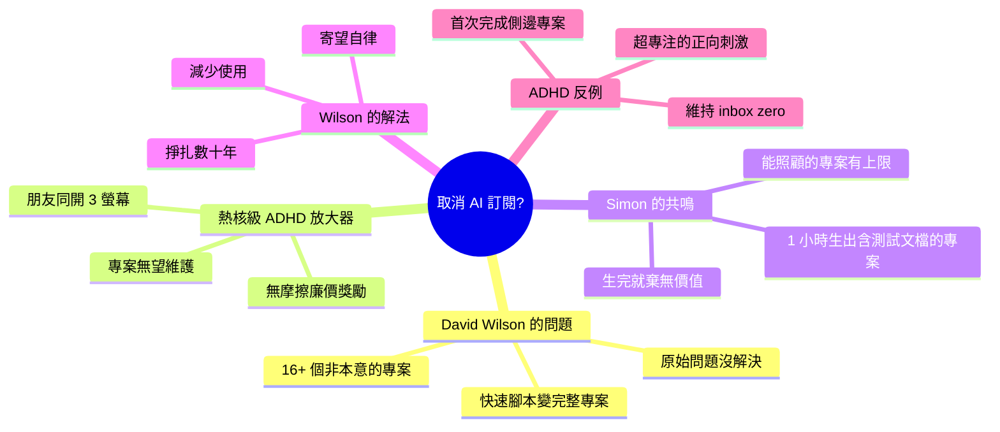

## The solution might be cancelling my AI subscription

Simon Willison 分享 David Wilson 的反思：AI coding agents 能將模糊想法快速轉化為完整專案（含測試、文檔），時間從數周縮至 1 小時，但廉價獎勵 + 無摩擦導致用户快速膨脹出 16+ 個無法維護的側邊專案。Wilson 診斷此為「thermonuclear ADHD amplifier」—— 任何無限低成本 + 無摩擦的工具必然助長注意力分散，唯一解法是自律節制。然而評論區大量 ADHD 患者報告相反體驗：AI agents 讓他們首次完成側邊專案、維護 inbox zero、感受到前所未有的專注力與成就感，揭示同一工具對不同神經型態的人產生對立效果。

### 重點
- 「寫個簡單腳本」在 1 小時膨脹成 16+ 個無法維護的專案；廉價獎勵無摩擦的工具極易成為分散注意力的工具
- 無限低成本 + 無摩擦輸出 = 必然的注意力陷阱，Wilson 認為唯一解法是紀律；但 ADHD 族群報告相反體驗 —— 終於能完成工作、感受清晰聚焦
- Pattern：同一工具對不同神經型態的人產生對立效果；超低成本工具的倖存率取決於使用者的自律能力而非工具本身

**原文：** [simon-willison](https://simonwillison.net/2026/May/31/the-solution-might-be-cancelling-my-ai-subscription/#atom-everything)

---

<!-- deep-analysis:begin -->
## 📌 摘要 (TL;DR)

- Simon Willison 引用 David Wilson 的反思文章，後者列出用 AI 工具開了 16+ 個專案，多數並非本意：常從「寫個快速腳本」開始，一小時後變成一個有測試、有文檔的完整專案，但原本的問題往往沒解決。
- Wilson 形容這項技術是「熱核級 ADHD 放大器」（thermonuclear ADHD amplifier），他看到身邊每個成年朋友都同時開 3 個螢幕做互不相關、幾乎無望維護的「專案」。
- Wilson 認為這不可持續，他目前唯一的管理方法就是「減少使用」，因為一個低投入、無摩擦就能產生廉價獎勵的工具，本質上是負債。
- 他寄望要培養的關鍵技能是「自律」（discipline）—— 但他自嘲為此已掙扎數十年。
- 反差點：Hacker News 討論串裡許多 ADHD 患者回報相反體驗 —— AI agents 反而讓他們首次完成側邊專案、維持 inbox zero、感受到前所未有的專注與成就感。
- 核心 insight：同一個工具對不同神經型態（neurotype）的人產生對立效果，沒有單一結論。

## 🎯 核心概念

- **熱核級 ADHD 放大器**（thermonuclear ADHD amplifier）：Wilson 用語，指 AI 工具因低成本、無摩擦而極度放大注意力分散的傾向。
- **無摩擦的廉價獎勵**（cheap reward with minimal input and no friction）：Wilson 的診斷核心 —— 容易取得的成果讓人不斷開新坑卻不維護。
- **超專注**（hyperfocus）：ADHD 特質之一，部分留言者表示 AI 提供了他們渴求的刺激，反而觸發正向的超專注狀態。

## 📖 整理分析

### 1. 16 個沒打算做的專案
Wilson 列出 16+ 個用 AI 工具生出的專案，並承認大多數「不是我本來想做的」。典型流程是 Claude session 從「幫我寫個處理 X 的快速腳本」開始，一小時後產出物既不是那個快速腳本，原本的問題（whatever the original itch）通常也沒解決。

### 2. 對注意力的傷害
Wilson 直言這技術「對注意力是災難性的」，稱之為熱核級 ADHD 放大器，並說在每一位成年朋友身上都看到同樣效應：同時掛 3 個螢幕、做著互不相關且幾乎無望維護的專案，對結果毫無投入，時間明顯被浪費。

### 3. Simon 的共鳴：能照顧多少專案？
Simon Willison 表示高度共鳴。coding agents 能在不到一小時內，把模糊想法變成有測試、有文檔、看似經過數週審慎打磨的可用方案。但他指出問題：即使程式碼穩固，一個人能合理照顧的專案數量有上限；若專案生出來就被立刻拋棄，當初創造的價值何在？

### 4. Wilson 的悲觀解法
Wilson 認為現況完全不可持續，目前唯一的管理手段是「減少使用」。他主張這類低投入、無摩擦的廉價獎勵工具只能是負債，而認清這點或許是 AI 至今唯一真正的貢獻。他寄望解方是培養自律，但坦言這件事他已試圖搞懂數十年。

### 5. 評論區的反例：ADHD 的反向體驗
Hacker News 討論串出現多則相反證言。一位 ADHD 留言者說：「我人生第一次完成側邊專案，因為我能在對它失去興趣前把它跑起來。」另一位說 AI 是心靈的慰藉，過去得靠激烈 EDM 才能工作，現在能在安靜中跟 agents 對話、維持 inbox zero、首次感覺像擁有一支支援團隊。第三位說對容易超專注的人而言，AI 提供了渴求的刺激，讓他前所未有地投入、高效、感覺強大。

## 🧠 Mindmap

<!-- deep-analysis:end -->
### 📄 原文內容

點此展開 / 收合

The solution might be cancelling my AI subscription 
I find this post by David Wilson very relatable. David lists 16+ projects he's spun up with AI tooling, and concludes: 
 
 I didn't mean to build most of these things. Usually the Claude session started with something like " write a quick script for X ", and one hour later the result is not a quick script for X , nor in the usual case is my problem solved, whatever the original itch happened to be. 
 On that last point, this technology is horrific for attention. It's a thermonuclear ADHD amplifier and I have seen the same effect in every single one of my adult friends. Folk running 3 screens simultaneously working on totally unrelated "projects" they have little hope of maintaining, and such little commitment to the outcome that the time is obviously wasted. 
 
 This is a very real problem. I'm finding that coding agents can take me from a vague idea to a working solution, one with tests and documentation and that looks like a carefully considered project evolved over the course of many weeks... in less than an hour. 
 Even if the code is rock solid, there's a limit to how many projects like that I can sensibly care for - and if they're instantly abandoned, what value was there from creating them in the first place? 
 David doesn't think this is sustainable at all: 
 
 I have no idea how to manage AI at present except by curtailing use, because a tool producing a cheap reward with minimal input and no friction can only be a liability, and achieving that realisation is probably the only real contribution of AI to date. 
 
 I'm hopeful that the critical skill to develop here is discipline . That’s not great news for me: I’ve been trying to figure that one out for decades! 
 Interestingly, the Hacker News thread has gathered a number of comments from people with ADHD who are finding agents help them achieve the focus they've been missing: 
 
 "... for me (also ADHD) it's kind of the opposite. I'm finishing side projects for the first time ever because I can actually get them working before I get bored of them" 
 "As someone with ADHD I feel like AI is a salve for my mind. I used to listen to intense EDM while working. Now I sit in silence and talk to my agents. I maintain inbox zero. I absorb and comment across all relevant projects, even outside my team. I literally feel like I have a support team for the first time." 
 "For those of us prone to hyperfocus, working with AI can provide the kinds of stimulation we crave. I can hardly remember a time when I've felt more engaged with my work, more productive, and more badass." 
 

 Via Hacker News 

 Tags: productivity , ai , generative-ai , llms , coding-agents , ai-misuse

