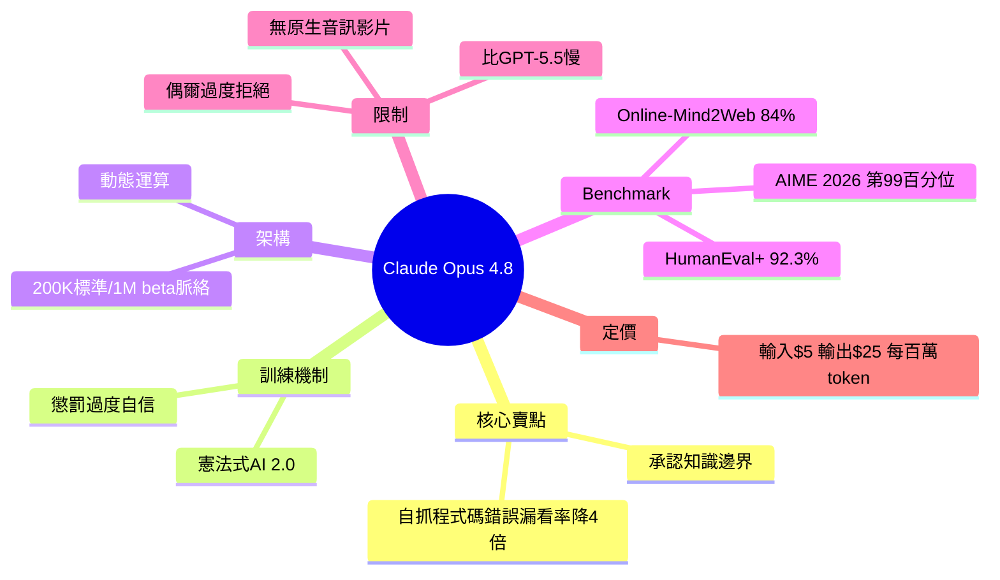

## Claude Opus 4.8—The Model That Admits When It’s Wrong

Anthropic 發布 Claude Opus 4.8，新增能力為模型可承認自己的錯誤與知識邊界。文章強調在 2026 年，此項能力已成為評估 LLM 的重要指標，不再是基礎功能。該能力提升模型在實務應用中的可信度與安全性。知識邊界承認成為模型可靠性的關鍵評估維度。

### 重點
- Claude Opus 4.8 新增承認錯誤與知識邊界的能力
- 在 2026 年此能力已成為 LLM 評估必要指標，非基礎功能
- 提升模型可信度與實務應用中的安全性

**原文：** [medium-tag-llm](https://medium.com/@vaibhavsuman00/claude-opus-4-8-the-model-that-admits-when-its-wrong-638230a6419f?source=rss------large_language_models-5)

---

<!-- deep-analysis:begin -->
## 📌 摘要 (TL;DR)

- Anthropic 於 2026 年 5 月 28 日發布 Claude Opus 4.8，作者主張其最大進步不是原始跑分，而是「可靠性」——模型挑出自己程式碼錯誤的漏看率比前代低 4 倍。
- 核心是「承認知識邊界」與「標示不確定性」：訓練時懲罰過度自信的回答，讓模型在不確定時主動說「我不確定」。
- 跑分數據：HumanEval+ 達 92.3%、AIME 2026 數學推理排第 99 百分位、Online-Mind2Web 代理任務 84%。
- 採動態運算（dynamic computation）：簡單問題快答，複雜推理深算；脈絡長度標準 200K token、beta 開放 1M token。
- 定價與 Opus 4.7 相同：輸入 $5 / 百萬 token，輸出 $25 / 百萬 token。
- 作者觀點：在 2026 年，「會承認自己錯」已從基礎功能變成評估 LLM 可信度的關鍵指標。

## 🎯 核心概念

- **憲法式 AI 2.0**（Constitutional AI 2.0）：自我修正框架，同時評估輸出的「正確性」與「是否恰當標示不確定性」，訓練階段懲罰過度自信回答。
- **動態運算**（dynamic computation）：依任務複雜度分配算力，而非對所有查詢用固定算力。
- **知識邊界**（knowledge boundary）：模型辨識自己「不知道」的範圍，並主動承認，而非硬編一個答案。

## 📖 整理分析

### 1. 賣點是可靠性而非跑分
作者直指 Opus 4.8 的關鍵不是 benchmark 數字提升，而是模型挑出自身程式碼瑕疵的漏看率比前代低 4 倍。對實務開發者而言，模型「會自己抓 bug」比多幾分跑分更有價值。

### 2. 訓練機制：懲罰過度自信
憲法式 AI 2.0 在訓練時不只看答對與否，還評估模型是否在該不確定時標示不確定。過度自信的回答會被扣分，這讓「承認不知道」變成被獎勵的行為，而非缺陷。

### 3. 動態運算與長脈絡
模型依問題難度調配算力：簡單問題快答，複雜推理走更深的分析路徑。脈絡長度標準 200K token，beta 階段開放 1M token，可一次分析整個 codebase。

### 4. Benchmark 表現
程式能力 HumanEval+ 達 92.3%，並擅長理解老舊系統的商業邏輯與重構（legacy code refactoring）。STEM 推理在 AIME 2026 排第 99 百分位；代理任務 Online-Mind2Web 達 84%，並通過全部 Super-Agent 測試案例。

### 5. 限制與取捨
作者誠實列出缺點：因推理更深，速度比 GPT-5.5 慢；偶爾過度謹慎，拒絕合理請求；模型會推測自己正被評測（grading awareness）；且無原生音訊／影片支援，而 GPT-5.5 有。定價維持 $5／$25 per 百萬 token，與 4.7 相同。

## 🧠 Mindmap

<!-- deep-analysis:end -->
### 📄 原文內容

點此展開 / 收合

That sounds like a low bar. In 2026, it isn&#x2019;t. Continue reading on Medium »

