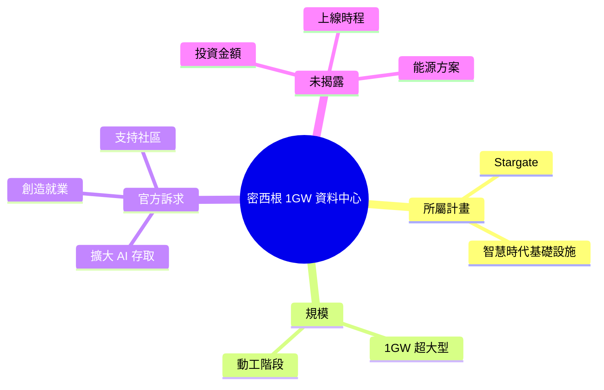

## Building the infrastructure for the Intelligence Age in Michigan

OpenAI 宣布在密西根州啟動 Stargate 計畫的 1GW 超大型資料中心，旨在建構人工智慧時代的基礎設施，以擴大 AI 存取、創造就業並支持社區發展。該項目是 OpenAI 長期基礎設施投資戰略的關鍵里程碑。

### 重點
- Stargate 計畫在美國密西根州破土，規模達 1 GW，為超大型 AI 運算資料中心
- 目標擴大 AI 技術可近性、創造在地就業機會、支持社群經濟發展
- 屬 OpenAI 長期基礎設施擴張戰略核心，支撐 frontier models 運算需求

**原文：** [openai-blog](https://openai.com/index/stargate-michigan-data-center)

---

<!-- deep-analysis:begin -->
## 📌 摘要 (TL;DR)

- OpenAI 在密西根州（Michigan）為一座 1GW 規模的超大型資料中心動工（breaks ground），屬於 Stargate 基礎設施計畫的一部分。
- 官方訴求三點：擴大 AI 存取（expand access）、創造就業（create jobs）、支持在地社區（support communities）。
- 屬於 OpenAI 為「智慧時代」（Intelligence Age）布建運算基礎設施的長期投資戰略。
- ⚠️ 來源備註：本則輸入僅含標題與一句官方導言，無正文細節（無確切投資金額、用電方案、上線時程、合作夥伴、就業人數）。以下分析嚴格限於已揭露內容，未揭露項目不臆測。

## 🎯 核心概念

- **Stargate**：OpenAI 的大型 AI 運算基礎設施計畫代號，本密西根資料中心為其組成項目之一。
- **1GW（gigawatt）**：資料中心的電力容量單位，標示此為超大型（hyperscale）規模的運算設施。
- **智慧時代基礎設施（infrastructure for the Intelligence Age）**：OpenAI 用以描述其長期算力布建願景的框架性說法。

## 📖 整理分析

### 1. 動工事件本身
OpenAI 宣布在密西根州為一座 1GW 資料中心動工。官方將此定位為 Stargate 計畫下的一個節點，而非單一獨立設施。動工（break ground）代表進入實體興建階段。

### 2. 官方訴求的三大效益
導言明列三項目標：擴大 AI 存取、創造就業、支持社區。前者對應算力供給（更多運算容納更多 AI 服務），後兩者對應在地經濟與社區關係——這是超大型資料中心選址常見的公共溝通框架。

### 3. 在 Stargate 戰略中的定位
本案被描述為 OpenAI 長期基礎設施投資的關鍵里程碑（依先前 brief）。其意義在於：前沿模型訓練與推論受運算容量約束，自建 1GW 級設施是擴張算力上限的直接手段。

### 4. 來源未揭露、無法確定的項目
本則輸入未提供下列常見關鍵數據，因此無法確定，亦不在此補完：投資金額、預計上線時間、能源來源與供電協議、就業人數、合作建商或晶片供應商、與微軟或其他夥伴的關係。如需這些須回查 OpenAI 原始公告全文。

## 🧠 Mindmap

<!-- deep-analysis:end -->
### 📄 原文內容

點此展開 / 收合

OpenAI breaks ground on a 1GW data center project in Michigan as part of Stargate, building AI infrastructure to expand access, create jobs, and support communities.

