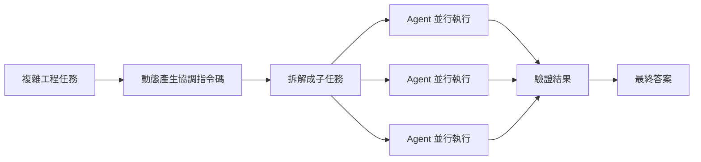
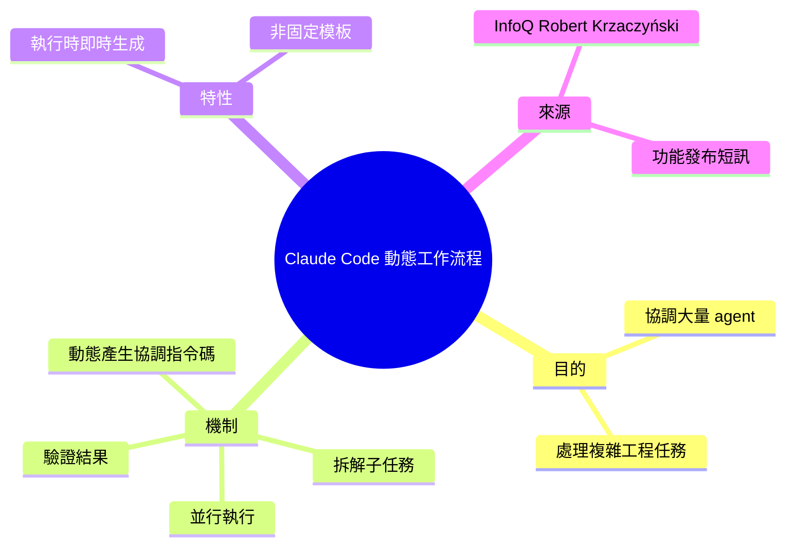

## Claude Code Adds Dynamic Workflows for Parallel Agent Coordination

Anthropic 推出 Claude Code 的 Dynamic Workflows 功能，用於協調軟體工程複雜任務中的大量 AI agent。特色：動態生成協調指令碼、自動分解子任務、並行執行多個 agent、驗證結果後提交最終答案。此功能讓 Claude 能處理涉及多 agent 協作的大規模工程任務。

### 重點
- 新功能：Dynamic Workflows 支援大量 agent 動態協調與並行執行
- 工作流能力：自動任務分解、子任務調度、結果驗證
- 應用場景：複雜軟體工程任務，多 agent 協作的大規模問題

**原文：** [infoq-ai-ml](https://www.infoq.com/news/2026/06/dynamic-workflows-claude-code/?utm_campaign=infoq_content&utm_source=infoq&utm_medium=feed&utm_term=AI%2C+ML+%26+Data+Engineering)

---

<!-- deep-analysis:begin -->
## 📌 摘要 (TL;DR)

- Anthropic 為 Claude Code 推出**動態工作流程**（Dynamic Workflows），用來在單一工作流程內協調大量 AI agent，處理複雜的軟體工程任務。
- 核心機制：Claude 能**動態產生協調指令碼**（orchestration scripts），自動把工作拆成子任務、並行執行，最後驗證結果再給出最終答案。
- 報導由 InfoQ 的 Robert Krzaczyński 撰寫；本則為功能發布性質的簡訊，未提供 benchmark 數據或定價細節。
- 對開發者的意義：把「單一 agent 線性執行」推向「一個 orchestrator 指揮多個 agent 並行」，適合可分解、可並行的大型工程任務。

## 🎯 核心概念

- **動態工作流程**（Dynamic Workflows）：Claude Code 的新能力，在執行時即時生成協調流程，而非依賴預先寫死的腳本。
- **協調指令碼**（orchestration script）：由 Claude 動態產生、用來指揮多個子 agent 如何分工與並行的程式碼。
- **agent 協調**（agent coordination）：在一個流程中管理多個 AI agent 的拆分、並行與結果彙整。

## 📖 整理分析

### 1. 解決什麼問題
複雜的軟體工程任務往往難以由單一 agent 線性完成。InfoQ 報導指出，Dynamic Workflows 的設計目標就是「在單一工作流程內協調大量 AI agent」，以處理這類複雜任務。

### 2. 運作方式
依報導描述，流程分四步：Claude 先**動態建立協調指令碼**，接著把工作**拆解成子任務**（break work into subtasks），將子任務**並行執行**（run in parallel），最後**驗證結果**（validate results）再呈現最終答案。

### 3. 「動態」的關鍵
重點在 dynamically create——協調腳本是執行當下生成，而非固定模板。這讓 Claude 能依任務形狀決定要拆出多少子任務、哪些可並行。

### 4. 報導範圍與限制
此為 InfoQ 的功能發布短訊，原文未提供具體 benchmark、可用版本號、定價或實測案例。以上分析僅依報導所述四個步驟，未額外推測未公開的實作細節。

## 🧭 流程圖 / 架構圖

## 🧠 Mindmap

<!-- deep-analysis:end -->
### 📄 原文內容

點此展開 / 收合

Anthropic introduced Dynamic Workflows, a new capability for Claude Code designed to handle complex software engineering tasks by coordinating large numbers of AI agents within a single workflow. The feature allows Claude to dynamically create orchestration scripts, break work into subtasks, run them in parallel, and validate results before presenting a final answer. By Robert Krzaczyński

