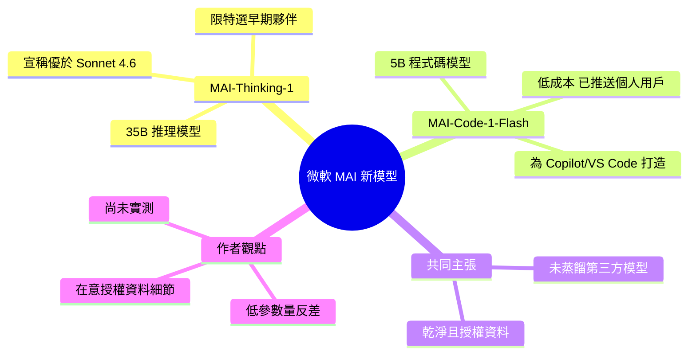

## Microsoft's new MAI models

微軟宣布兩款新文本語言模型。MAI-Thinking-1 為 35B 參數推理模型，目前提供給「特選早期夥伴」；MAI-Code-1-Flash 為 5B 參數模型，專為 GitHub Copilot 和 Visual Studio Code 優化，正在向 VS Code 個人用戶推出。微軟聲稱 MAI-Thinking-1 在盲測人類並排評估中優於 Claude Sonnet 4.6。兩款模型均聲稱採用「企業級、乾淨且獲得商業授權」的數據訓練，「不進行第三方模型蒸餾」。Simon Willison 表示期望了解「獲得適當授權」的資料具體內容，懷疑這可能是首批未依賴未授權網路資料的通用代碼專科模型，引發業界對模型訓練來源透明度的質疑。

### 重點
- MAI-Thinking-1（35B 參數）在盲測中優於 Claude Sonnet 4.6；MAI-Code-1-Flash（5B）針對 Copilot/VS Code 優化並推出
- 兩款模型均使用「企業級、乾淨且商業授權資料」訓練、無第三方蒸餾，與業界常見的網路資料自動爬取模式形成對比
- MAI-Code-1-Flash 已向 VS Code 個人用戶推出；MAI-Thinking-1 目前限制提供予選定早期合作夥伴

**原文：** [simon-willison](https://simonwillison.net/2026/Jun/2/microsofts-new-models/#atom-everything)

---

<!-- deep-analysis:begin -->
## 📌 摘要 (TL;DR)

- 微軟今早發表兩款全新文本大型語言模型（text LLM）：**MAI-Thinking-1**（推理型，35B 參數）與 **MAI-Code-1-Flash**（5B 參數）。
- MAI-Thinking-1 目前僅開放給「特選早期夥伴」（select early partners）；MAI-Code-1-Flash 專為 GitHub Copilot 與 Visual Studio Code 打造，主打高效能與低成本，正向 VS Code 的 Copilot 個人用戶推出。
- 微軟宣稱在「盲測人類並排評估」（blind human side-by-side evaluations）中，MAI-Thinking-1 比 Claude Sonnet 4.6 更受偏好——對一個 35B 模型來說相當亮眼。
- 兩款模型都標榜以「乾淨、適當商業授權」的資料從頭訓練，且**未對第三方模型做蒸餾**（distillation）。
- Simon Willison 認為值得關注的不是效能，而是「適當授權資料」這件事——這可能是首批沒有用未授權網路爬取資料訓練的實用程式碼專用模型。
- 作者本人尚未實測過任一款模型，內容基於微軟官方公告。

## 🎯 核心概念

- **蒸餾（distillation）**：用一個既有模型的輸出來訓練新模型的技巧；微軟特別強調「未採用」此法。
- **參數量（parameter count）**：模型規模指標。35B、5B 在 2026 年屬於偏小的模型，作者指出他自己筆電就常跑比 35B 更大的模型。
- **盲測並排評估（blind human side-by-side evaluation）**：讓人類在不知模型身分下比較兩者輸出、選出較佳者的評測方式。

## 📖 整理分析

### 1. 兩款模型的定位
MAI-Thinking-1 是 35B 的推理模型，限「特選早期夥伴」使用；MAI-Code-1-Flash 是 5B 模型，端到端由微軟自建，鎖定 GitHub Copilot 與 VS Code 場景，訴求高效能與更低成本，已開始向 VS Code 的 Copilot 個人用戶推送。

### 2. 低參數量的反差
作者點出值得玩味之處：在大模型存取成本高昂的當下，微軟反而推出參數量這麼低的模型。35B 在他眼中並不算大——他常在自己筆電上跑比這更大的模型，因此 35B 能贏過 Sonnet 4.6 的說法格外引人注意。

### 3. 微軟的效能宣稱
微軟稱 MAI-Thinking-1 在盲測並排評估中「比 Sonnet 4.6 更受偏好」。這是微軟單方面公告的數字，作者尚未親自驗證，故僅作為廠商聲明看待。

### 4. 重點其實在資料來源
真正讓作者在意的是訓練資料：MAI-Thinking-1 標榜以「企業級、乾淨且商業授權」資料從頭訓練、不蒸餾第三方模型；MAI-Code-1-Flash 同樣稱用「乾淨且適當授權」資料端到端打造。作者想深入了解「適當授權」具體指什麼，並猜想這可能是首批沒有依賴未授權網路資料的實用程式碼專用模型。

## 🧠 Mindmap

<!-- deep-analysis:end -->
### 📄 原文內容

點此展開 / 收合

Microsoft announced two new text LLMs this morning - MAI-Thinking-1 (reasoning, 35B parameters, available to "select early partners") and MAI-Code-1-Flash (5B parameters, "purpose-built for GitHub Copilot and VS Code to deliver high performance and lower cost [...] rolling out to GitHub Copilot individual users in Visual Studio Code"). I've not been able to try either of them just yet. 
 It's very interesting to see Microsoft releasing models with such low parameter counts, especially given how expensive larger models are to access right now. They claim MAI-Thinking-1 "is preferred to Sonnet 4.6 in our blind human side-by-side evaluations", which is impressive for a 35B model seeing as I frequently run models larger than that on my own laptop. 
 Also of note : 
 
 We trained [MAI-Thinking-1] from the ground up on enterprise grade, clean and commercially licensed data, without distillation from third-party models. 
 
 And for MAI-Code-1-Flash as well: 
 
 It is built end-to-end by Microsoft using clean and appropriately licensed data. 
 
 I would very much like to learn more about this "appropriately licensed" data! Could these be the first generally useful code-specialist models that didn't train on an unlicensed dump of the web? 

 Tags: llm-release , generative-ai , ai , microsoft , llms

