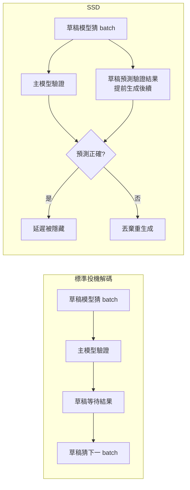
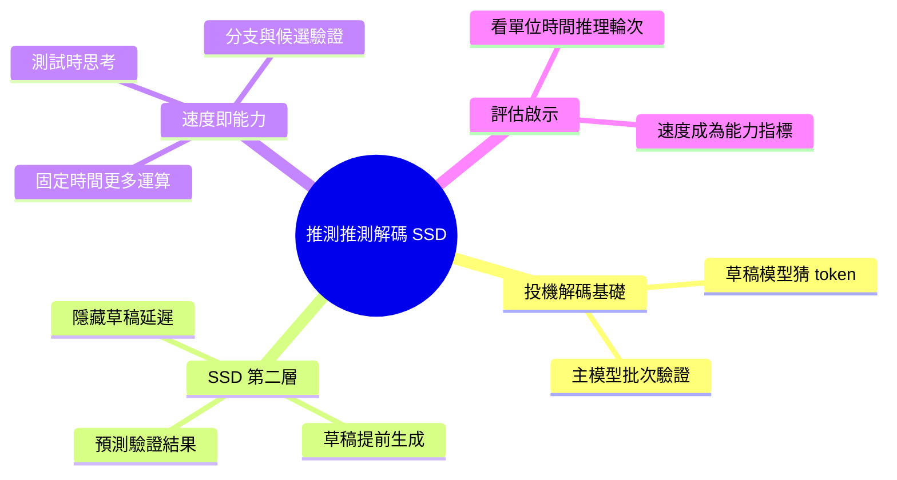

## Speculative Speculative Decoding: Why Inference Speed Is Becoming a Capability

推測推測解碼 (Speculative Speculative Decoding, SSD) 是雙層推理優化技術。在標準投機解碼基礎上，再加第二層：主模型驗證草稿 token 時，草稿模型已根據預測的驗證結果提前開始生成後續序列，消除草稿延遲。作者論證推理速度直接決定模型效能：更快推理 = 更多測試時思考、分支搜尋、候選驗證，使「速度本身成為智能基礎設施」而非單純部署優化。

### 重點
- 雙層結構：標準投機解碼 + 預測驗證結果提前起草，消除起草延遲 (parallelization via draft model token probability signals)
- 速度即能力：推理快 → 更多思考預算 → 自驗證、工具使用、RL rollout 都能更深入
- 實務意義：在推理成本中心的系統，速度最佳化與能力提升直接耦合

**原文：** [medium-tag-llm](https://chierhu.medium.com/speculative-speculative-decoding-why-inference-speed-is-becoming-a-capability-9e1b63dfa47f?source=rss------large_language_models-5)

---

<!-- deep-analysis:begin -->
## 📌 摘要 (TL;DR)

- 作者提出**推測推測解碼**（Speculative Speculative Decoding，簡稱 SSD），是在標準投機解碼（speculative decoding）之上再疊一層的雙層推理優化技術。
- 標準投機解碼用小的草稿模型（draft model）先猜 token、再由主模型（target model）批次驗證；SSD 多做一步：主模型還在驗證當前草稿時，草稿模型已**根據預測的驗證結果**提前生成後續序列，消除草稿等待的延遲。
- 核心論點：推理速度不只是部署成本問題，而是**直接決定模型能力**——更快的推理換來更多測試時運算（test-time compute）。
- 速度越快，模型能在固定時間內做越多測試時思考、分支搜尋、候選驗證，因此「速度本身成為智能基礎設施」。
- 對讀者的意義：評估模型不該只看單次回答品質，還要看單位時間內能塞進多少推理輪次——速度與能力在 agent 與推理時代開始耦合。

## 🎯 核心概念

- **投機解碼**（speculative decoding）：用便宜的草稿模型先預測多個 token，再讓主模型一次性平行驗證，驗證通過就採用，藉此減少主模型逐一生成的次數。
- **推測推測解碼**（Speculative Speculative Decoding，SSD）：在上述基礎上再加第二層投機——草稿模型不等驗證結果，先賭驗證會通過並繼續往下生成。
- **測試時運算**（test-time compute）：推理階段投入的運算量，例如多次取樣、分支搜尋、自我驗證；越多通常品質越好。
- **草稿模型 / 主模型**（draft / target model）：草稿模型快但弱負責猜，主模型慢但準負責驗。

## 📖 整理分析

### 1. 標準投機解碼的瓶頸
投機解碼已能加速推理，但存在序列依賴：草稿模型猜完一批 token 後，必須**等主模型驗證完**才知道從哪裡接著猜。這段等待形成空檔，草稿模型在驗證期間是閒置的。

### 2. SSD 的第二層投機
SSD 讓草稿模型不再空等。它**預測主模型的驗證結果**（賭哪些 token 會被接受），並據此提前開始生成後續序列。若預測正確，草稿延遲被完全隱藏；若錯誤則丟棄重來。這把「猜 token」的投機思路再套用到「猜驗證結果」上，故名「推測的推測」。

### 3. 速度即能力的論證
作者的核心主張：在推理時代，更快的推理不等於只是省錢。固定時間預算下，推理越快 → 能跑越多輪測試時運算（取樣、分支、候選驗證）→ 最終答案品質越高。因此延遲優化從「部署細節」升格為「能力槓桿」。

### 4. 對模型評估的啟示
若速度與能力耦合，單看一次回答的品質就不足以衡量模型。應該問：在相同 wall-clock 時間內，這個模型能完成多少次思考/驗證循環？速度成為 agent 與推理密集工作負載的隱性能力指標。

## 🧭 流程圖 / 架構圖

標準投機解碼 vs SSD 的時序差異：

## 🧠 Mindmap

<!-- deep-analysis:end -->
### 📄 原文內容

點此展開 / 收合

I know the title looks as if I accidentally typed the same word twice. I did not. &#x201c;Speculative Speculative Decoding&#x201d; is meant to sound&#x2026; Continue reading on Medium »

