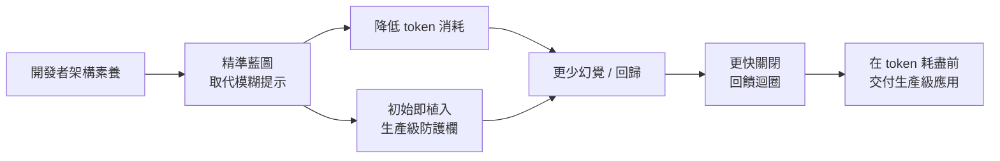
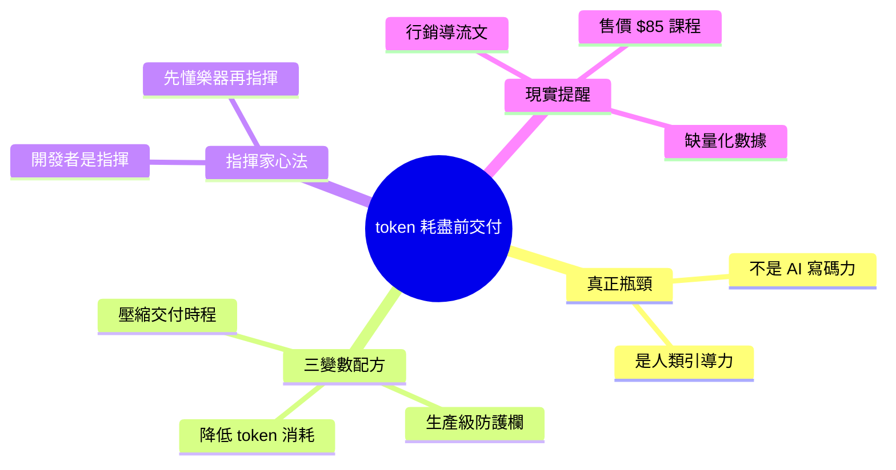

## How to Ship Production-Ready Apps Before Your AI Runs Out of Tokens

本文重新定義了 AI 輔助開發的瓶頸：並非 AI 代碼生成能力，而是人類有效指導 AI 的能力。在 token 預算有限的約束下，精確表述需求、迭代反饋和決策成為交付生產就緒應用的關鍵。該觀點強調了人機協作中人類側的效率優化，開發者需掌握更高效的 prompt 工程與問題分解技能，才能在 token 限制下最大化開發效率。這是 AI 時代軟體工程的新範式轉變。

### 重點
- AI 輔助開發的瓶頸從模型能力轉向人類指導效率與決策品質
- Token 預算約束下，精確表述需求與有效迭代反饋成為核心挑戰
- 人機協作效率取決於開發者的 prompt 工程、需求分解與指導能力

**原文：** [medium-tag-claude](https://medium.com/@doz55ier/how-to-ship-production-ready-apps-before-your-ai-runs-out-of-tokens-2afb49970d88?source=rss------claude-5)

---

<!-- deep-analysis:begin -->
## 📌 摘要 (TL;DR)

- 作者核心論點：現代網頁開發的最大瓶頸不是 AI 寫程式的能力，而是**人類精準引導 AI 的能力**（"the human's ability to steer it efficiently"）。
- 痛點：缺乏架構知識的開發者會迅速燒光 token 預算與情境視窗（context window），陷入幻覺（hallucination）、回歸錯誤（regression）與無止境的修正迴圈。
- 解方是一組「三變數配方」：用精準藍圖降低 token 消耗、在初始提示就植入生產級標準與防護欄、把「猜測」轉為「指揮」以加速時程。
- 關鍵比喻：未來的開發者不是「鍵盤技工」，而是「**交響樂指揮**」——你得先懂樂器（基礎技能）才能指揮樂團（AI）。
- 須留意：本文帶有行銷性質，主要在推銷作者 apparentcreative.com 的「30 項 WebDev 技能、售價 $85」課程，技術論點偏觀念框架，缺乏量化數據或實測案例。

## 🎯 核心概念

- **情境視窗（context window）**：AI 一次能納入的有效記憶上限，被無效提示與反覆修正快速耗盡。
- **生產級防護欄（production-ready guardrails）**：在第一個提示就明訂的安全與品質約束（語意化 HTML、安全 API 連接等），避免事後補救。
- **精準藍圖（precision blueprint）**：取代模糊提示的具體規格說明，讓 AI 直接產出乾淨程式碼。

## 📖 整理分析

### 1. 瓶頸不在 AI，而在人
作者把問題重新定義：開發者常把失敗歸咎於 AI 能力不足，但真正原因是人不懂架構、給不出清楚指示。缺乏基礎知識時，token 預算與情境視窗會在反覆來回修正中被燒光，導致幻覺與回歸錯誤。

### 2. 三變數成功配方
作者提出三個可同時優化的變數：(1)**大幅降低 token 消耗**——提供精準藍圖而非模糊提示，換來更乾淨、更少幻覺的程式碼；(2)**即時達到生產級標準**——理解乾淨檔案結構、語意化 HTML/CSS、輕量 JavaScript 與安全 API 串接，並在初始提示就強制要求防護欄；(3)**壓縮交付時程**——從「猜測」轉為「指揮」，更快關閉回饋迴圈、消除錯誤。

### 3. 指揮家心法
核心比喻：「未來的開發者不是鍵盤技工，而是交響樂指揮。」要能指揮 AI 這個樂團，前提是你先懂每一件基礎樂器。換言之，提示工程（prompt engineering）的上限，取決於開發者本身的架構素養。

### 4. 作者的解方（與商業意圖）
文章導向作者的課程「30 WebDev Skills for $85」，涵蓋乾淨元件設計（Clean Component Design）、狀態管理基礎（State Management Basics）、現代 CSS（Grid/Flexbox）與效能優化（Performance Optimization）。需注意這是付費課程的導流文，技術內容以觀念框架為主，未提供實測數據或具體 token 節省幅度，閱讀時宜區分「洞見」與「行銷」。

## 🧭 流程圖 / 架構圖

## 🧠 Mindmap

<!-- deep-analysis:end -->
### 📄 原文內容

點此展開 / 收合

The greatest bottleneck in modern web development isn&#x2019;t the AI&#x2019;s ability to write code &#x2014; it&#x2019;s the human&#x2019;s ability to steer it efficiently. Continue reading on Medium »

