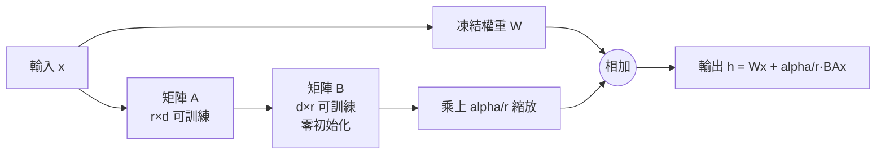
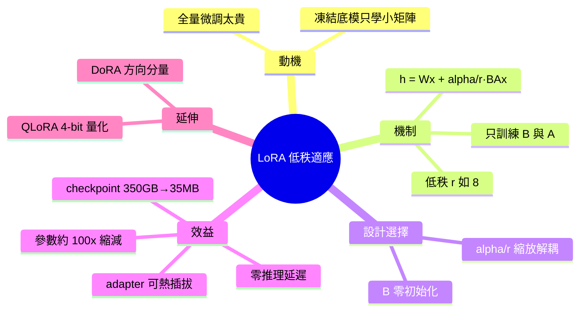

## What exactly is LoRA (Low-Rank Adaptation)?

本文介紹 LoRA (Low-Rank Adaptation) 技術，一種高效的大語言模型微調方法。通過訓練兩個小矩陣而非整個模型，可將可訓練參數減少約 100 倍。LoRA 的核心優勢是零額外推理成本，使得微調大型模型變得可行且高效。該技術已廣泛應用於需要快速適應特定任務的場景，對資源受限的開發者和企業提供了成本效益高的微調方案。

### 重點
- 訓練兩個小矩陣（low-rank matrices）而非整個模型，可訓練參數減少 ~100 倍
- 零額外推理成本：微調後的模型推理性能與原模型相同
- 高效微調方案：適用於資源受限環境下的模型領域適應

**原文：** [medium-tag-llm](https://vizuara.medium.com/what-exactly-is-lora-low-rank-adaptation-5bdc3275e54d?source=rss------large_language_models-5)

---

<!-- deep-analysis:begin -->
## 📌 摘要 (TL;DR)

- LoRA（Low-Rank Adaptation，低秩適應）是一種高效微調法：**凍結整個預訓練模型**，只在旁邊訓練兩個小矩陣 B 與 A 來「微調」模型行為。
- 核心數學：對凍結權重 W，更新公式為 `h = Wx + (alpha/r)·BAx`，只有 B、A 可訓練，rank（秩）r 通常很小（如 8）。
- 參數量大幅縮減：以 1000×1000 權重為例，原需 100 萬參數，rank=8 時只需 16,000 個（約 62× 縮減）；整體模型約 **100× 縮減**。
- 儲存成本驟降：每個任務的 checkpoint 從 350GB 縮到約 **35MB**，一個底模可掛多個可熱插拔的小型 adapter（轉接器）。
- **零推理成本**：訓練完把 BA 併回 W 後，推理延遲沒有任何額外開銷。
- 延伸技術：QLoRA 把底模量化成 4-bit，讓 65B 模型能在 48GB GPU 上微調；DoRA 對方向分量套用 LoRA 取得邊際品質提升。

## 🎯 核心概念

- **低秩適應**（Low-Rank Adaptation，簡稱 LoRA）：不更新全部權重，改用兩個瘦長矩陣的乘積來近似權重更新量。
- **秩**（rank，符號 r）：矩陣的內在維度；LoRA 假設模型微調的更新量具有「低內在秩」，所以能用很小的 r 表達。
- **alpha/r 縮放**（scaling factor）：把 BA 的輸出乘上 alpha/r，讓 rank 的選擇與學習率調整解耦。
- **adapter**（轉接器）：訓練出來的 B、A 小矩陣即一個可掛載/卸載的任務專屬模組。
- **QLoRA**：在量化（4-bit）底模上做 LoRA；**DoRA**：權重分解方向後再套 LoRA。

## 📖 整理分析

### 1. 為什麼需要 LoRA
全量微調（full fine-tuning）一個巨型模型要更新所有權重，運算與儲存成本極高，且每個下游任務都要存一份完整模型副本。LoRA 的出發點是：凍結預訓練模型，所有原始權重一律不動，只在旁邊學一對很小的矩陣去「推一把」模型的行為。

### 2. 低秩分解的數學機制
對任一凍結權重矩陣 W，LoRA 不直接學完整的更新矩陣，而是把它拆成兩個瘦矩陣 B 與 A 的乘積（秩為 r）。前向計算變成 `h = Wx + (alpha/r)·BAx`：W 維持固定，只有 B 與 A 參與訓練。由於更新量被限制在低秩空間，可訓練參數量被壓到極小。

### 3. 具體參數量對比
以一個 1000×1000 的權重矩陣為例：全量微調需要 1,000,000 個可訓練參數。改用 rank=8 的 LoRA 後，B 為 1000×8（8,000 參數）、A 為 8×1000（8,000 參數），合計僅 16,000 個——約 62× 縮減。放大到整個模型，典型約有 100× 的可訓練參數縮減。

### 4. 兩個關鍵設計選擇
第一，**B 採零初始化**：B 一開始為零，使得 BA=0，訓練起點恰好等於原始預訓練模型，不會一開始就破壞既有能力。第二，**alpha/r 縮放**：把 rank 的選擇與學習率調整解耦，換 r 時不必重調學習率。

### 5. 效益與零推理成本
儲存上，每個任務的 checkpoint 從 350GB 縮到約 35MB，一個底模可搭配多個可熱插拔的小 adapter 服務不同任務。推理上，訓練完成後把 BA 併回 W，模型結構與原本完全相同——**沒有任何額外推理延遲**。這是 LoRA 相較其他 adapter 法的關鍵優勢。

### 6. 延伸：QLoRA 與 DoRA
QLoRA 進一步把底模量化成 4-bit，再在其上做 LoRA，讓 65B 參數模型能塞進單張 48GB GPU 微調。DoRA 則把權重拆成大小與方向，僅對方向分量套用 LoRA，換取邊際的品質提升。

## 🧭 流程圖 / 架構圖

## 🧠 Mindmap

<!-- deep-analysis:end -->
### 📄 原文內容

點此展開 / 收合

How to fine-tune a giant model by training two tiny matrices, cutting trainable parameters by about 100x with zero extra inference cost. Continue reading on Medium »

