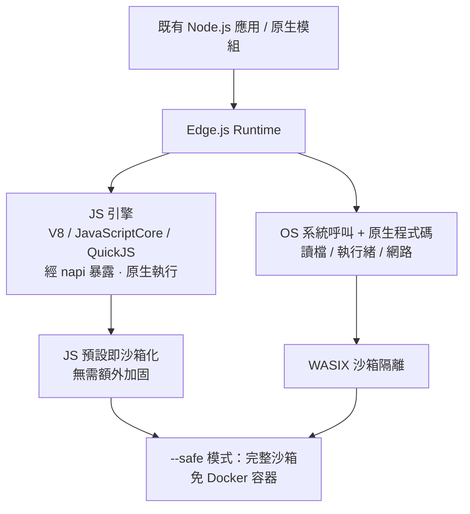
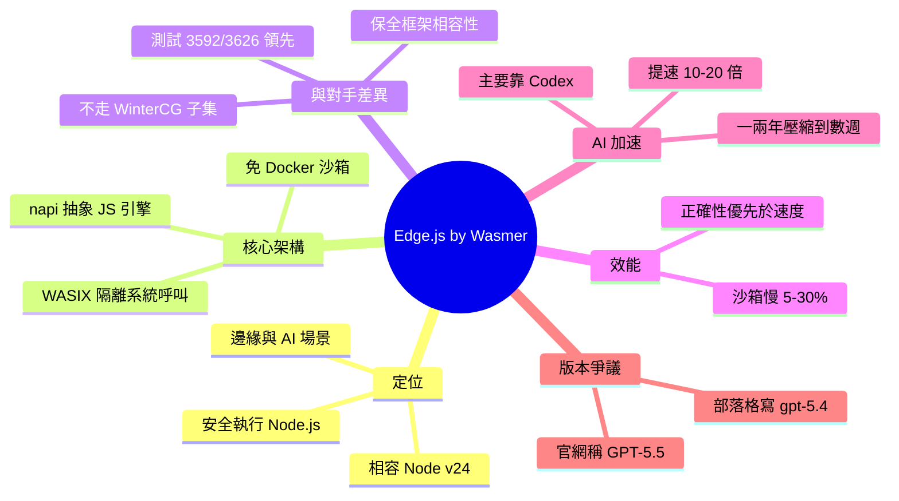

## How Wasmer used Codex to build a Node.js runtime for the edge

Wasmer 使用 Codex + GPT-5.5 構建邊界端 Node.js runtime，開發效率提升 10–20 倍，自原預期的數月縮短至數週完成。展示 OpenAI 代碼生成模型對基礎設施開發的實際加速效果。

### 重點
- Wasmer 用 Codex + GPT-5.5 構建邊界端 Node.js runtime，開發加速 10–20 倍
- 原預期時程從數月縮減至數週，展示 LLM 輔助工程生產力的量化提升

**原文：** [openai-blog](https://openai.com/index/wasmer)

---

<!-- deep-analysis:begin -->
## 📌 摘要 (TL;DR)

- Wasmer 開源了 **Edge.js**：一個專為「在邊緣運算（edge computing）與 AI 場景中安全執行 Node.js 工作負載」設計的 JavaScript runtime，目標相容 Node.js v24。
- 核心賣點：不靠 Docker 容器或硬體虛擬化，就能把 Node.js 應用「沙箱化（sandbox）」執行——用 WebAssembly + WASIX 隔離不安全的部分，達到容器做不到的高密度與快速啟動。
- AI 是這次能成事的關鍵：Wasmer 表示主要依賴 OpenAI 的 Codex 開發，**開發速度加快 10–20 倍**，原本對小型新創需耗時「一兩年」的工程，壓縮到「幾週」完成。
- 連團隊中不熟 C++ 或 Node 內部機制的工程師，也能靠 Codex 參與修 bug。
- 相容性實測亮眼：Edge.js 通過 **3592/3626** 項 Node 模組測試，遠勝 Bun（1513）與 Deno（1607）。
- ⚠️ 版本標示有出入：OpenAI 官網稱使用 **GPT-5.5**，但 Wasmer 自家技術部落格寫的是「主要依賴 `gpt-5.4`」——兩者對模型版本說法不一致。

## 🎯 核心概念

- **Edge.js**：Wasmer 推出的開源 Node.js 相容 runtime，與 Node 同架構、同依賴、同語意。
- **WASIX** (WebAssembly System Interface eXtended)：WebAssembly 的系統介面擴充，負責隔離系統呼叫、執行緒、網路等不安全操作。
- **NAPI** (Node-API)：Node 原生模組與 JS 引擎之間的抽象契約；Edge.js 以它作為 JS 引擎抽象層的基礎。
- **WinterCG**：由 Cloudflare、Deno 等邊緣供應商制定的 JS 子集規範；Wasmer 認為它造成框架碎片化，因此走相反路線。
- **無伺服器**（serverless）：免管理伺服器、依需求自動擴展的執行模式，是 Edge.js 鎖定的部署場景。

## 📖 整理分析

### 1. 要解決的問題
Node.js 雖快又穩，但有兩個架構限制：緊綁特定 JS 引擎 V8，且無法在「不靠容器化或硬體虛擬化」的情況下安全執行。對主打「高應用密度、快速啟動」的 Wasmer 雲端服務來說，容器啟動太慢是硬傷。既有邊緣方案如 Deno、Cloudflare Workers 則改用 WinterCG 這類新 API 子集，犧牲了相容性——多數框架根本不支援。

### 2. Edge.js 的做法：只沙箱化「不安全的部分」
Edge.js 把沙箱拆成兩個獨立隔離區：**JS 引擎**透過自訂 napi API 暴露，因 JS 本身預設即沙箱化，不需額外加固；**作業系統呼叫與原生程式碼**（讀檔、開執行緒、網路操作）則交給 WASIX 隔離。JS 引擎仍以原生模式執行（可插拔 V8、JavaScriptCore 或 QuickJS），只在 `--safe` 模式下啟用完整沙箱。為求行為一致，它沿用與 Node 相同的底層依賴：libuv、simdutf、ada、llhttp、ncrypto、ares。

### 3. 試錯之路：為何最終押注 napi
這不是 Wasmer 第一次嘗試。他們曾做過在 SpiderMonkey 上架 V8 shim（太慢、相容性脆弱）、把 V8 的 C++ API 當作 Wasm imports 暴露（有破壞沙箱的安全風險、且難長期維護）。也評估過 Node-WASIX 路線——把 V8 整個編進 Wasm，雖然技術上可行，但 V8 在 Wasm 內以直譯模式執行，效能代價高。這些失敗讓他們確認 napi 才是正解。

### 4. 效能與相容性現況
沙箱模式下 Edge.js 約比原生 Node 慢 **5–30%**（原生執行 5–20%，用 Wasmer 全沙箱約 30%），HTTP 等 Native↔Wasm 密集場景差距更大；啟動時間因尚缺 JS snapshot 而劣於 Node。0.x 階段他們刻意「正確性優先於速度」。相容性上（macOS M3 Max 實測），Edge.js 在 node:fs、node:http、node:crypto 等多數模組達到滿分通過，總計 3592/3626，明顯領先 Bun 與 Deno。

### 5. AI 如何讓小新創做成大工程
Wasmer 直言：這種規模的工程「對我們這種小新創原本不可行」，靠 Codex 把預期的一兩年縮短到幾週，提速 10–20 倍。更關鍵的是降低參與門檻——沒有 C++ 或 Node 內部經驗的成員也能協作修 bug。團隊承諾：只要有「在 Node 能跑、在 Edge.js 不能跑」的可重現範例，將在一週內修復。

## 🧭 架構圖

## 🧠 Mindmap

<!-- deep-analysis:end -->
### 📄 原文內容

點此展開 / 收合

See how Wasmer used Codex with GPT-5.5 to build a Node.js runtime for the edge, accelerating development 10x to 20x and shipping in weeks instead of months.

