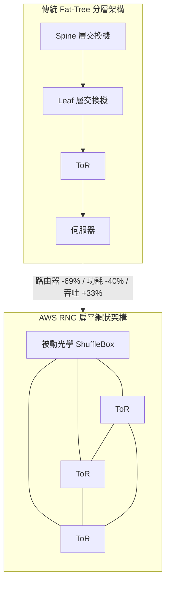
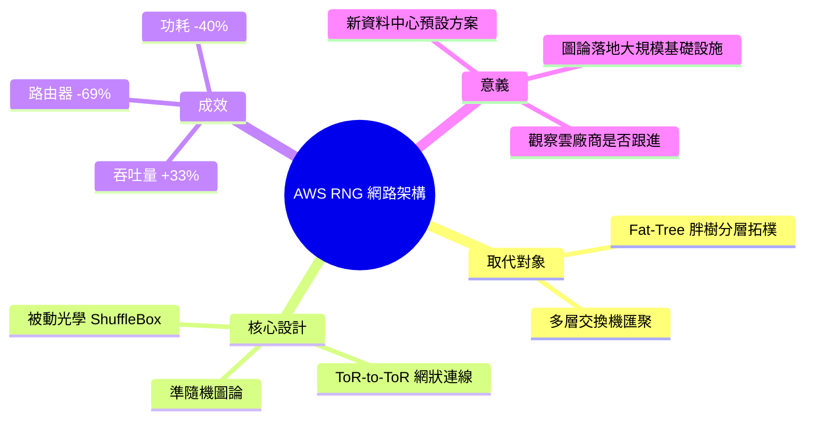

## AWS Replaces Fat-Tree Data Center Networks with Random Graph Theory, Cutting Routers by 69%

AWS 公開了新一代資料中心網路架構「Resilient Network Graphs」(RNG)，基於準隨機圖論，現已成為新資料中心構建的預設方案。RNG 用被動光學 ShuffleBox 連接交換機 (ToR) 的直接網格，取代傳統分層 fat-tree 設計，實現 69% 路由器減少、33% 吞吐量提升、40% 網路功耗降低。這是資料中心網路設計的範式轉變，將圖論應用於大規模基礎設施，同時降低資本與運營成本。

### 重點
- 隨機圖理論應用於 ToR-to-ToR 直接網格，取代 fat-tree 層級結構
- 69% 路由器減少、33% 吞吐量提升、40% 功耗降低的三維收益
- 被動光學 ShuffleBox 降低設備複雜度與功耗，成為新資料中心預設

**原文：** [infoq-architecture](https://www.infoq.com/news/2026/06/aws-random-graph-data-center/?utm_campaign=infoq_content&utm_source=infoq&utm_medium=feed&utm_term=Architecture+%26+Design)

---

<!-- deep-analysis:begin -->
## 📌 摘要 (TL;DR)

- AWS 公開新一代資料中心網路架構「Resilient Network Graphs」（RNG），以準隨機圖論（quasi-random graph theory）為基礎，現已成為多數新建資料中心的預設方案。
- RNG 用被動光學的 ShuffleBox 把機櫃頂端交換機（Top of Rack，簡稱 ToR）直接組成網狀（mesh）連線，取代傳統分層式的胖樹（fat-tree）拓樸。
- 關鍵成效：路由器數量減少 69%、吞吐量（throughput）提升 33%、網路功耗降低 40%。
- 這是把圖論直接應用到大規模基礎設施的設計範式轉變，同時壓低資本支出（CapEx）與營運支出（OpEx）。
- 對關注雲端基礎設施與成本結構的讀者而言，值得觀察 Google、Azure 是否跟進類似的扁平化網路設計。（本文作者：Steef-Jan Wiggers，來源 InfoQ）

## 🎯 核心概念

- **彈性網路圖**（Resilient Network Graphs，簡稱 RNG）：AWS 以圖論為基礎的扁平網路架構，現為新資料中心預設。
- **胖樹**（fat-tree）：傳統資料中心常用的分層樹狀拓樸，靠多層交換機（spine／leaf）逐層匯聚流量（本文以此為被取代的對象）。
- **準隨機圖論**（quasi-random graph theory）：以接近隨機方式連接節點的圖結構，藉此在較少設備下維持高連通性與路徑多樣性。
- **ShuffleBox**：被動式（passive）光學連接盒，無需供電與主動交換邏輯，用來把多台 ToR 交織連線。
- **機櫃頂端交換機**（Top of Rack，簡稱 ToR）：架設在每個機櫃頂端、直接連接該櫃伺服器的交換機。

## 📖 整理分析

### 1. 被取代的胖樹架構
傳統資料中心普遍採用胖樹拓樸：伺服器接到 ToR，ToR 再往上連到多層交換機逐層匯聚。這種分層設計連通性穩定，但需要大量交換機與路由器來堆疊各層，連帶帶來較高的設備數、功耗與成本。AWS 此次正是針對這種分層結構提出替代方案。

### 2. RNG 的做法：扁平網狀 + 被動光學
依 AWS 揭露，RNG 改用準隨機圖論設計一個扁平（flat）網路：以被動光學的 ShuffleBox 將 ToR 之間直接交織成 ToR-to-ToR 的網狀連線，省去傳統胖樹中間的多層匯聚交換機。ShuffleBox 為被動元件，本身不耗電、也不含主動交換邏輯，是降低功耗與設備數的關鍵。

### 3. 量化成效
相較胖樹，RNG 帶來三項具體改善：路由器數量減少 69%、吞吐量提升 33%、網路功耗降低 40%。換言之，AWS 同時在資本支出（更少設備）與營運支出（更低用電）兩端取得效益，而非以效能換成本。

### 4. 為何是範式轉變
胖樹等分層拓樸主導資料中心網路設計已有數十年。RNG 的意義在於把圖論（特別是準隨機／高連通圖的特性）直接落地到超大規模基礎設施，並已成為 AWS 新建資料中心的預設，而非實驗性專案。這顯示扁平化、以圖結構為核心的設計可能成為下一代資料中心網路的方向。

> 註：本文（InfoQ 新聞稿）主要揭露架構名稱與三項量化指標；胖樹的分層運作為網路領域通用背景知識，原文未逐項列出胖樹的細節缺點，故此處僅作一般性說明。

## 🧭 架構對比圖

## 🧠 Mindmap

<!-- deep-analysis:end -->
### 📄 原文內容

點此展開 / 收合

AWS disclosed that Resilient Network Graphs, a flat network architecture based on quasi-random graph theory, is now the default for most new data center builds. The design replaces fat-tree hierarchies with direct ToR-to-ToR mesh connections using passive optical ShuffleBoxes, cutting routers by 69%, boosting throughput by 33%, and reducing network power consumption by 40%. By Steef-Jan Wiggers

