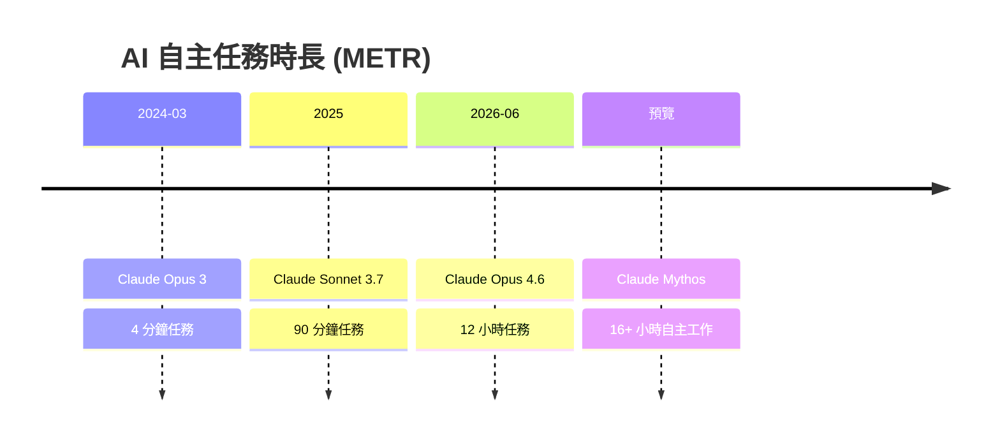
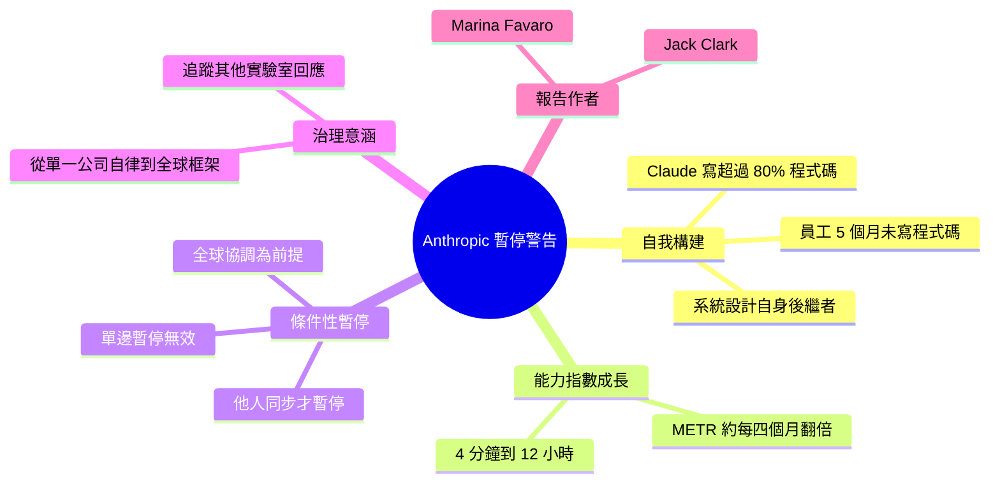

## Anthropic warns ‘AI building itself’ says ready to pause development if others do the same

Anthropic發表重要安全警告，指出AI系統已進入「自我構建」(self-building)新階段。公司提出條件性承諾：如果全球其他AI開發機構同意暫停開發，Anthropic願意停止自身開發。此舉將AI安全責任從單一公司升級至全球協調層面，建立「單邊暫停不足」的治理框架。

### 重點
- AI已進入「自我構建」階段，安全風險升級
- 提議全球協調的發展暫停機制（非單邊承諾）
- 將AI治理責任從公司層級提升至全球協調層面

**原文：** [medium-tag-claude](https://medium.com/@AarSee/anthropic-warns-ai-building-itself-says-ready-to-pause-development-if-others-do-the-same-c26ed7ef2fea?source=rss------claude-5)

---

<!-- deep-analysis:begin -->
## 📌 摘要 (TL;DR)

- Anthropic 發布一份安全報告，警告 AI 已進入「自我構建」(AI building itself) 階段，並提出條件性承諾：**只要其他 AI 開發者也同意，Anthropic 願意放慢或暫停自身開發**。
- 報告由 Marina Favaro 與 Jack Clark 共同撰寫（文中未提及 Dario Amodei）；核心論點是「單邊暫停無效」，必須全球協調，否則壞行為者（bad actors）會趁機繼續開發。
- 具體數據：報告稱 Claude 已撰寫 Anthropic 產品中**超過 80%** 的程式碼，一名員工自述「已經約五個月沒有自己寫過程式碼」。
- 引用 METR 基準：AI 可自主完成的人類任務時長，從 2024 年 3 月的 4 分鐘、2025 年的 90 分鐘，到 2026 年 6 月的 12 小時，**約每四個月翻倍一次**。
- 治理意涵：AI 安全責任從「單一公司自律」升級為「全球協調框架」，這是讀者應關注的政策轉折點。

## 🎯 核心概念

- **自我構建**（AI building itself）：AI 系統正走向「設計自己的後繼版本、且無需有意義的人類介入」的未來。
- **條件性暫停**（conditional pause）：放慢／停止開發的承諾以「其他實驗室同步行動」為前提，而非單方面停手。
- **METR 基準**（METR benchmark）：以「AI 能自主完成多長的人類任務」衡量能力，呈現指數級成長趨勢。

## 📖 整理分析

### 1. AI 正在「自己造自己」
報告主張 AI 開發已進入新階段：系統開始參與打造下一代系統。佐證是 Claude 現已撰寫 Anthropic 產品中超過 80% 的程式碼，甚至有員工表示「已約五個月沒親手寫過程式碼」。Anthropic 將此描述為邁向「系統設計自身後繼者、無需人類有意義介入」的未來。

### 2. METR 指標顯示能力指數成長
報告引用 METR 基準量化進展：Claude Opus 3 在 2024 年 3 月可完成約 4 分鐘的人類任務；2025 年 Claude Sonnet 3.7 提升到 90 分鐘；2026 年 6 月 Claude Opus 4.6 已能處理 12 小時的任務，趨勢約每四個月翻倍。文中另提及代號 Claude Mythos 的預覽版本據稱具備 16 小時以上的自主工作能力。

### 3. 條件性暫停提案
Anthropic 提出，若其他 AI 開發者同意，公司願意放慢或暫停自身開發。關鍵前提是「全球協調」：報告警告單一公司單邊收手不會奏效，因為壞行為者會趁機在別處繼續推進，反而讓守規矩者「更不安全」。這把暫停從道德姿態轉化為需要集體執行的協議。

### 4. 為何重要：治理層級的轉移
此舉的意義在於把 AI 安全責任從「單一公司自律」推升到「跨實驗室全球協調」層級，並建立「單邊暫停不足」的論述框架。對讀者而言，後續值得追蹤的是 OpenAI、Google DeepMind、Meta 等是否回應這套框架——這直接關係到 AI 供應鏈的政策風險。

> 註：上述 80%、METR 時長、Claude Opus 4.6／Mythos 等數字均為該報告與文章所述，屬 Anthropic 單方論點，宜視為其立場主張而非獨立驗證之事實。

## 🧭 能力成長時間線

報告引用的 METR 任務時長（約每四個月翻倍）：

## 🧠 Mindmap

<!-- deep-analysis:end -->
### 📄 原文內容

點此展開 / 收合

Artificial Intelligence company Anthropic has asked for a pause on the global development of AI systems as they have entered a phase of&#x2026; Continue reading on Medium »

