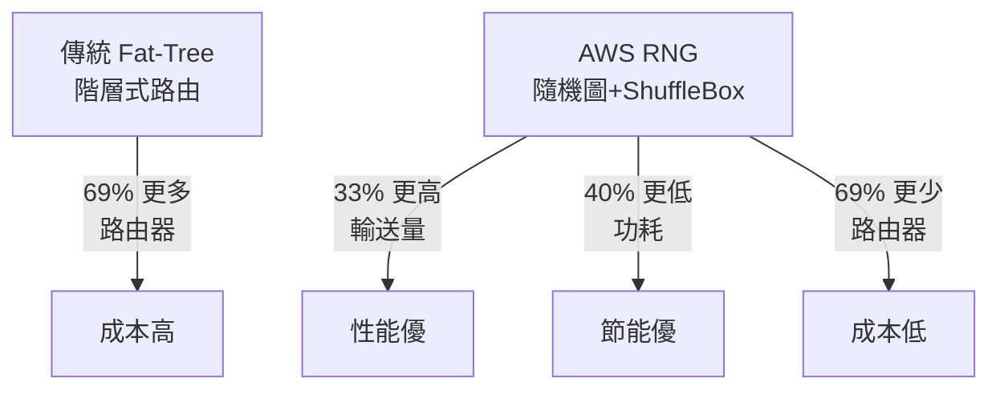

## AWS Replaces Fat-Tree Data Center Networks with Random Graph Theory, Cutting Routers by 69%

AWS 公開 Resilient Network Graphs（RNG），一種基於準隨機圖論的平坦網路架構，已成為新資料中心的預設標準。RNG 以被動光學 ShuffleBox 實現 ToR-to-ToR（機架頂部到機架頂部）直連網格，取代傳統 fat-tree 階層結構，實現路由器數量減少 69%、輸送量提升 33%、網路功耗降低 40% 的成果。

### 重點
- 網路架構創新：從 fat-tree 階層轉向基於準隨機圖論的平坦網格，使用被動光學 ShuffleBox
- 成本效益：路由器數量減少 69%，顯著降低基礎設施投資
- 性能倍增：輸送量提升 33%，網路功耗降低 40%

**原文：** [infoq-main](https://www.infoq.com/news/2026/06/aws-random-graph-data-center/?utm_campaign=infoq_content&utm_source=infoq&utm_medium=feed&utm_term=global)

---

### 📄 原文內容

點此展開 / 收合

# AWS Replaces Fat-Tree Data Center Networks with Random Graph Theory, Cutting Routers by 69%

AWS disclosed that Resilient Network Graphs, a flat network architecture based on quasi-random graph theory, is now the default for most new data center builds. The design replaces fat-tree hierarchies with direct ToR-to-ToR mesh connections using passive optical ShuffleBoxes, cutting routers by 69%, boosting throughput by 33%, and reducing network power consumption by 40%. By Steef-Jan Wiggers

