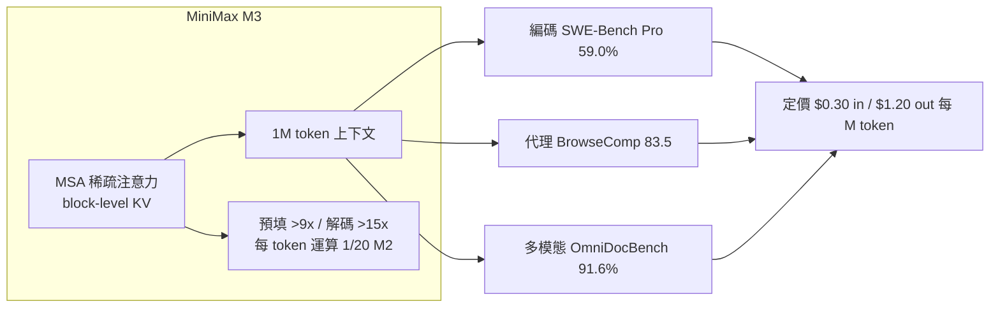
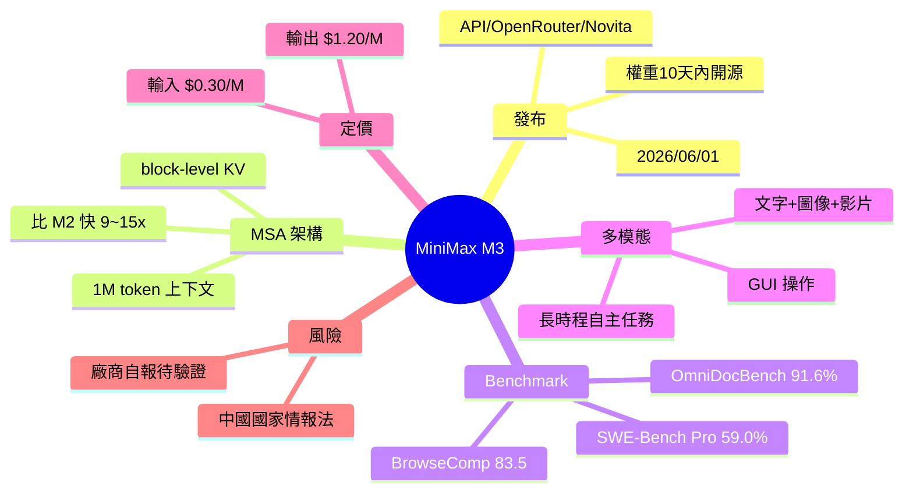

## MiniMax M3: The Open-Weight SOTA Model That Rewrites the Rules

MiniMax 在 2026 年 6 月 1 日發布開源權重的 M3 模型，在多個維度實現重大突破：支援 100 萬 token 上下文窗口（遠超業界標準），具備原生多模態能力（文本+圖像+音頻），並在編碼任務達到 SOTA 水平。該開源發布意味著從前專屬閉源商業模型的能力邊界現已向社區開放。

### 重點
- MiniMax M3 在 2026-06-01 發布，支援 1,000,000 token 上下文窗口（前沿長度）
- 原生多模態支援（文本、圖像、音頻集成）與編碼任務 SOTA 水平
- 開源權重發布打破商業封閉，降低大規模 LLM 建設門檻

**原文：** [medium-tag-llm](https://medium.com/@ffguci8/minimax-m3-the-open-weight-sota-model-that-rewrites-the-rules-4fe318056d22?source=rss------large_language_models-5)

---

<!-- deep-analysis:begin -->
## 📌 摘要 (TL;DR)

- MiniMax 於 **2026 年 6 月 1 日**發布 **M3** 模型，主打前沿編碼、真正可用的 **100 萬 token 上下文**與原生多模態，並承諾在發布後 **10 天內**釋出開源權重（撰文時權重尚未公開）。
- 核心是自研的 **MSA（MiniMax Sparse Attention）** 稀疏注意力架構，採 block-level KV 設計，宣稱比 Flash-Sparse-Attention 快 4 倍；相較前代 M2，預填快逾 9 倍、解碼快逾 15 倍，每 token 運算量僅為 M2 的 1/20。
- 編碼能力：**SWE-Bench Pro 59.0%**，廠商宣稱領先 GPT-5.5 與 Gemini 3.1 Pro，但仍低於 Anthropic Opus 4.7；Terminal-Bench 2.1 達 66.0%。
- 代理（agentic）與多模態表現亮眼：**BrowseComp 83.5** 超越 Opus 4.7 的 79.3；**OmniDocBench 91.6%** 為同場最高（Opus 4.7 為 89.3%）。
- 定價極具侵略性：促銷價約 **每百萬輸入 token 0.30 美元、輸出 1.20 美元**，遠低於同級閉源模型。
- 重大保留：所有 benchmark 皆為**廠商自報、尚待第三方驗證**；且 MiniMax 為中國公司，受 **2017 年中國《國家情報法》**規範，企業導入需評估資料合規風險。

## 🎯 核心概念

- **稀疏注意力（sparse attention）**：只對部分 token 對計算注意力以降低長上下文的運算與記憶體成本，是支撐 1M token 的關鍵技術。
- **MSA（MiniMax Sparse Attention）**：MiniMax 自研的 block-level KV 注意力實作，用區塊化的鍵值快取換取長上下文吞吐。
- **開源權重（open-weight）**：模型權重對外釋出、可自行部署，但不必然附完整訓練資料或商用無限制授權。
- **代理任務（agentic task）**：模型自主規劃、呼叫工具、操作環境以完成長流程任務，對應 MCP Atlas、BrowseComp 等評測。

## 📖 整理分析

### 1. 發布定位與取得管道
M3 在 2026 年 6 月 1 日上線，首發即可透過 MiniMax Code IDE、官方 API，以及 OpenRouter、Novita AI、Qubrid AI、EvoLink 等第三方平台取用。MiniMax 承諾 10 天內開源權重，但撰文當下尚未釋出，因此「open-weight SOTA」此刻仍是承諾而非既成事實。

### 2. MSA 架構與效能增益
效能故事的核心是 MSA 稀疏注意力。它採 block-level KV 架構處理長上下文，官方稱比 Flash-Sparse-Attention 快約 4 倍，撐起 100 萬 token 視窗的同時壓低運算成本。對比前代 M2，預填（prefill）加速逾 9 倍、解碼（decode）加速逾 15 倍，每 token 運算量僅約 M2 的 1/20——這是支撐其低定價的工程基礎。

### 3. 編碼與代理能力 benchmark
編碼方面，SWE-Bench Pro 拿下 59.0%，廠商定位為領先 GPT-5.5、Gemini 3.1 Pro 但落後 Opus 4.7；另有 Terminal-Bench 2.1 66.0%、SWE-fficiency 34.8%。代理任務上，MCP Atlas 74.2%、BrowseComp 83.5（高於 Opus 4.7 的 79.3），Claw-Eval 為同場最高。數學上 IMO 2025 拿 35/42、USAMO 2026 拿 36/42。獨立評測 BenchLM 將其列為 119 個模型中第 28 名（76/100），在「已驗證的代理工具使用」項目排第 13。

### 4. 多模態與長流程自主執行
M3 為原生多模態，涵蓋文字、圖像、影片（注意：先前 brief 提到的「音訊」在原文未出現，原文列的是 video），並支援桌面／GUI 操作。文件理解 OmniDocBench 達 91.6%（最高，Opus 4.7 89.3%、GPT-5.5 87.5%），SVG-Bench 亦超越 Opus 4.7。官方展示了長時程自主任務，如 12 小時論文重現、24 小時 CUDA 最佳化。

### 5. 風險與保留事項
兩點必須加註：其一，上述數字**全為廠商自報，獨立驗證仍待補上**，BenchLM 的第三方名次（第 28）與官方敘事存在落差；其二，MiniMax 為中國企業，受 2017 年《國家情報法》約束，加上權重尚未實際開源，企業在合規與供應鏈信任上需自行評估。

## 🧭 架構與效能對比

## 🧠 Mindmap

<!-- deep-analysis:end -->
### 📄 原文內容

點此展開 / 收合

Frontier coding, a genuine 1M-token context window, and native multimodality &#x2014; all in one open-weight model released June 1, 2026 Continue reading on Medium »

